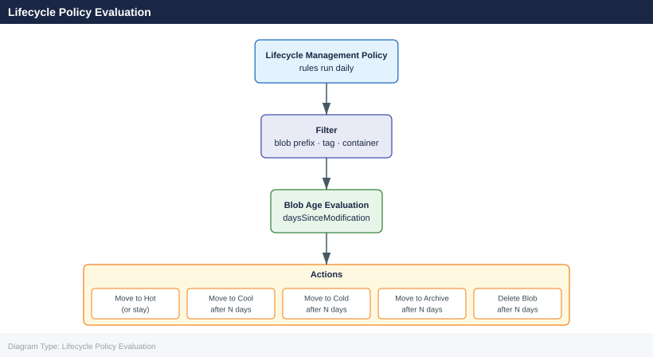

---
tags:
  - azure
description: "Azure Storage Lifecycle Management reference covering Overview, Lifecycle Policy Evaluation, Policy Structure, Tier Transitions, Filter Sets and 3 more..."
---
# Azure Storage Lifecycle Management

<div class="kb-summary">
Azure Storage Lifecycle Management reference covering Overview, Lifecycle Policy Evaluation, Policy Structure, Tier Transitions, Filter Sets and 3 more sections.

*Applies to: Azure*
</div>

## Overview

Azure Storage lifecycle management policies automate blob tier transitions and deletion based on object age and conditions. Policies run daily and evaluate blobs against defined rules, applying transitions from Hot to Cool, Cold, or Archive, and deleting objects after a configured number of days.

## Lifecycle Policy Evaluation



## Policy Structure

A lifecycle policy is a JSON document containing one or more rules. Each rule has a filter (which blobs it applies to) and an action set (what to do).

```bash
# View existing lifecycle policy
az storage account management-policy show \
  --resource-group rg-storage-prod \
  --account-name stprodblobs01

# Create or replace a policy from JSON file
az storage account management-policy create \
  --resource-group rg-storage-prod \
  --account-name stprodblobs01 \
  --policy @lifecycle-policy.json

# Delete a policy
az storage account management-policy delete \
  --resource-group rg-storage-prod \
  --account-name stprodblobs01
```


```text title="Expected output"
{
  "id": "/subscriptions/a1b2c3d4-e5f6-4a7b-8c9d-0e1f2a3b4c5d/resourceGroups/rg-storage-prod/providers/Microsoft.Storage/storageAccounts/stprodblobs01/managementPolicies/default",
  "name": "default",
  "properties": {
    "policy": {
      "rules": [
        {
          "enabled": true,
          "name": "archive-old-blobs",
          "type": "Lifecycle",
          "definition": {
            "actions": {
              "baseBlob": {
                "tierToArchive": {
                  "daysAfterModificationGreaterThan": 90
                }
              }
            },
            "filters": {
              "blobTypes": ["blockBlob"],
              "prefixMatch": ["logs/"]
            }
          }
        }
      ]
    }
  },
  "resourceGroup": "rg-storage-prod",
  "type": "Microsoft.Storage/storageAccounts/managementPolicies"
}
(no output — command completes silently)
Are you sure you want to perform this operation? (y/n): y
(no output — command completes silently)
```

!!! warning "Common errors"
    **`ResourceNotFound: The Resource 'Microsoft.Storage/storageAccounts/stprodblobs01' under resource group 'rg-storage-prod' was not found.`** — Verify the storage account name and resource group name are correct using `az storage account list --resource-group rg-storage-prod`.
    **`FileNotFoundError: [Errno 2] No such file or directory: 'lifecycle-policy.json'`** — Ensure the JSON policy file exists in the current directory or provide the full path with `@/path/to/lifecycle-policy.json`.
    **`InvalidJsonInput: The provided JSON is invalid.`** — Validate the JSON syntax in your policy file using `jq . < lifecycle-policy.json` or an online JSON validator before applying.
## Tier Transitions

Example policy with full tier transition and deletion chain:

```json
{
  "rules": [
    {
      "name": "archive-and-expire-backups",
      "enabled": true,
      "type": "Lifecycle",
      "definition": {
        "filters": {
          "blobTypes": ["blockBlob"],
          "prefixMatch": ["backups/"]
        },
        "actions": {
          "baseBlob": {
            "tierToCool": {
              "daysAfterModificationGreaterThan": 30
            },
            "tierToCold": {
              "daysAfterModificationGreaterThan": 60
            },
            "tierToArchive": {
              "daysAfterModificationGreaterThan": 90
            },
            "delete": {
              "daysAfterModificationGreaterThan": 365
            }
          },
          "snapshot": {
            "delete": {
              "daysAfterCreationGreaterThan": 90
            }
          },
          "version": {
            "delete": {
              "daysAfterCreationGreaterThan": 90
            }
          }
        }
      }
    }
  ]
}
```

## Filter Sets

Filters control which blobs a rule applies to:

| Filter Field | Type | Example |
|---|---|---|
| `blobTypes` | Array | `["blockBlob"]`, `["appendBlob"]` |
| `prefixMatch` | Array of strings | `["logs/", "backups/2025"]` |
| `blobIndexMatch` | Tag-based filter | `{"name": "env", "op": "==", "value": "prod"}` |

```bash
# Create a policy targeting blobs with a specific index tag
az storage account management-policy create \
  --resource-group rg-storage-prod \
  --account-name stprodblobs01 \
  --policy '{
    "rules": [{
      "name": "archive-archived-tagged",
      "enabled": true,
      "type": "Lifecycle",
      "definition": {
        "filters": {
          "blobTypes": ["blockBlob"],
          "blobIndexMatch": [{"name": "lifecycle", "op": "==", "value": "archive"}]
        },
        "actions": {
          "baseBlob": {
            "tierToArchive": {"daysAfterModificationGreaterThan": 1}
          }
        }
      }
    }]
  }'
```


```text title="Expected output"
{
  "id": "/subscriptions/a1b2c3d4-e5f6-4a5b-8c9d-0e1f2a3b4c5d/resourceGroups/rg-storage-prod/providers/Microsoft.Storage/storageAccounts/stprodblobs01/managementPolicies/default",
  "name": "default",
  "type": "Microsoft.Storage/storageAccounts/managementPolicies",
  "properties": {
    "policy": {
      "rules": [
        {
          "name": "archive-archived-tagged",
          "enabled": true,
          "type": "Lifecycle",
          "definition": {
            "filters": {
              "blobTypes": [
                "blockBlob"
              ],
              "blobIndexMatch": [
                {
                  "name": "lifecycle",
                  "op": "==",
                  "value": "archive"
                }
              ]
            },
            "actions": {
              "baseBlob": {
                "tierToArchive": {
                  "daysAfterModificationGreaterThan": 1
                }
              }
            }
          }
        }
      ]
    }
  }
}
```

!!! warning "Common errors"
    **`(ResourceNotFound) The Resource 'Microsoft.Storage/storageAccounts/stprodblobs01' under resource group 'rg-storage-prod' was not found.`** — Verify the storage account name and resource group name are correct using `az storage account list --resource-group rg-storage-prod`.
    **`Invalid JSON in policy definition`** — Ensure the JSON policy is properly formatted by validating it with a JSON linter before passing to the command.
    **`(AuthorizationFailed) The client does not have permission to perform action 'Microsoft.Storage/storageAccounts/managementPolicies/write'`** — Confirm your Azure account has the Storage Account Contributor role or higher on the storage account using `az role assignment list --scope /subscriptions/{subscriptionId}/resourceGroups/rg-storage-prod/providers/Microsoft.Storage/storageAccounts/stprodblobs01`.
## Deletion Rules

```json
{
  "name": "delete-temp-objects",
  "enabled": true,
  "type": "Lifecycle",
  "definition": {
    "filters": {
      "blobTypes": ["blockBlob"],
      "prefixMatch": ["temp/", "staging/"]
    },
    "actions": {
      "baseBlob": {
        "delete": {"daysAfterModificationGreaterThan": 7}
      }
    }
  }
}
```

## Lifecycle Policy Limitations

| Constraint | Value |
|---|---|
| Max rules per policy | 100 |
| Max prefix filters per rule | 10 |
| Max blob index match filters | 10 |
| Policy evaluation frequency | Once per day |
| Minimum Cool tier retention | 30 days (penalties apply if deleted earlier) |
| Minimum Archive tier retention | 180 days (early deletion fee applies) |

## Monitoring Policy Execution

```bash
# Check storage account activity logs for lifecycle policy runs
az monitor activity-log list \
  --resource-group rg-storage-prod \
  --resource-type "Microsoft.Storage/storageAccounts" \
  --query "[?operationName.value=='Microsoft.Storage/storageAccounts/managementPolicies/write']" \
  --output table

# Get blob lifecycle events via storage diagnostics logs
az storage logging update \
  --account-name stprodblobs01 \
  --log rwd \
  --services b \
  --retention 7
```


```text title="Expected output"
EventTimestamp            ResourceGroup      ResourceProvider                 OperationName                                                    Status
-----------------------  -----------------  ------------------------------   ---------------------------------------------------------------  --------
2024-01-15T14:32:18.456Z rg-storage-prod    Microsoft.Storage               Microsoft.Storage/storageAccounts/managementPolicies/write      Succeeded
2024-01-15T09:47:02.123Z rg-storage-prod    Microsoft.Storage               Microsoft.Storage/storageAccounts/managementPolicies/write      Succeeded
2024-01-14T22:15:44.789Z rg-storage-prod    Microsoft.Storage               Microsoft.Storage/storageAccounts/managementPolicies/write      Succeeded

Storage logging properties updated for account stprodblobs01.
```

!!! warning "Common errors"
    **`ResourceNotFound : The resource 'Microsoft.Storage/storageAccounts/stprodblobs01' under resource group 'rg-storage-prod' was not found.`** — Verify the storage account name and resource group name are correct using `az storage account list --resource-group rg-storage-prod`.
    **`AuthorizationFailed : The client 'user@contoso.com' with object id 'xxxxxxxx-xxxx-xxxx-xxxx-xxxxxxxxxxxx' does not have authorization to perform action 'Microsoft.Storage/storageAccounts/write' over scope '/subscriptions/xxxxxxxx-xxxx-xxxx-xxxx-xxxxxxxxxxxx/resourceGroups/rg-storage-prod/providers/Microsoft.Storage/storageAccounts/stprodblobs01'.`** — Ensure your Azure account has Storage Account Contributor or Owner role on the storage account using `az role assignment list --scope /subscriptions/{subscriptionId}/resourceGroups/rg-storage-prod`.