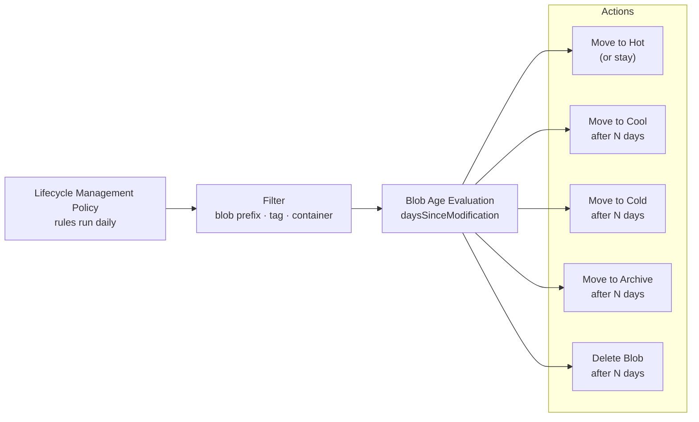

---
tags:
  - azure
---
# Azure Storage Lifecycle Management


<div class="kb-summary">
Azure Storage Lifecycle Management reference covering Overview, Lifecycle Policy Evaluation, Policy Structure, Tier Transitions, Filter Sets and 3 more sections.
</div>
```text
┌───────────────────────────────────────── Cloud Azure Storage ─────────────────────────────────────────┐
│                                                                                                       │
│   ┌───────────────────────────────────────────────────────────────────────────────────────────────┐   │
│   │                              Azure: Cloud Azure Storage platform                              │   │
│   │                                  Protocols: Various protocols                                 │   │
│   │                       Management: Cloud Azure Storage management console                      │   │
│   │                Sections: Architecture · Operations · Security · Troubleshooting               │   │
│   └───────────────────────────────────────────────────────────────────────────────────────────────┘   │
│                                                                                                       │
│    Architecture → Operations → Security → Troubleshooting → Escalation                                │
│                                                                                                       │
│                  ▼                                ▼                                ▼                  │
│                                                                                                       │
│   ┌─────────────────────────────┐  ┌─────────────────────────────┐  ┌─────────────────────────────┐   │
│   │            Layer            │  │          Component          │  │            Notes            │   │
│   │             Core            │  │       Primary service       │  │        Main function        │   │
│   │          Management         │  │        Control plane        │  │         Admin access        │   │
│   │          Monitoring         │  │         Health/perf         │  │      Alerts/dashboards      │   │
│   │           Security          │  │         Auth/encrypt        │  │        Access control       │   │
│   │         Integration         │  │        APIs/plug-ins        │  │         Third-party         │   │
│   └─────────────────────────────┘  └─────────────────────────────┘  └─────────────────────────────┘   │
│                                                                                                       │
│                          ▼                                                 ▼                          │
│                                                                                                       │
│   ┌───────────────────────────────────────────────────────────────────────────────────────────────┐   │
│   │      Layer       │    Component     │      Function     │      Notes       │       Auth       │   │
│   │       Core       │ Primary service  │   Main function   │     See docs     │       RBAC       │   │
│   │    Management    │  Control plane   │    Admin access   │     See docs     │       RBAC       │   │
│   │    Monitoring    │   Health/perf    │  Alerts/dashboard │     See docs     │       RBAC       │   │
│   │     Security     │   Auth/encrypt   │   Access control  │     See docs     │       RBAC       │   │
│   └───────────────────────────────────────────────────────────────────────────────────────────────┘   │
│                                                                                                       │
│    Physical: Cloud Azure Storage infrastructure · management network · monitoring                     │
│                                                                                                       │
│    Key terms:                                                                                         │
│                                                                                                       │
│    Azure              = Cloud Azure Storage platform overview and core concepts                       │
│    Management         = management console and command-line interface for administration              │
│    Monitoring         = health and performance monitoring dashboards and alerting                     │
│    Automation         = REST API, scripting, and pipeline integration capabilities                    │
│    Security           = access control, authentication, and encryption configuration                  │
│    Backup             = backup and recovery procedures and schedule configuration                     │
│    Upgrade            = software version upgrades and firmware patching procedures                    │
│    Troubleshooting    = diagnostic procedures and common issue resolution steps                       │
│    Escalation         = vendor support escalation path and severity triage process                    │
│    Documentation      = vendor knowledge base and official product documentation                      │
│    Change management  = change ticket requirements for production modifications                       │
│    Audit log          = admin action logging for compliance and security review                       │
│                                                                                                       │
└───────────────────────────────────────────────────────────────────────────────────────────────────────┘
```


## Overview

Azure Storage lifecycle management policies automate blob tier transitions and deletion based on object age and conditions. Policies run daily and evaluate blobs against defined rules, applying transitions from Hot to Cool, Cold, or Archive, and deleting objects after a configured number of days.

## Lifecycle Policy Evaluation



## Policy Structure

A lifecycle policy is a JSON document containing one or more rules. Each rule has a filter (which blobs it applies to) and an action set (what to do).

```bash
# View existing lifecycle policy
az storage account management-policy show \
  --resource-group rg-storage-prod \
  --account-name stprodblobs01

# Create or replace a policy from JSON file
az storage account management-policy create \
  --resource-group rg-storage-prod \
  --account-name stprodblobs01 \
  --policy @lifecycle-policy.json

# Delete a policy
az storage account management-policy delete \
  --resource-group rg-storage-prod \
  --account-name stprodblobs01
```

## Tier Transitions

Example policy with full tier transition and deletion chain:

```json
{
  "rules": [
    {
      "name": "archive-and-expire-backups",
      "enabled": true,
      "type": "Lifecycle",
      "definition": {
        "filters": {
          "blobTypes": ["blockBlob"],
          "prefixMatch": ["backups/"]
        },
        "actions": {
          "baseBlob": {
            "tierToCool": {
              "daysAfterModificationGreaterThan": 30
            },
            "tierToCold": {
              "daysAfterModificationGreaterThan": 60
            },
            "tierToArchive": {
              "daysAfterModificationGreaterThan": 90
            },
            "delete": {
              "daysAfterModificationGreaterThan": 365
            }
          },
          "snapshot": {
            "delete": {
              "daysAfterCreationGreaterThan": 90
            }
          },
          "version": {
            "delete": {
              "daysAfterCreationGreaterThan": 90
            }
          }
        }
      }
    }
  ]
}
```

## Filter Sets

Filters control which blobs a rule applies to:

| Filter Field | Type | Example |
|---|---|---|
| `blobTypes` | Array | `["blockBlob"]`, `["appendBlob"]` |
| `prefixMatch` | Array of strings | `["logs/", "backups/2025"]` |
| `blobIndexMatch` | Tag-based filter | `{"name": "env", "op": "==", "value": "prod"}` |

```bash
# Create a policy targeting blobs with a specific index tag
az storage account management-policy create \
  --resource-group rg-storage-prod \
  --account-name stprodblobs01 \
  --policy '{
    "rules": [{
      "name": "archive-archived-tagged",
      "enabled": true,
      "type": "Lifecycle",
      "definition": {
        "filters": {
          "blobTypes": ["blockBlob"],
          "blobIndexMatch": [{"name": "lifecycle", "op": "==", "value": "archive"}]
        },
        "actions": {
          "baseBlob": {
            "tierToArchive": {"daysAfterModificationGreaterThan": 1}
          }
        }
      }
    }]
  }'
```

## Deletion Rules

```json
{
  "name": "delete-temp-objects",
  "enabled": true,
  "type": "Lifecycle",
  "definition": {
    "filters": {
      "blobTypes": ["blockBlob"],
      "prefixMatch": ["temp/", "staging/"]
    },
    "actions": {
      "baseBlob": {
        "delete": {"daysAfterModificationGreaterThan": 7}
      }
    }
  }
}
```

## Lifecycle Policy Limitations

| Constraint | Value |
|---|---|
| Max rules per policy | 100 |
| Max prefix filters per rule | 10 |
| Max blob index match filters | 10 |
| Policy evaluation frequency | Once per day |
| Minimum Cool tier retention | 30 days (penalties apply if deleted earlier) |
| Minimum Archive tier retention | 180 days (early deletion fee applies) |

## Monitoring Policy Execution

```bash
# Check storage account activity logs for lifecycle policy runs
az monitor activity-log list \
  --resource-group rg-storage-prod \
  --resource-type "Microsoft.Storage/storageAccounts" \
  --query "[?operationName.value=='Microsoft.Storage/storageAccounts/managementPolicies/write']" \
  --output table

# Get blob lifecycle events via storage diagnostics logs
az storage logging update \
  --account-name stprodblobs01 \
  --log rwd \
  --services b \
  --retention 7
```
