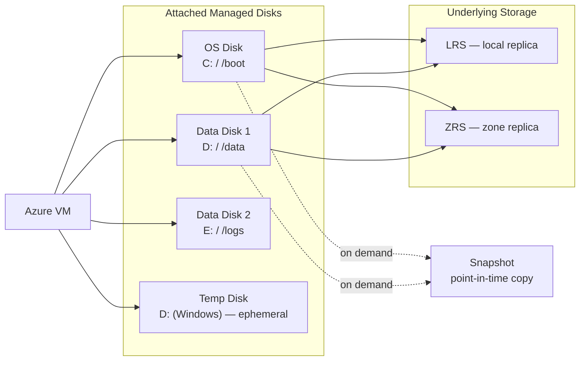

---
tags:
  - azure
---
# Azure Managed Disks


<div class="kb-summary">
Azure Managed Disks reference covering Overview, Managed Disk Architecture, Disk Types, Creating and Attaching Disks, Resizing Disks and 3 more sections.

*Applies to: Azure*
</div>
```text
┌───────────────────────────────────────── Cloud Azure Storage ─────────────────────────────────────────┐
│                                                                                                       │
│   ┌───────────────────────────────────────────────────────────────────────────────────────────────┐   │
│   │                              Azure: Cloud Azure Storage platform                              │   │
│   │                                  Protocols: Various protocols                                 │   │
│   │                       Management: Cloud Azure Storage management console                      │   │
│   │                Sections: Architecture · Operations · Security · Troubleshooting               │   │
│   └───────────────────────────────────────────────────────────────────────────────────────────────┘   │
│                                                                                                       │
│    Architecture → Operations → Security → Troubleshooting → Escalation                                │
│                                                                                                       │
│                  ▼                                ▼                                ▼                  │
│                                                                                                       │
│   ┌─────────────────────────────┐  ┌─────────────────────────────┐  ┌─────────────────────────────┐   │
│   │            Layer            │  │          Component          │  │            Notes            │   │
│   │             Core            │  │       Primary service       │  │        Main function        │   │
│   │          Management         │  │        Control plane        │  │         Admin access        │   │
│   │          Monitoring         │  │         Health/perf         │  │      Alerts/dashboards      │   │
│   │           Security          │  │         Auth/encrypt        │  │        Access control       │   │
│   │         Integration         │  │        APIs/plug-ins        │  │         Third-party         │   │
│   └─────────────────────────────┘  └─────────────────────────────┘  └─────────────────────────────┘   │
│                                                                                                       │
│                          ▼                                                 ▼                          │
│                                                                                                       │
│   ┌───────────────────────────────────────────────────────────────────────────────────────────────┐   │
│   │      Layer       │    Component     │      Function     │      Notes       │       Auth       │   │
│   │       Core       │ Primary service  │   Main function   │     See docs     │       RBAC       │   │
│   │    Management    │  Control plane   │    Admin access   │     See docs     │       RBAC       │   │
│   │    Monitoring    │   Health/perf    │  Alerts/dashboard │     See docs     │       RBAC       │   │
│   │     Security     │   Auth/encrypt   │   Access control  │     See docs     │       RBAC       │   │
│   └───────────────────────────────────────────────────────────────────────────────────────────────┘   │
│                                                                                                       │
│    Physical: Cloud Azure Storage infrastructure · management network · monitoring                     │
│                                                                                                       │
│    Key terms:                                                                                         │
│                                                                                                       │
│    Azure              = Cloud Azure Storage platform overview and core concepts                       │
│    Management         = management console and command-line interface for administration              │
│    Monitoring         = health and performance monitoring dashboards and alerting                     │
│    Automation         = REST API, scripting, and pipeline integration capabilities                    │
│    Security           = access control, authentication, and encryption configuration                  │
│    Backup             = backup and recovery procedures and schedule configuration                     │
│    Upgrade            = software version upgrades and firmware patching procedures                    │
│    Troubleshooting    = diagnostic procedures and common issue resolution steps                       │
│    Escalation         = vendor support escalation path and severity triage process                    │
│    Documentation      = vendor knowledge base and official product documentation                      │
│    Change management  = change ticket requirements for production modifications                       │
│    Audit log          = admin action logging for compliance and security review                       │
│                                                                                                       │
└───────────────────────────────────────────────────────────────────────────────────────────────────────┘
```


## Overview

Azure Managed Disks are block-level storage volumes managed by Azure and attached to Azure VMs. They abstract the underlying Storage Account and provide high availability through replication. The disk type determines IOPS, throughput, and cost.

## Managed Disk Architecture



## Disk Types

| Type | SKU | Max IOPS | Max Throughput | Max Size | Use Case |
|---|---|---|---|---|---|
| Standard HDD | Standard_LRS | 2,000 | 500 MB/s | 32 TiB | Dev/test, low priority |
| Standard SSD | StandardSSD_LRS | 6,000 | 750 MB/s | 32 TiB | Web servers, light workloads |
| Premium SSD v1 | Premium_LRS | 20,000 | 900 MB/s | 32 TiB | Production databases, enterprise apps |
| Premium SSD v2 | PremiumV2_LRS | 80,000 | 1,200 MB/s | 64 TiB | High-throughput databases (configurable IOPS) |
| Ultra Disk | UltraSSD_LRS | 160,000 | 4,000 MB/s | 64 TiB | Latency-sensitive, SAP HANA, top-tier SQL |

## Creating and Attaching Disks

```bash
# Create a Premium SSD managed disk
az disk create \
  --resource-group rg-compute-prod \
  --name "vm01-datadisk01" \
  --size-gb 512 \
  --sku Premium_LRS \
  --location eastus \
  --zone 1

# Create a Premium SSD v2 disk with custom IOPS and throughput
az disk create \
  --resource-group rg-compute-prod \
  --name "vm01-datadisk02" \
  --size-gb 1024 \
  --sku PremiumV2_LRS \
  --location eastus \
  --zone 1 \
  --disk-iops-read-write 40000 \
  --disk-mbps-read-write 600

# Attach a disk to a running VM
az vm disk attach \
  --resource-group rg-compute-prod \
  --vm-name vm01 \
  --name "vm01-datadisk01"

# Attach as read-only (e.g., for shared access)
az vm disk attach \
  --resource-group rg-compute-prod \
  --vm-name vm01 \
  --name "vm01-datadisk01" \
  --caching ReadOnly
```

## Resizing Disks

```bash
# Stop the VM before resizing the OS disk (required)
az vm deallocate --resource-group rg-compute-prod --name vm01

# Resize a disk (must be stopped for OS disk; data disk can be hot-resized on some SKUs)
az disk update \
  --resource-group rg-compute-prod \
  --name "vm01-datadisk01" \
  --size-gb 1024

# Start the VM after resize
az vm start --resource-group rg-compute-prod --name vm01

# Extend the filesystem inside the OS after disk resize (Linux)
# Run on the VM:
sudo growpart /dev/sda 1
sudo resize2fs /dev/sda1          # ext4
# or: sudo xfs_growfs /mount/point  # XFS
```

## SKU Comparison and Selection

```bash
# List available disk SKUs for a region and zone
az disk list-skus \
  --location eastus \
  --query "[?diskSku!=null].{name:name, tier:tier, maxSizeGB:capabilities[?name=='MaxSizeGiB'].value|[0]}" \
  --output table

# Show current disk configuration
az disk show \
  --resource-group rg-compute-prod \
  --name "vm01-datadisk01" \
  --query "{sku:sku.name, sizeGB:diskSizeGb, iops:diskIOPSReadWrite, mbps:diskMBpsReadWrite}"

# Change disk SKU (VM must be stopped)
az disk update \
  --resource-group rg-compute-prod \
  --name "vm01-datadisk01" \
  --sku StandardSSD_LRS
```

## Shared Disks

Premium SSD, Premium SSD v2, and Ultra Disk support shared access for clustered workloads:

```bash
# Create a shared Premium SSD disk (max 3 shares)
az disk create \
  --resource-group rg-compute-prod \
  --name "shared-disk-cluster01" \
  --size-gb 256 \
  --sku Premium_LRS \
  --max-shares 2 \
  --location eastus

# Attach to first cluster node
az vm disk attach \
  --resource-group rg-compute-prod \
  --vm-name cluster-node01 \
  --name "shared-disk-cluster01"

# Attach to second cluster node
az vm disk attach \
  --resource-group rg-compute-prod \
  --vm-name cluster-node02 \
  --name "shared-disk-cluster01"
```

## Disk Management Operations

```bash
# List all disks in a resource group
az disk list \
  --resource-group rg-compute-prod \
  --query "[].{name:name, sku:sku.name, sizeGB:diskSizeGb, state:diskState}" \
  --output table

# Find unattached disks (state: Unattached)
az disk list \
  --resource-group rg-compute-prod \
  --query "[?diskState=='Unattached'].{name:name, sizeGB:diskSizeGb, created:timeCreated}" \
  --output table

# Delete an unattached disk
az disk delete \
  --resource-group rg-compute-prod \
  --name "vm01-datadisk01-old" \
  --yes
```
