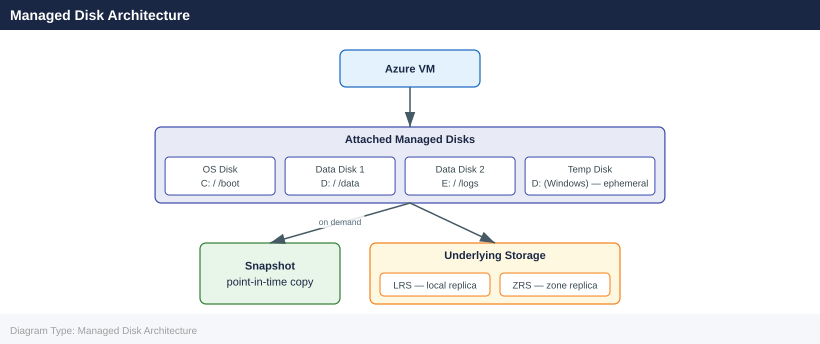

---
tags:
  - azure
description: "Azure Managed Disks reference covering Overview, Managed Disk Architecture, Disk Types, Creating and Attaching Disks, Resizing Disks and 3 more sections."
---
# Azure Managed Disks

<div class="kb-summary">
Azure Managed Disks reference covering Overview, Managed Disk Architecture, Disk Types, Creating and Attaching Disks, Resizing Disks and 3 more sections.

*Applies to: Azure*
</div>

## Overview

Azure Managed Disks are block-level storage volumes managed by Azure and attached to Azure VMs. They abstract the underlying Storage Account and provide high availability through replication. The disk type determines IOPS, throughput, and cost.

## Managed Disk Architecture



## Disk Types

| Type | SKU | Max IOPS | Max Throughput | Max Size | Use Case |
|---|---|---|---|---|---|
| Standard HDD | Standard_LRS | 2,000 | 500 MB/s | 32 TiB | Dev/test, low priority |
| Standard SSD | StandardSSD_LRS | 6,000 | 750 MB/s | 32 TiB | Web servers, light workloads |
| Premium SSD v1 | Premium_LRS | 20,000 | 900 MB/s | 32 TiB | Production databases, enterprise apps |
| Premium SSD v2 | PremiumV2_LRS | 80,000 | 1,200 MB/s | 64 TiB | High-throughput databases (configurable IOPS) |
| Ultra Disk | UltraSSD_LRS | 160,000 | 4,000 MB/s | 64 TiB | Latency-sensitive, SAP HANA, top-tier SQL |

## Creating and Attaching Disks

```bash
# Create a Premium SSD managed disk
az disk create \
  --resource-group rg-compute-prod \
  --name "vm01-datadisk01" \
  --size-gb 512 \
  --sku Premium_LRS \
  --location eastus \
  --zone 1

# Create a Premium SSD v2 disk with custom IOPS and throughput
az disk create \
  --resource-group rg-compute-prod \
  --name "vm01-datadisk02" \
  --size-gb 1024 \
  --sku PremiumV2_LRS \
  --location eastus \
  --zone 1 \
  --disk-iops-read-write 40000 \
  --disk-mbps-read-write 600

# Attach a disk to a running VM
az vm disk attach \
  --resource-group rg-compute-prod \
  --vm-name vm01 \
  --name "vm01-datadisk01"

# Attach as read-only (e.g., for shared access)
az vm disk attach \
  --resource-group rg-compute-prod \
  --vm-name vm01 \
  --name "vm01-datadisk01" \
  --caching ReadOnly
```


```text title="Expected output"
{
  "id": "/subscriptions/a1b2c3d4-e5f6-4a7b-8c9d-0e1f2a3b4c5d/resourceGroups/rg-compute-prod/providers/Microsoft.Compute/disks/vm01-datadisk01",
  "location": "eastus",
  "name": "vm01-datadisk01",
  "provisioningState": "Succeeded",
  "sizeGb": 512,
  "sku": {
    "name": "Premium_LRS",
    "tier": "Premium"
  },
  "zones": [
    "1"
  ]
}
{
  "id": "/subscriptions/a1b2c3d4-e5f6-4a7b-8c9d-0e1f2a3b4c5d/resourceGroups/rg-compute-prod/providers/Microsoft.Compute/disks/vm01-datadisk02",
  "location": "eastus",
  "name": "vm01-datadisk02",
  "provisioningState": "Succeeded",
  "sizeGb": 1024,
  "sku": {
    "name": "PremiumV2_LRS",
    "tier": "Premium"
  },
  "zones": [
    "1"
  ]
}
{
  "id": "/subscriptions/a1b2c3d4-e5f6-4a7b-8c9d-0e1f2a3b4c5d/resourceGroups/rg-compute-prod/providers/Microsoft.Compute/virtualMachines/vm01/storageProfile/dataDisks/0",
  "caching": "None",
  "createOption": "Attach",
  "lun": 0,
  "managedDisk": {
    "id": "/subscriptions/a1b2c3d4-e5f6-4a7b-8c9d-0e1f2a3b4c5d/resourceGroups/rg-compute-prod/providers/Microsoft.Compute/disks/vm01-datadisk01"
  }
}
{
  "id": "/subscriptions/a1b2c3d4-e5f6-4a7b-8c9d-0e1f2a3b4c5d/resourceGroups/rg-compute-prod/providers/Microsoft.Compute/virtualMachines/vm01/storageProfile/dataDisks/1",
  "caching": "ReadOnly",
  "createOption": "Attach",
  "lun": 1,
  "managedDisk": {
    "id": "/subscriptions/a1b2c3d4-e5f6-4a7b-8c9d-0e1f2a3b4c5d/resourceGroups/rg-compute-prod/providers/Microsoft.Compute/disks/vm01-datadisk01"
  }
}
```

!!! warning "Common errors"
    | Error | Fix |
    |---|---|
    | `ResourceGroupNotFound` | Verify the resource group name with `az group list` and ensure it exists in the target subscription. |
    | `InvalidDiskSize` | Confirm the disk size in GB |
## Resizing Disks

```bash
# Stop the VM before resizing the OS disk (required)
az vm deallocate --resource-group rg-compute-prod --name vm01

# Resize a disk (must be stopped for OS disk; data disk can be hot-resized on some SKUs)
az disk update \
  --resource-group rg-compute-prod \
  --name "vm01-datadisk01" \
  --size-gb 1024

# Start the VM after resize
az vm start --resource-group rg-compute-prod --name vm01

# Extend the filesystem inside the OS after disk resize (Linux)
# Run on the VM:
sudo growpart /dev/sda 1
sudo resize2fs /dev/sda1          # ext4
# or: sudo xfs_growfs /mount/point  # XFS
```


```text title="Expected output"
VM deallocate: Succeeded
PowerState/deallocated

Updating
Succeeded

VM start: Succeeded
PowerState/running

root@vm01:~# sudo growpart /dev/sda 1
CHANGED: partition=1 start=2048 old: size=2095104 end=2097152 new: size=4192256 end=4194304

root@vm01:~# sudo resize2fs /dev/sda1
resize2fs 1.46.2 (28-Feb-2023)
Filesystem at /dev/sda1 is mounted on /; on-line resizing required
old_desc_blocks = 128, new_desc_blocks = 256
Performing an on-line resize of /dev/sda1 to 524288 (4k) blocks.
The filesystem on /dev/sda1 is now 524288 (4k) blocks long.
```

!!! warning "Common errors"
    | Error | Fix |
    |---|---|
    | `The resource 'Microsoft.Compute/disks/vm01-datadisk01' under resource group 'rg-compute-prod' was not found.` | Verify the disk name and resource group match your environment using `az disk list --resource-group rg-compute-prod`. |
    | `Operation failed because the VM is still in a running state.` | Ensure the VM is fully deallocated by waiting 30 seconds and checking status with `az vm get-instance-view --resource-group rg-compute-prod --name vm01 | grep powerState`. |
## SKU Comparison and Selection

```bash
# List available disk SKUs for a region and zone
az disk list-skus \
  --location eastus \
  --query "[?diskSku!=null].{name:name, tier:tier, maxSizeGB:capabilities[?name=='MaxSizeGiB'].value|[0]}" \
  --output table

# Show current disk configuration
az disk show \
  --resource-group rg-compute-prod \
  --name "vm01-datadisk01" \
  --query "{sku:sku.name, sizeGB:diskSizeGb, iops:diskIOPSReadWrite, mbps:diskMBpsReadWrite}"

# Change disk SKU (VM must be stopped)
az disk update \
  --resource-group rg-compute-prod \
  --name "vm01-datadisk01" \
  --sku StandardSSD_LRS
```


```text title="Expected output"
ResourceSkuName          Tier    MaxSizeGB
-----------------------  ------  -----------
Standard_LRS             Standard 32768
StandardSSD_LRS          SSD     32768
Premium_LRS              Premium 32768
PremiumV2_LRS            Premium 33554432
UltraSSD_LRS             Ultra   65536

{
  "sku": "Premium_LRS",
  "sizeGB": 256,
  "iops": 1100,
  "mbps": 145
}

{
  "id": "/subscriptions/a1b2c3d4-e5f6-7890-abcd-ef1234567890/resourceGroups/rg-compute-prod/providers/Microsoft.Compute/disks/vm01-datadisk01",
  "location": "eastus",
  "name": "vm01-datadisk01",
  "resourceGroup": "rg-compute-prod",
  "sku": {
    "name": "StandardSSD_LRS",
    "tier": "Standard"
  },
  "type": "Microsoft.Compute/disks"
}
```

!!! warning "Common errors"
    | Error | Fix |
    |---|---|
    | `The resource 'Microsoft.Compute/disks/vm01-datadisk01' under resource group 'rg-compute-prod' was not found.` | Verify the disk name and resource group name match exactly with `az disk list --resource-group rg-compute-prod`. |
    | `Operation failed. The VM 'vm01' using disk 'vm01-datadisk01' is not in a deallocated state.` | Stop the VM with `az vm deallocate --resource-group rg-compute-prod --name vm01` before updating the disk SKU. |
## Shared Disks

Premium SSD, Premium SSD v2, and Ultra Disk support shared access for clustered workloads:

```bash
# Create a shared Premium SSD disk (max 3 shares)
az disk create \
  --resource-group rg-compute-prod \
  --name "shared-disk-cluster01" \
  --size-gb 256 \
  --sku Premium_LRS \
  --max-shares 2 \
  --location eastus

# Attach to first cluster node
az vm disk attach \
  --resource-group rg-compute-prod \
  --vm-name cluster-node01 \
  --name "shared-disk-cluster01"

# Attach to second cluster node
az vm disk attach \
  --resource-group rg-compute-prod \
  --vm-name cluster-node02 \
  --name "shared-disk-cluster01"
```


```text title="Expected output"
{
  "id": "/subscriptions/a1b2c3d4-e5f6-4a7b-8c9d-0e1f2a3b4c5d/resourceGroups/rg-compute-prod/providers/Microsoft.Compute/disks/shared-disk-cluster01",
  "location": "eastus",
  "maxShares": 2,
  "name": "shared-disk-cluster01",
  "provisioningState": "Succeeded",
  "sizeGb": 256,
  "sku": {
    "name": "Premium_LRS",
    "tier": "Premium"
  },
  "timeCreated": "2024-01-15T14:32:18.123456+00:00"
}
{
  "id": "/subscriptions/a1b2c3d4-e5f6-4a7b-8c9d-0e1f2a3b4c5d/resourceGroups/rg-compute-prod/providers/Microsoft.Compute/virtualMachines/cluster-node01/managedDisks/shared-disk-cluster01",
  "lun": 0,
  "name": "shared-disk-cluster01"
}
{
  "id": "/subscriptions/a1b2c3d4-e5f6-4a7b-8c9d-0e1f2a3b4c5d/resourceGroups/rg-compute-prod/providers/Microsoft.Compute/virtualMachines/cluster-node02/managedDisks/shared-disk-cluster01",
  "lun": 0,
  "name": "shared-disk-cluster01"
}
```

!!! warning "Common errors"
    | Error | Fix |
    |---|---|
    | `The shared disk 'shared-disk-cluster01' cannot be attached to more VMs than the max-shares value of 2.` | Increase the `--max-shares` parameter to 3 or higher before attaching to additional nodes. |
    | `The resource 'cluster-node02' does not exist in the resource group 'rg-compute-prod'.` | Verify the VM name and resource group match your deployment using `az vm list --resource-group rg-compute-prod`. |
    | `Premium_LRS shared disks are only supported in specific regions and VM sizes.` | Confirm both VMs support shared disk attachments by checking their SKU compatibility in the Azure documentation. |
## Disk Management Operations

```bash
# List all disks in a resource group
az disk list \
  --resource-group rg-compute-prod \
  --query "[].{name:name, sku:sku.name, sizeGB:diskSizeGb, state:diskState}" \
  --output table

# Find unattached disks (state: Unattached)
az disk list \
  --resource-group rg-compute-prod \
  --query "[?diskState=='Unattached'].{name:name, sizeGB:diskSizeGb, created:timeCreated}" \
  --output table

# Delete an unattached disk
az disk delete \
  --resource-group rg-compute-prod \
  --name "vm01-datadisk01-old" \
  --yes
```


```text title="Expected output"
Name                          Sku           SizeGB    State
------------------------------  -----------  --------  -----------
vm01-osdisk                   Premium_LRS      128    Attached
vm01-datadisk01               Premium_LRS      256    Attached
vm02-osdisk                   Standard_LRS      64    Attached
vm02-datadisk01               Standard_LRS      512   Unattached
vm01-datadisk01-old           Premium_LRS      256    Unattached
backup-disk-20240115          Standard_LRS      100   Unattached

Name                          SizeGB    Created
------------------------------  --------  ---------------------------------
vm02-datadisk01               512       2024-01-10T14:22:33.456789+00:00
vm01-datadisk01-old           256       2023-11-28T09:15:47.123456+00:00
backup-disk-20240115          100       2024-01-05T16:43:12.789012+00:00

Deleting disk 'vm01-datadisk01-old' in resource group 'rg-compute-prod'.
```

!!! warning "Common errors"
    | Error | Fix |
    |---|---|
    | `ResourceNotFound : The Resource 'Microsoft.Compute/disks/vm01-datadisk01-old' under resource group 'rg-compute-prod' was not found.` | Verify the disk name and resource group are correct using `az disk list`. |
    | `AuthorizationFailed : The client 'user@contoso.com' with object id 'xxxxxxxx-xxxx-xxxx-xxxx-xxxxxxxxxxxx' does not have authorization to perform action 'Microsoft.Compute/disks/delete' over scope '/subscriptions/xxxxxxxx-xxxx-xxxx-xxxx-xxxxxxxxxxxx/resourceGroups/rg-compute-prod/providers/Microsoft.Compute/disks/vm01-datadisk01-old'.` | Ensure your account has Contributor or Owner role on the resource group using `az role assignment list --resource-group rg-compute-prod`. |