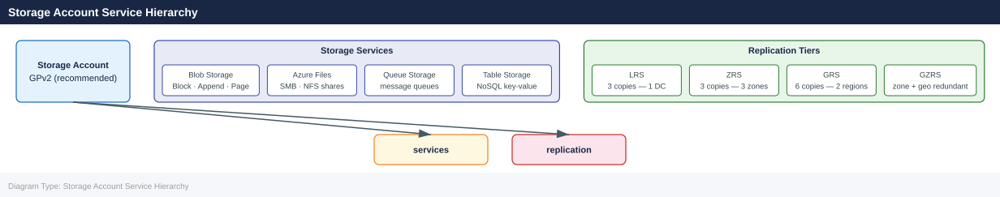

---
tags:
  - azure
---
# Azure Storage Accounts

<div class="kb-summary">
Azure Storage Accounts reference covering Overview, Storage Account Service Hierarchy, Account Types, Replication Options, Creating Storage Accounts and 3 more sections.

*Applies to: Azure*
</div>

## Overview

A Storage Account is the top-level namespace for all Azure Storage services (Blobs, Files, Queues, Tables). The account type, replication option, and access tier are set at creation and determine cost, durability, and available features.

## Storage Account Service Hierarchy



## Account Types

| Kind | SKU Options | Services | Use Case |
|---|---|---|---|
| StorageV2 (GPv2) | Standard, Premium | Blobs, Files, Queues, Tables | General purpose — recommended default |
| BlobStorage | Standard only | Blobs only | Legacy; prefer GPv2 |
| BlockBlobStorage | Premium only | Block blobs, Append blobs | High-throughput blob workloads |
| FileStorage | Premium only | Files only | Premium file shares (NFS/SMB) |

## Replication Options

| Replication | Copies | Scope | RPO | Use Case |
|---|---|---|---|---|
| LRS (Locally Redundant) | 3 | Single datacenter | 0 (sync) | Dev/test, non-critical |
| ZRS (Zone Redundant) | 3 | 3 AZs in one region | 0 (sync) | HA within a region |
| GRS (Geo-Redundant) | 6 | Primary + secondary region | ~15 min async | DR to paired region |
| GZRS (Geo-Zone Redundant) | 6 | 3 AZs primary + secondary | ~15 min async | Highest durability |
| RA-GRS / RA-GZRS | Same as above | Same as above | Same | GRS/GZRS + read access to secondary |

## Creating Storage Accounts

```bash
# Create a standard GPv2 storage account with ZRS replication
az storage account create \
  --resource-group rg-storage-prod \
  --name stproddata01 \
  --location eastus \
  --sku Standard_ZRS \
  --kind StorageV2 \
  --access-tier Hot \
  --https-only true \
  --min-tls-version TLS1_2 \
  --allow-blob-public-access false

# Create a Premium BlockBlobStorage account
az storage account create \
  --resource-group rg-storage-prod \
  --name stprodpremblob01 \
  --location eastus \
  --sku Premium_LRS \
  --kind BlockBlobStorage \
  --https-only true

# Create a Premium FileStorage account
az storage account create \
  --resource-group rg-storage-prod \
  --name stprodpremfiles01 \
  --location eastus \
  --sku Premium_LRS \
  --kind FileStorage \
  --https-only true
```


```text title="Expected output"
{
  "accessTier": "Hot",
  "allowBlobPublicAccess": false,
  "creationTime": "2024-01-15T14:32:47.123456+00:00",
  "customDomain": null,
  "enableHttpsTrafficOnly": true,
  "encryption": {
    "keySource": "Microsoft.Storage",
    "services": {
      "blob": {
        "enabled": true,
        "lastEnabledTime": "2024-01-15T14:32:47.123456+00:00"
      },
      "file": {
        "enabled": true,
        "lastEnabledTime": "2024-01-15T14:32:47.123456+00:00"
      }
    }
  },
  "id": "/subscriptions/a1b2c3d4-e5f6-4a5b-8c9d-0e1f2a3b4c5d/resourceGroups/rg-storage-prod/providers/Microsoft.Storage/storageAccounts/stproddata01",
  "kind": "StorageV2",
  "location": "eastus",
  "minimumTlsVersion": "TLS1_2",
  "name": "stproddata01",
  "primaryEndpoints": {
    "blob": "https://stproddata01.blob.core.windows.net/",
    "file": "https://stproddata01.file.core.windows.net/",
    "queue": "https://stproddata01.queue.core.windows.net/",
    "table": "https://stproddata01.table.core.windows.net/",
    "web": "https://stproddata01.web.core.windows.net/"
  },
  "primaryLocation": "eastus",
  "provisioningState": "Succeeded",
  "resourceGroup": "rg-storage-prod",
  "sku": {
    "name": "Standard_ZRS",
    "tier": "Standard"
  },
  "type": "Microsoft.Storage/storageAccounts"
}
{
  "accessTier": null,
  "creationTime": "2024-01-15T14:33:12.456789+00:00",
  "enableHttpsTrafficOnly": true,
  "id": "/subscriptions/a1b2c3d4-e5f6-4a5b-8c9d-0e1f2a3b4c5d/resourceGroups/rg-storage-prod/providers/Microsoft.Storage/storageAccounts/stprodpremblob01",
  "kind": "BlockBlobStorage",
  "location": "eastus",
  "name": "stprodpremblob01",
  "primaryEndpoints": {
    "blob": "https://stprodpremblob01.blob.core.windows.net/"
  },
  "provisioningState": "Succeeded",
  "resourceGroup": "rg-storage-prod",
  "sku": {
    "name": "Premium_LRS",
    "tier": "Premium"
  }
}
{
  "accessTier": null,
  "creation
```
## Firewall and Network Rules

```bash
# Enable firewall and set default deny
az storage account update \
  --resource-group rg-storage-prod \
  --name stproddata01 \
  --default-action Deny \
  --bypass AzureServices Logging Metrics

# Allow access from a specific VNet subnet
az storage account network-rule add \
  --resource-group rg-storage-prod \
  --account-name stproddata01 \
  --vnet-name vnet-prod-eastus \
  --subnet snet-app

# Allow access from a specific IP range
az storage account network-rule add \
  --resource-group rg-storage-prod \
  --account-name stproddata01 \
  --ip-address "203.0.113.0/24"

# View current network rules
az storage account show \
  --resource-group rg-storage-prod \
  --name stproddata01 \
  --query "networkRuleSet" \
  --output json
```


```text title="Expected output"
{
  "bypass": "AzureServices, Logging, Metrics",
  "defaultAction": "Deny",
  "ipRules": [
    {
      "action": "Allow",
      "value": "203.0.113.0/24"
    }
  ],
  "virtualNetworkRules": [
    {
      "action": "Allow",
      "id": "/subscriptions/a1b2c3d4-e5f6-47g8-h9i0-j1k2l3m4n5o6/resourceGroups/rg-storage-prod/providers/Microsoft.Network/virtualNetworks/vnet-prod-eastus/subnets/snet-app",
      "state": "Succeeded"
    }
  ]
}
```

!!! warning "Common errors"
    **`(ResourceNotFound) The Resource 'Microsoft.Storage/storageAccounts/stproddata01' under resource group 'rg-storage-prod' was not found.`** — Verify the storage account name and resource group name are correct with `az storage account list --resource-group rg-storage-prod`.
    **`(InvalidParameterValue) The provided subnet 'snet-app' does not exist in virtual network 'vnet-prod-eastus'.`** — Confirm the subnet exists and use the full subnet resource ID format: `/subscriptions/{subscriptionId}/resourceGroups/{rgName}/providers/Microsoft.Network/virtualNetworks/{vnetName}/subnets/{subnetName}`.
    **`(AuthorizationFailed) The client 'user@example.com' with object id 'a1b2c3d4-e5f6-47g8-h9i0-j1k2l3m4n5o6' does not have authorization to perform action 'Microsoft.Storage/storageAccounts/write' over scope '/subscriptions/a1b2c3d4-e5f6-47g8-h9i0-j1k2l3m4n5o6/resourceGroups/rg-storage-prod/providers/Microsoft.Storage/storageAccounts/stproddata01'.`** — Ensure your user account has the Storage Account Contributor role assigned to the resource group or storage account.
## Access Keys and Key Management

```bash
# List access keys
az storage account keys list \
  --resource-group rg-storage-prod \
  --account-name stproddata01 \
  --output table

# Rotate key 1
az storage account keys renew \
  --resource-group rg-storage-prod \
  --account-name stproddata01 \
  --key key1

# Disable shared key access (force Azure AD auth only)
az storage account update \
  --resource-group rg-storage-prod \
  --name stproddata01 \
  --allow-shared-key-access false
```


```text title="Expected output"
KeyName    Value                                                            Permissions
---------  ---------------------------------------------------------------  -----------
key1       DefaultEndpointsProtocol=https;AccountName=stproddata01;Accoun…  Full
key2       DefaultEndpointsProtocol=https;AccountName=stproddata01;Accoun…  Full

{
  "keys": [
    {
      "keyName": "key1",
      "value": "aBcD1234efGH5678ijKL9012mnOP3456qrST7890uvWX1234yzAB5678cDEF9012==",
      "permissions": "Full"
    },
    {
      "keyName": "key2",
      "value": "xYzA1234bCdE5678fGhI9012jKlM3456nOpQ7890rStU1234vWxY5678zAbC9012==",
      "permissions": "Full"
    }
  ]
}

{
  "id": "/subscriptions/12345678-1234-1234-1234-123456789012/resourceGroups/rg-storage-prod/providers/Microsoft.Storage/storageAccounts/stproddata01",
  "name": "stproddata01",
  "allowSharedKeyAccess": false,
  "accessTier": "Hot",
  "creationTime": "2023-06-15T10:22:45.123456+00:00",
  "primaryLocation": "eastus",
  "statusOfPrimary": "available"
}
```

!!! warning "Common errors"
    **`ResourceNotFound: The Resource 'Microsoft.Storage/storageAccounts/stproddata01' under resource group 'rg-storage-prod' was not found.`** — Verify the resource group name and storage account name are correct using `az storage account list --resource-group rg-storage-prod`.
    **`AuthorizationFailed: The client 'user@contoso.com' with object id '...' does not have authorization to perform action 'Microsoft.Storage/storageAccounts/listKeys/action' over scope '/subscriptions/...'.`** — Ensure your user account has the Storage Account Key Operator Service Role or higher on the storage account or resource group.
## Listing and Auditing

```bash
# List all storage accounts in a subscription
az storage account list \
  --query "[].{name:name, rg:resourceGroup, sku:sku.name, kind:kind, location:location}" \
  --output table

# Find accounts with public blob access enabled (security audit)
az storage account list \
  --query "[?allowBlobPublicAccess==\`true\`].{name:name, rg:resourceGroup}" \
  --output table

# Find accounts still using TLS < 1.2
az storage account list \
  --query "[?minimumTlsVersion!='TLS1_2'].{name:name, tls:minimumTlsVersion}" \
  --output table

# Find accounts with shared key access enabled
az storage account list \
  --query "[?allowSharedKeyAccess==\`true\`].name" \
  --output tsv
```


```text title="Expected output"
Name                          ResourceGroup      Sku          Kind              Location
-----------------------------  -----------------  -----------  ----------------  ----------
storageacct001                 prod-rg            Standard_LRS StorageV2         eastus
storageacct002                 dev-rg             Premium_ZRS  BlockBlobStorage  westus2
storageacct003                 backup-rg          Standard_GRS StorageV2         centralus
storageacct004                 staging-rg         Standard_LRS BlobStorage       northeurope

Name                          ResourceGroup
-----------------------------  -----------------
storageacct002                 dev-rg
storageacct004                 staging-rg

Name                          Tls
-----------------------------  ---------------
storageacct001                 TLS1_0

storageacct001
storageacct002
storageacct003
```

!!! warning "Common errors"
    **`ERROR: unrecognized arguments: --query`** — Ensure you are using Azure CLI version 2.0.24 or later with `az --version`, and update if needed.
    **`ERROR: The subscription of 'None' could not be found.`** — Set the active subscription with `az account set --subscription <subscription-id>` before running the commands.
    **`ERROR: (InvalidResourceGroup) Resource group 'None' could not be found.`** — Verify you have Reader or higher permissions on the subscription with `az role assignment list --assignee <your-user-id>`.