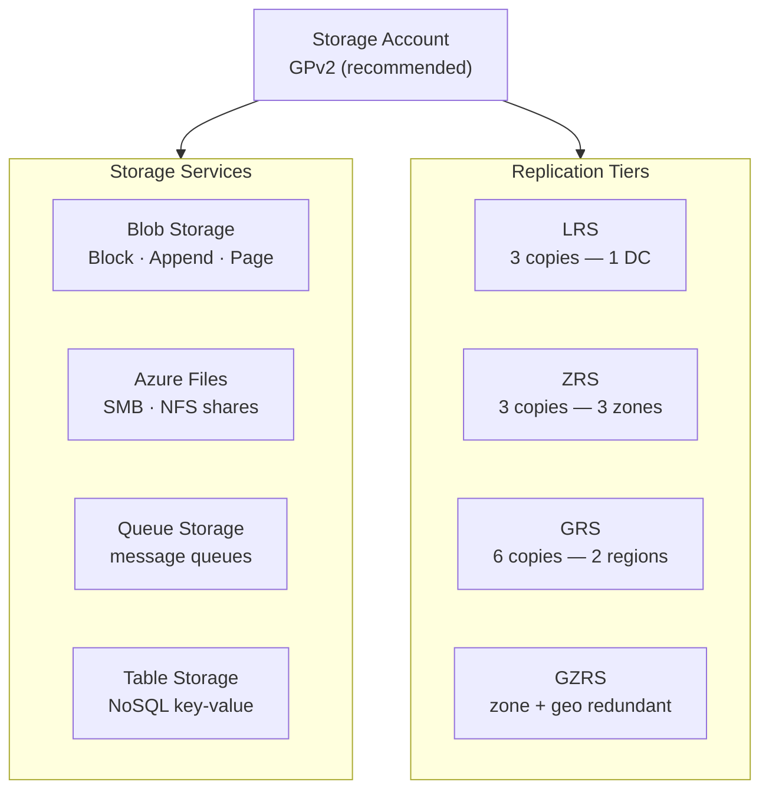

# Azure Storage Accounts


<div class="kb-summary">
Azure Storage Accounts reference covering Overview, Storage Account Service Hierarchy, Account Types, Replication Options, Creating Storage Accounts and 3 more sections.
</div>

## Overview

A Storage Account is the top-level namespace for all Azure Storage services (Blobs, Files, Queues, Tables). The account type, replication option, and access tier are set at creation and determine cost, durability, and available features.

## Storage Account Service Hierarchy



## Account Types

| Kind | SKU Options | Services | Use Case |
|---|---|---|---|
| StorageV2 (GPv2) | Standard, Premium | Blobs, Files, Queues, Tables | General purpose — recommended default |
| BlobStorage | Standard only | Blobs only | Legacy; prefer GPv2 |
| BlockBlobStorage | Premium only | Block blobs, Append blobs | High-throughput blob workloads |
| FileStorage | Premium only | Files only | Premium file shares (NFS/SMB) |

## Replication Options

| Replication | Copies | Scope | RPO | Use Case |
|---|---|---|---|---|
| LRS (Locally Redundant) | 3 | Single datacenter | 0 (sync) | Dev/test, non-critical |
| ZRS (Zone Redundant) | 3 | 3 AZs in one region | 0 (sync) | HA within a region |
| GRS (Geo-Redundant) | 6 | Primary + secondary region | ~15 min async | DR to paired region |
| GZRS (Geo-Zone Redundant) | 6 | 3 AZs primary + secondary | ~15 min async | Highest durability |
| RA-GRS / RA-GZRS | Same as above | Same as above | Same | GRS/GZRS + read access to secondary |

## Creating Storage Accounts

```bash
# Create a standard GPv2 storage account with ZRS replication
az storage account create \
  --resource-group rg-storage-prod \
  --name stproddata01 \
  --location eastus \
  --sku Standard_ZRS \
  --kind StorageV2 \
  --access-tier Hot \
  --https-only true \
  --min-tls-version TLS1_2 \
  --allow-blob-public-access false

# Create a Premium BlockBlobStorage account
az storage account create \
  --resource-group rg-storage-prod \
  --name stprodpremblob01 \
  --location eastus \
  --sku Premium_LRS \
  --kind BlockBlobStorage \
  --https-only true

# Create a Premium FileStorage account
az storage account create \
  --resource-group rg-storage-prod \
  --name stprodpremfiles01 \
  --location eastus \
  --sku Premium_LRS \
  --kind FileStorage \
  --https-only true
```

## Firewall and Network Rules

```bash
# Enable firewall and set default deny
az storage account update \
  --resource-group rg-storage-prod \
  --name stproddata01 \
  --default-action Deny \
  --bypass AzureServices Logging Metrics

# Allow access from a specific VNet subnet
az storage account network-rule add \
  --resource-group rg-storage-prod \
  --account-name stproddata01 \
  --vnet-name vnet-prod-eastus \
  --subnet snet-app

# Allow access from a specific IP range
az storage account network-rule add \
  --resource-group rg-storage-prod \
  --account-name stproddata01 \
  --ip-address "203.0.113.0/24"

# View current network rules
az storage account show \
  --resource-group rg-storage-prod \
  --name stproddata01 \
  --query "networkRuleSet" \
  --output json
```

## Access Keys and Key Management

```bash
# List access keys
az storage account keys list \
  --resource-group rg-storage-prod \
  --account-name stproddata01 \
  --output table

# Rotate key 1
az storage account keys renew \
  --resource-group rg-storage-prod \
  --account-name stproddata01 \
  --key key1

# Disable shared key access (force Azure AD auth only)
az storage account update \
  --resource-group rg-storage-prod \
  --name stproddata01 \
  --allow-shared-key-access false
```

## Listing and Auditing

```bash
# List all storage accounts in a subscription
az storage account list \
  --query "[].{name:name, rg:resourceGroup, sku:sku.name, kind:kind, location:location}" \
  --output table

# Find accounts with public blob access enabled (security audit)
az storage account list \
  --query "[?allowBlobPublicAccess==\`true\`].{name:name, rg:resourceGroup}" \
  --output table

# Find accounts still using TLS < 1.2
az storage account list \
  --query "[?minimumTlsVersion!='TLS1_2'].{name:name, tls:minimumTlsVersion}" \
  --output table

# Find accounts with shared key access enabled
az storage account list \
  --query "[?allowSharedKeyAccess==\`true\`].name" \
  --output tsv
```
