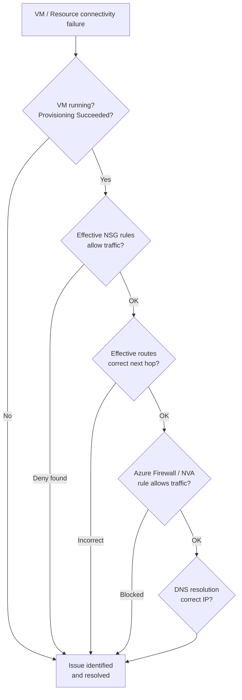

# Azure — Common Issues


<div class="kb-summary">
> Known failure modes, symptoms, causes, and fixes. See also: [Troubleshooting](../index.md) for full diagnostic procedures.
</div>

> Known failure modes, symptoms, causes, and fixes.

See also: [Troubleshooting](../index.md) for full diagnostic procedures.

---

## Azure Connectivity Triage



## VM Connectivity Issues

```bash
# 1. Check effective NSG rules on the NIC
az network nic show-effective-nsg --name <nic-name> -g <rg> | \
    jq '.effectiveNetworkSecurityGroups[].effectiveSecurityRules[] | select(.access=="Deny")'

# 2. Check effective routes on the NIC
az network nic show-effective-route-table --name <nic-name> -g <rg>

# 3. Use Network Watcher to test connectivity
az network watcher test-connectivity \
    --source-resource <source-vm-id> \
    --dest-address <destination-ip> --dest-port 443

# 4. Packet capture on NIC
az network watcher packet-capture create \
    --vm <vm-name> -g <rg> --name my-capture --storage-account <sa>
```

Common causes:
- NSG deny rule at NIC level (NIC NSG takes precedence over Subnet NSG)
- User-defined route sending traffic to wrong next hop
- Azure Firewall blocking traffic between hub and spoke
- Service endpoint not configured on subnet (for PaaS services)

## NSG Troubleshooting

```bash
# Check if traffic is allowed by NSG
az network watcher check-nsg-flow --direction Inbound \
    --protocol TCP --local 10.0.0.4 --local-port 443 \
    --remote 10.1.0.10 --remote-port 52000 \
    --nsg <nsg-id>
# Output: access = Allow or Deny, with matching rule name

# View NSG flow logs (query Log Analytics)
# Workspace → Logs:
AzureNetworkAnalytics_CL
| where SubType_s == "FlowLog"
| where FlowStatus_s == "D"   // Denied flows
| where DestIP_s == "<target-ip>"
| project TimeGenerated, SrcIP_s, DestIP_s, DestPort_d, NSGName_s, NSGRule_s
```

## Azure AD Authentication Errors

```bash
# Check token issuance via Entra ID sign-in logs
az monitor activity-log list --correlation-id <correlation-id>

# Via Entra ID portal: Monitor → Sign-in logs → filter by app/user
# Look for: failure reason, conditional access policy that blocked sign-in

# Check service principal credential expiry
az ad sp credential list --id <sp-object-id>

# If federated credential issue (OIDC):
az ad app federated-credential list --id <app-id>
```

Common causes:
- Conditional Access policy blocking (no MFA, non-compliant device, suspicious location)
- Service principal client secret expired
- Missing API permission or admin consent not granted

## Azure Storage Access Denied

```bash
# Check storage firewall rules
az storage account show -n <storage-account> --query 'networkRuleSet'

# Check role assignments on storage account
az role assignment list --scope <storage-account-resource-id>

# Test access via SAS token
az storage blob download --account-name <sa> --container-name <container> \
    --name <blob> --file /tmp/test --sas-token "<sas>"

# Check if data plane access uses Entra ID or key-based auth
# Key-based access can be disabled in Shared Key authorization:
az storage account show -n <sa> --query 'allowSharedKeyAccess'
```

## AKS Pod Not Starting

```bash
# Get pod description and events
kubectl describe pod <pod-name> -n <namespace>
kubectl get events -n <namespace> --sort-by='.lastTimestamp' | tail -20

# Check node resource pressure
kubectl describe node <node-name> | grep -A 5 "Conditions:"
kubectl top nodes

# Image pull error
kubectl get events -n <namespace> | grep "Failed to pull"
# Check Azure Container Registry firewall if using private ACR:
az acr show --name <acr-name> --query 'networkRuleSet'

# DNS resolution in pod (network policy blocking?)
kubectl run test-pod --rm -i --image=busybox -- nslookup kubernetes.default
```

## App Service 502/503

1. Azure Portal → App Service → Diagnose and solve problems → Availability and Performance
2. Check App Service Plan metrics: CPU %, Memory % (Metrics blade)
3. Review application logs: App Service → App Service Logs → enable File System logging
4. Check health probe configuration: App Service → Health Check — confirm probe returning 200

```bash
# Check App Service Plan scale out status
az appservice plan show --name <plan-name> -g <rg> \
    --query 'properties.numberOfWorkers'

# Manual scale up (if throttled)
az appservice plan update --name <plan-name> -g <rg> --sku P2V3
```
