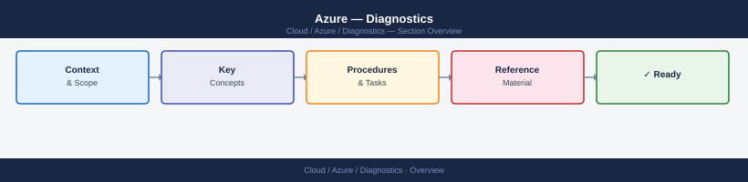

---
tags:
  - azure
  - troubleshooting
search:
  boost: 1.5
---
# Azure — Diagnostics

<div class="kb-summary">
Azure diagnostic commands: check account and subscription context with az cli, diagnose VM boot and network issues with Network Watcher, query Activity Log for recent changes, run Log Analytics KQL queries, inspect Key Vault access, and collect resource diagnostic data for Microsoft support.

*Applies to: Microsoft Azure — all core IaaS services*
</div>



```mermaid
graph TD
    A([Azure Issue]) --> B{What type of problem?}
    B -->|VM not reachable / SSH-RDP fails| C[az vm get-instance-view\nCheck power state and agent health]
    B -->|Network connectivity error| D[az network nic show-effective-nsg\nFind deny rule]
    B -->|Recent change caused regression| E[az monitor activity-log list\nFind the change event]
    B -->|VM boot failure| F[az vm boot-diagnostics get-boot-log\nRead serial console output]
    B -->|App error / log analysis| G[Log Analytics KQL\nHeartbeat or custom table]
    B -->|Key Vault access denied| H[az keyvault show\nCheck access policies and firewall]
    C --> I{Power state?}
    I -->|Stopped / deallocated| J[az vm start --name vm -g rg\nVerify billing and quota]
    I -->|Running but agent failed| K[az vm run-command invoke\nRun ipconfig or hostname]
    D --> L{Rule found?}
    L -->|Deny rule| M[az network nsg rule update\nor add allow rule with lower priority]
    L -->|No rule; check UDR| N[az network nic show-effective-route-table\nBlackhole route?]
    E --> O[Review change: who, what, when\nRoll back if recent deployment]
    F --> P[Boot error in serial log\nCheck disk, kernel panic, fstab]
    G --> Q[KQL: Heartbeat | where TimeGenerated > ago 1h\nCount by Computer]
    H --> R[Check RBAC vs access policies\nCheck network ACLs on Key Vault]
    J --> S[Collect resource diag\naz vm boot-diagnostics get-boot-log]
    K --> S
    M --> S
    N --> S
    O --> S
    P --> S
    Q --> S
    R --> S
    S --> T[Open Azure support request\nportal.azure.com → Help + support]

    classDef dark fill:#1e3a5f,color:#fff
    classDef action fill:#78350f,color:#fff
    classDef escalate fill:#991b1b,color:#fff
    class A,B,I,L dark
    class C,D,E,F,G,H,J,K,M,N,O,P,Q,R action
    class S,T escalate
```

## Before you begin

- **Access:** Verify your Azure CLI is logged in and targeting the correct subscription before running any commands
- **Gather first:** the affected VM name and resource group, the specific error (HTTP error code, SSH failure, application error), and the approximate time the issue started
- **Scope:** confirm whether the issue affects a single VM, a VNet, a subscription, or appears in the Azure Service Health dashboard (platform incident)
- **Check Azure Status first:** visit status.azure.com — if the region is degraded, customer-side investigation is limited until Microsoft resolves the platform issue

---

## Step 1 — Verify subscription context

```bash
# Confirm which account and subscription are active
az account show
# Check: id (subscription ID), name, state (Enabled), tenantId

# List all subscriptions accessible to this identity
az account list -o table

# Switch to the correct subscription
az account set --subscription "<subscription-name-or-id>"

# Verify access to the affected resource group
az group show -n <rg-name>
# Error "ResourceGroupNotFound" = wrong subscription; error 403 = insufficient RBAC
```

---

## Step 2 — Check VM state and health

```bash
# Get VM power state and guest agent / extension status
az vm get-instance-view --name <vm-name> -g <rg> -o json
# Key fields:
#   statuses[].displayStatus: "VM running" (expected) or "VM stopped" / "VM deallocated"
#   extensions[].statuses[].displayStatus: "Provisioning succeeded" (expected)
#   extensions[].statuses[].message: extension error detail if failed

# Start a stopped VM
az vm start --name <vm-name> -g <rg>

# List extensions and their statuses
az vm extension list --vm-name <vm-name> -g <rg> -o table

# Run a command on the VM via Azure guest agent (no SSH or RDP needed)
az vm run-command invoke --command-id RunShellScript \
  --name <vm-name> -g <rg> \
  --scripts "df -h && ip addr show && ss -tulnp | grep LISTEN"
# Use RunPowerShellScript for Windows VMs:
# --scripts "Get-Service | Where-Object Status -eq Stopped"
```

---

## Step 3 — Read boot diagnostics

Boot diagnostics captures the VM's serial console output — available even when the OS is unresponsive or crashed.

```bash
# Get the serial console log (text)
az vm boot-diagnostics get-boot-log --name <vm-name> -g <rg>
# Look for:
#   Kernel panic: system crashed; check disk or memory
#   Starting: normal boot sequence
#   GRUB error / fstab error: disk or volume mount failed
#   cloud-init: cloud-init failure (SSH key injection, disk resize)

# Enable boot diagnostics if not already enabled (requires storage account)
az vm boot-diagnostics enable --name <vm-name> -g <rg> \
  --storage "https://<sa-name>.blob.core.windows.net"

# Get boot diagnostics screenshot (PNG of the VM console)
az vm boot-diagnostics get-boot-log-uri --name <vm-name> -g <rg>
```

---

## Step 4 — Check NSG and routing

```bash
# Show effective NSG rules applied to a VM's NIC
az network nic show-effective-nsg --name <nic-name> -g <rg>
# Columns: name, protocol, sourcePort, destinationPort, access (Allow/Deny), priority
# Look for: a Deny rule that matches the traffic you expect to be allowed

# Get the NIC name if unknown
az network nic list --query "[?virtualMachine.id contains '${VM_NAME}'].{name: name, rg: resourceGroup}" -o table

# Test connectivity from a source VM to a destination
az network watcher test-connectivity \
  --source-resource <source-vm-resource-id> \
  --dest-address <destination-ip-or-fqdn> \
  --dest-port 443
# Returns: connectionStatus (Reachable/Unreachable), hop-by-hop path, and latency

# Show effective routes on a NIC (to find blackhole routes)
az network nic show-effective-route-table --name <nic-name> -g <rg> -o table
# Look for: nextHopType = None (blackhole); addressPrefix matching your destination

# Start a packet capture on a VM (requires Network Watcher extension on VM)
az network watcher packet-capture create \
  --vm <vm-name> -g <rg> \
  --name diag-capture \
  --storage-account <sa-name> \
  --filters '[{"protocol":"TCP","localIPAddress":"","localPort":"","remoteIPAddress":"","remotePort":"443"}]'
```

---

## Step 5 — Check Activity Log for recent changes

```bash
# Last 50 events in the subscription (sorted by most recent)
az monitor activity-log list --max-events 50 \
  --query '[*].[eventTimestamp,level,operationName.localizedValue,resourceGroupName,status.localizedValue]' \
  -o table

# Filter by resource group and time window
az monitor activity-log list \
  --resource-group <rg> \
  --start-time "2026-06-15T08:00:00Z" \
  --end-time   "2026-06-15T12:00:00Z" \
  --query '[*].[eventTimestamp,caller,operationName.localizedValue,status.localizedValue]' \
  -o table

# Filter for failed operations only
az monitor activity-log list --resource-group <rg> --max-events 100 \
  --query '[?status.value==`Failed`].[eventTimestamp,caller,operationName.localizedValue,properties.statusCode]' \
  -o table

# Look for: who made a change (caller), what operation (operationName), when (eventTimestamp)
# Common patterns: NSG rule updates, VM extensions deployed/failed, scale events
```

---

## Step 6 — Query Log Analytics

```kusto
// VM heartbeat — find VMs that stopped reporting (may indicate crash or agent failure)
Heartbeat
| summarize LastSeen = max(TimeGenerated) by Computer
| where LastSeen < ago(5m)
| order by LastSeen asc

// Failed Windows logins (brute force indicator)
SecurityEvent
| where EventID == 4625
| summarize count() by Account, IpAddress, Computer
| order by count_ desc

// NSG denied flows (requires NSG flow logs enabled)
AzureNetworkAnalytics_CL
| where SubType_s == "FlowLog" and FlowStatus_s == "D"
| project TimeGenerated, SrcIP_s, DestIP_s, DestPort_d, NSGName_s, NSGRule_s
| order by TimeGenerated desc

// VM CPU and memory (requires Azure Monitor agent)
Perf
| where ObjectName == "Processor" and CounterName == "% Processor Time"
| summarize avg(CounterValue) by Computer, bin(TimeGenerated, 5m)
| order by TimeGenerated desc
```

---

## Step 7 — Check Key Vault access

```bash
# Verify Key Vault is accessible and show its state
az keyvault show --name <kv-name> -o json
# Check: properties.provisioningState = Succeeded; properties.enableSoftDelete = true

# List access policies (RBAC-disabled vaults)
az keyvault show --name <kv-name> \
  --query 'properties.accessPolicies[].{objectId:objectId,permissions:permissions}' -o table

# Check Key Vault firewall rules
az keyvault show --name <kv-name> --query 'properties.networkAcls' -o json
# If networkAcls.defaultAction = Deny: the caller's IP must be in ipRules or bypass = AzureServices

# Check RBAC permissions for a specific principal (RBAC-enabled vaults)
az role assignment list --scope "/subscriptions/<sub>/resourceGroups/<rg>/providers/Microsoft.KeyVault/vaults/<kv>" \
  --assignee <object-id-or-upn> -o table

# Test reading a secret from the Key Vault
az keyvault secret show --vault-name <kv-name> --name <secret-name>
# Error 403 = RBAC or access policy missing; Error 404 = secret does not exist
```

---

## Log locations

| Source | Command / Location | What to look for |
|---|---|---|
| Boot diagnostics | `az vm boot-diagnostics get-boot-log` | OS crash, fstab, kernel panic |
| Activity Log | `az monitor activity-log list` | Recent changes: NSG rules, deployments |
| VM guest OS | `az vm run-command invoke` or SSH | Application errors, OS-level issues |
| Log Analytics | KQL via portal or `az monitor log-analytics query` | Heartbeat, security events, performance |
| NSG flow logs | `AzureNetworkAnalytics_CL` in Log Analytics | Denied flows, source/destination |
| Azure Service Health | `az monitor service-health alert list` | Platform-level incidents |

---

## See also

- [Azure — Common Issues](../common-issues/)
- [Azure — Escalation](../escalation/)
- [Azure — Health Checks](../../operations/health-checks/)

## Verify resolution

- `az vm get-instance-view` shows `displayStatus: VM running` and guest agent `Provisioning succeeded`
- `az network watcher test-connectivity` returns `connectionStatus: Reachable` for the previously failing path
- Log Analytics `Heartbeat` query shows the VM appearing with `TimeGenerated` within the last 5 minutes
- The original application error does not recur for 15 minutes after the fix
- Activity Log shows no new Failed operations on the affected resource after the fix
