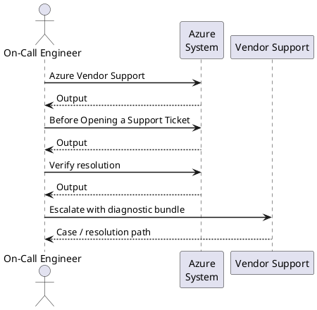

---
tags:
  - azure
  - troubleshooting
search:
  boost: 1.5
---
# Azure — Escalation

<div class="kb-summary">
What to collect before opening a support case and how to engage Microsoft support.

*Applies to: Azure*
</div>

---



## Before you begin

- **Access:** Admin credentials on all affected systems
- **Gather first:** recent error message text, event timestamps, and affected object names
- **Scope:** confirm whether the issue affects a single object, host, cluster, or site
- **Escalation:** open a vendor support ticket before running any destructive step
- **Logging:** document each command and output — required if escalation is needed

---

## Azure Vendor Support

Azure Support plans range from Developer (business-hours email, general guidance) through Standard (24/7 phone, <2 hr critical response) and Professional Direct (24/7 phone, <1 hr critical response, ProDirect engineer) to Premier/Unified (dedicated support, <15 min critical response, proactive services). Support tickets are opened via the Azure Portal under Help + Support or programmatically via the Azure Support API. Before opening a ticket, collect the subscription ID, affected resource IDs, region, timestamp of the issue, and relevant diagnostic logs from Azure Monitor or the Activity Log.

| Plan | Best for | Critical response SLA |
|---|---|---|
| Developer | Dev/test, non-production | < 8 hours (business hours) |
| Standard | Production workloads | < 2 hours |
| Professional Direct | Business-critical production | < 1 hour |
| Premier / Unified | Enterprise / mission-critical | < 15 minutes + TAM |

**Key resources:**

- Azure Portal Support: `portal.azure.com` → Help + Support → Create a support request
- Azure Service Health: `portal.azure.com/#blade/Microsoft_Azure_Health` — service issues, planned maintenance, health advisories
- Microsoft FastTrack for Azure: deployment guidance for eligible workloads (>= $5k/month spend)
- Support API: `az support tickets create` (requires appropriate support plan)

---

## Before Opening a Support Ticket

Collect the following before contacting Microsoft Support:

- Subscription ID: `az account show --query id -o tsv`
- Affected resource IDs: `az resource show --name <name> -g <rg> --query id -o tsv`
- Region and time of issue (UTC)
- Activity Log events around the incident time
- Azure Monitor alert details and metric screenshots
- Diagnostic logs from the affected resource

```bash
# Collect subscription and resource info
az account show --query '{SubscriptionId:id, Name:name, TenantId:tenantId}' -o json

# Export Activity Log for the incident window
az monitor activity-log list \
  --start-time <start-utc> \
  --end-time <end-utc> \
  --resource-group <rg> \
  --output json > activity-log-export.json

# Create support ticket via CLI (requires active support plan)
az support tickets create \
  --ticket-name "incident-$(date +%Y%m%d)" \
  --title "Description of issue" \
  --description "Detailed description" \
  --problem-classification "/providers/Microsoft.Support/services/<service>/problemClassifications/<id>" \
  --severity "critical" \
  --contact-first-name "<name>" \
  --contact-last-name "<name>" \
  --contact-method "email" \
  --contact-email "<email>"
```


```text title="Expected output"
{
  "SubscriptionId": "a1b2c3d4-e5f6-4789-a012-b3c4d5e6f7a8",
  "Name": "Production-Subscription",
  "TenantId": "f7e6d5c4-b3a2-1098-7654-fedcba987654"
}
(no output — command completes silently)
{
  "id": "/subscriptions/a1b2c3d4-e5f6-4789-a012-b3c4d5e6f7a8/providers/microsoft.insights/eventTypes/management/values/Administrative",
  "operationName": {
    "value": "Microsoft.Compute/virtualMachines/write",
    "localizedValue": "Create or Update Virtual Machine"
  },
  "resourceId": "/subscriptions/a1b2c3d4-e5f6-4789-a012-b3c4d5e6f7a8/resourceGroups/prod-rg/providers/Microsoft.Compute/virtualMachines/vm-prod-01",
  "resourceGroupName": "prod-rg",
  "eventTimestamp": "2024-01-15T14:32:18.123456Z",
  "status": {
    "value": "Succeeded",
    "localizedValue": "Succeeded"
  }
}
{
  "id": "/subscriptions/a1b2c3d4-e5f6-4789-a012-b3c4d5e6f7a8/providers/microsoft.support/supportTickets/2024011501",
  "name": "2024011501",
  "type": "Microsoft.Support/supportTickets",
  "properties": {
    "supportTicketId": "2024011501",
    "title": "Description of issue",
    "description": "Detailed description",
    "severity": "critical",
    "status": "Open",
    "createdDate": "2024-01-15T14:35:22Z"
  }
}
```

!!! warning "Common errors"
    **`The subscription 'a1b2c3d4-e5f6-4789-a012-b3c4d5e6f7a8' could not be found.`** — Verify the subscription ID with `az account list` and set the correct subscription using `az account set --subscription <id>`.
    **`This operation requires a support plan. Please contact support or upgrade your support plan.`** — Ensure your Azure subscription has an active support plan (Standard, Professional Direct, or Premier) before creating tickets via CLI.
    **`Invalid problem classification ID provided.`** — Retrieve valid problem classification IDs using `az support services problem-classifications list --service-name <service-name>` and use the correct format.
---

## Verify resolution

- Confirm the original symptom no longer occurs
- Check logs for any residual errors related to the issue
- Monitor for 10–15 minutes to confirm the fix is stable

---

## See also

- [Azure — Diagnostics](../diagnostics/)
- [Azure — Common Issues](../common-issues/)
