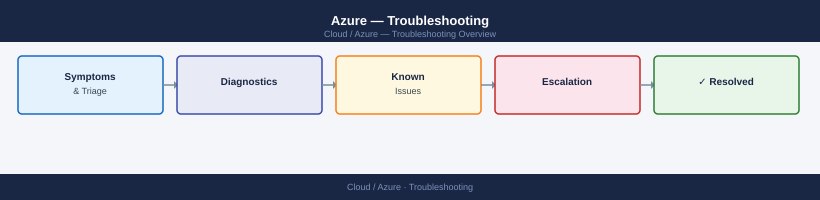

---
tags:
  - azure
  - troubleshooting
search:
  boost: 1.5
---
# Azure — Troubleshooting


<div class="kb-summary">
Troubleshooting reference covering NSG Troubleshooting, Azure AD Authentication Errors, Azure Storage Access Denied, AKS Pod Not Starting, App Service 502/503.

*Applies to: Azure*
</div>



<div class="kb-grid kb-grid-3">

<a class="kb-card" href="common-issues/">
  <strong>Common Issues</strong>
  <span>Known problems, symptoms, and resolution steps.</span>
</a>

<a class="kb-card" href="diagnostics/">
  <strong>Diagnostics</strong>
  <span>Diagnostic commands, log locations, and data collection.</span>
</a>

<a class="kb-card" href="escalation/">
  <strong>Escalation</strong>
  <span>When and how to escalate to Microsoft Support with the right data.</span>
</a>

</div>

Common causes:
- Conditional Access policy blocking (no MFA, non-compliant device, suspicious location)
- Service principal client secret expired
- Missing API permission or admin consent not granted

```d2
direction: down

symptom: Identify Symptom {shape: diamond}
azure_storage_access_denied: "Azure Storage Access Denied" {shape: rectangle}
aks_pod_not_starting: "AKS Pod Not Starting" {shape: rectangle}
app_service_502503: "App Service 502/503" {shape: rectangle}
resolution: Resolve or Escalate {shape: oval}

symptom -> azure_storage_access_denied: investigate
symptom -> aks_pod_not_starting: investigate
symptom -> app_service_502503: investigate
azure_storage_access_denied -> resolution
aks_pod_not_starting -> resolution
app_service_502503 -> resolution
```

## Azure Storage Access Denied

```bash
# Check storage firewall rules
az storage account show -n <storage-account> --query 'networkRuleSet'

# Check role assignments on storage account
az role assignment list --scope <storage-account-resource-id>

# Test access via SAS token
az storage blob download --account-name <sa> --container-name <container> \
    --name <blob> --file /tmp/test --sas-token "<sas>"

# Check if data plane access uses Entra ID or key-based auth
# Key-based access can be disabled in Shared Key authorization:
az storage account show -n <sa> --query 'allowSharedKeyAccess'
```

## AKS Pod Not Starting

```bash
# Get pod description and events
kubectl describe pod <pod-name> -n <namespace>
kubectl get events -n <namespace> --sort-by='.lastTimestamp' | tail -20

# Check node resource pressure
kubectl describe node <node-name> | grep -A 5 "Conditions:"
kubectl top nodes

# Image pull error
kubectl get events -n <namespace> | grep "Failed to pull"
# Check Azure Container Registry firewall if using private ACR:
az acr show --name <acr-name> --query 'networkRuleSet'

# DNS resolution in pod (network policy blocking?)
kubectl run test-pod --rm -i --image=busybox -- nslookup kubernetes.default
```

**Expected output:** Node conditions show `Ready True`. `kubectl top nodes` shows CPU and memory below 80%. DNS test returns an address for `kubernetes.default`. Events show `Pulled` and `Started` rather than `BackOff` or `ErrImagePull`.

## App Service 502/503

1. Azure Portal → App Service → Diagnose and solve problems → Availability and Performance
2. Check App Service Plan metrics: CPU %, Memory % (Metrics blade)
3. Review application logs: App Service → App Service Logs → enable File System logging
4. Check health probe configuration: App Service → Health Check — confirm probe returning 200

```bash
# Check App Service Plan scale out status
az appservice plan show --name <plan-name> -g <rg> \
    --query 'properties.numberOfWorkers'

# Manual scale up (if throttled)
az appservice plan update --name <plan-name> -g <rg> --sku P2V3
```
