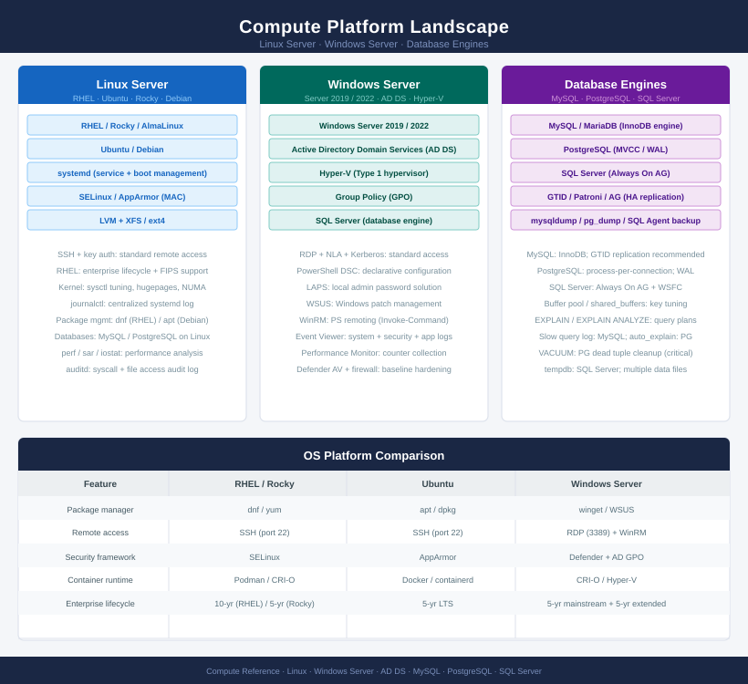
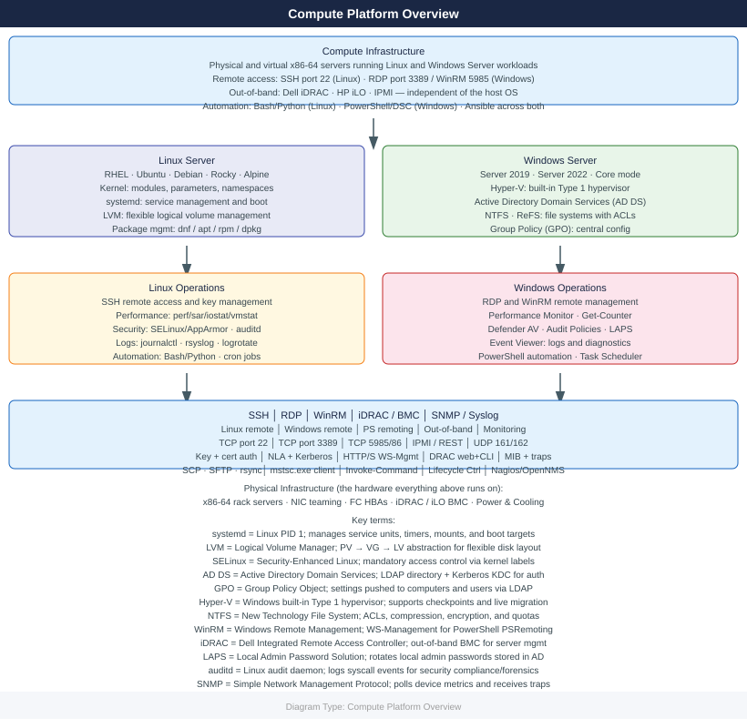

# Compute

Compute platform knowledge base covering Windows Server, Linux, GPU workloads, and local AI (Ollama). Includes architecture references, server build standards, operational procedures, CLI commands, patching and lifecycle management, performance troubleshooting, and security hardening guides.

<a class="kb-card" href="windows-server/"><strong>Windows Server</strong>Architecture, standards, lifecycle, operations, CLI, scripts, troubleshooting, and security.</a>
<a class="kb-card" href="linux/"><strong>Linux</strong>Architecture, standards, lifecycle, operations, CLI, scripts, troubleshooting, and security.</a>
<a class="kb-card" href="local-ai/"><strong>Local AI & GPU</strong>Run LLMs locally with Ollama and manage GPU workloads — drivers, CUDA, sizing, and performance tuning.</a>

