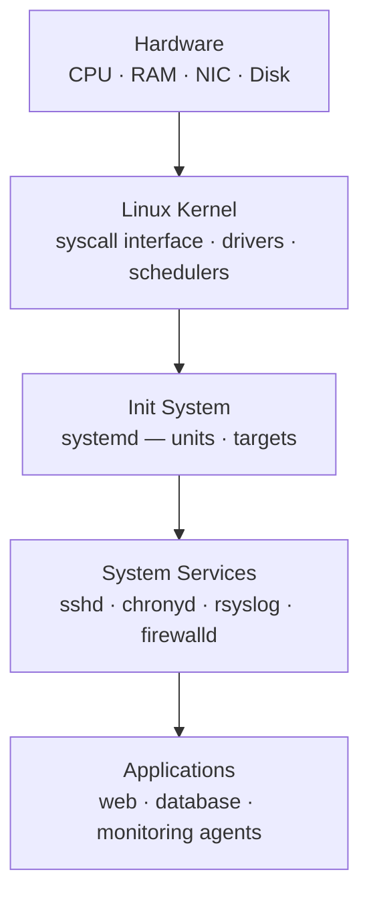

# Linux — Standards

Sizing guidelines, design standards, and best practices.

## Naming Convention

```text
<site>-<role>-<nn>
```
┌────────────────────────────────────── Linux — Design Standards ───────────────────────────────────────┐
│                                                                                                       │
│   ┌───────────────────────────────────────────────────────────────────────────────────────────────┐   │
│   │                                    Build & Naming Standards                                   │   │
│   │         Hostname convention: role-dc-seq (e.g. web-lon-001); FQDN in /etc/hosts + DNS         │   │
│   │             Approved distros: RHEL 8/9 · Rocky 8/9 · Ubuntu 22.04 LTS · Debian 12             │   │
│   │             Kernel: maintain vendor-supported; custom kernels require CAB approval            │   │
│   │            Time: chronyd synced to internal NTP; timezone UTC for all server builds           │   │
│   └───────────────────────────────────────────────────────────────────────────────────────────────┘   │
│                                                                                                       │
│    Consistent build standards reduce configuration drift and simplify troubleshooting                 │
│                                                                                                       │
│                          ▼                                                 ▼                          │
│                                                                                                       │
│   ┌──────────────────────────────────────────────┐  ┌─────────────────────────────────────────────┐   │
│   │               Partition Layout               │  │              Hardening Baseline             │   │
│   │          /boot: 1 GB xfs (separate)          │  │        SSH: PasswordAuth no; root no        │   │
│   │             /: 20 GB xfs on LVM              │  │           SELinux: enforcing mode           │   │
│   │           /var: 20 GB (log growth)           │  │        firewalld: default-deny zones        │   │
│   │           /var/log: separate 10 GB           │  │         auditd: CIS rule set enabled        │   │
│   │            /home: separate 10 GB             │  │        AIDE: file integrity baseline        │   │
│   └──────────────────────────────────────────────┘  └─────────────────────────────────────────────┘   │
│                                                                                                       │
│  Physical Infrastructure (the hardware everything above runs on):                                     │
│  x86-64 servers · SSD/NVMe boot · LVM volumes · iDRAC BMC · NIC · Power & Cooling                     │
│                                                                                                       │
│  Key terms:                                                                                           │
│                                                                                                       │
│  LVM         = Logical Volume Manager; enables flexible resizing of volumes without repartition       │
│  SELinux     = Security-Enhanced Linux; MAC enforcement with targeted/enforcing policy                │
│  firewalld   = Dynamic firewall daemon using zones and nftables rules under the hood                  │
│  auditd      = Linux audit daemon; records syscall events for CIS/STIG compliance                     │
│  AIDE        = Advanced Intrusion Detection Environment; detects file system changes                  │
│  chronyd     = NTP client/server daemon; preferred over ntpd on RHEL/Rocky/Ubuntu                     │
│  FQDN        = Fully Qualified Domain Name; hostname + domain (host.example.com)                      │
│  CIS         = Center for Internet Security; publishes hardening benchmarks for Linux                 │
│  STIG        = Security Technical Implementation Guide; DoD hardening specification                   │
│  CAB         = Change Advisory Board; reviews and approves infrastructure changes                     │
│  UTC         = Coordinated Universal Time; used on servers to avoid DST ambiguity                     │
│  XFS         = High-performance journaling filesystem; default on RHEL/Rocky Linux                    │
│                                                                                                       │
└───────────────────────────────────────────────────────────────────────────────────────────────────────┘

## Authentication

```bash
# SSH key-based authentication only
# /etc/ssh/sshd_config enforced via Ansible
PasswordAuthentication no
PermitRootLogin no
ChallengeResponseAuthentication no
PubkeyAuthentication yes
```

Sudo access granted via AD group membership:
```bash
# /etc/sudoers.d/infra-admins
%infra_admins ALL=(ALL) ALL
# No NOPASSWD — all privileged operations require password confirmation
```

## NTP Configuration

```bash
# /etc/chrony.conf (RHEL)
server ntp1.example.local iburst
server ntp2.example.local iburst
makestep 1.0 3
rtcsync
```

Verify: `chronyc tracking` — `System time` offset should be < 1ms.

## Syslog Forwarding

```bash
# /etc/rsyslog.d/00-forward.conf
*.info @siem.example.local:514
# Or TLS:
*.info @@siem.example.local:6514
```

## Package Repository Policy

Production servers point only to approved internal mirrors:
```bash
# RHEL: subscription-manager repos — configure approved repos only
subscription-manager repos --disable="*" --enable=rhel-9-for-x86_64-baseos-rpms --enable=rhel-9-for-x86_64-appstream-rpms

# Ubuntu: /etc/apt/sources.list — point to internal mirror
deb http://mirror.example.local/ubuntu jammy main restricted universe
```

No direct internet access from production servers — all package traffic via mirror.

## OS Component Stack



## Software Installation Policy

- All packages installed from approved repositories only
- No manual compilation from source in production
- Third-party RPMs/DEBs signed and hosted in the internal repository
- Package additions require a change record

---


## Hostname and DNS Configuration

Hostnames follow the server naming convention `{site}{role}{env}{num}` (see naming-conventions/servers). The hostname must be set persistently and match forward and reverse DNS before a build is marked complete.

```bash
# Set hostname
hostnamectl set-hostname dc1-wapp-prd-01

# Confirm FQDN resolves correctly
getent hosts dc1-wapp-prd-01.corp.example.com
dig +short dc1-wapp-prd-01.corp.example.com
dig +short -x 10.10.4.21
```

DNS resolver configuration is managed by Ansible. `/etc/resolv.conf` must not be edited manually on RHEL/Ubuntu; use `nmcli` or the Ansible `dns_baseline` role.

```ini
# /etc/resolv.conf (managed — do not edit)
search corp.example.com example.com
nameserver 10.10.0.10
nameserver 10.10.0.11
options timeout:2 attempts:3
```

## NTP Configuration

All Linux servers synchronise to internal NTP servers only. External NTP access is blocked at the perimeter firewall.

```ini
# /etc/chrony.conf — managed by Ansible role ntp_baseline
server 10.10.0.5 iburst prefer
server 10.10.0.6 iburst
driftfile /var/lib/chrony/drift
makestep 1.0 3
rtcsync
logdir /var/log/chrony
```

Verify sync:

```bash
chronyc tracking
chronyc sources -v
```

Expected: reference time offset under 100 ms, stratum 3 or better. An alert fires if offset exceeds 500 ms for more than 5 minutes.

## SSH and sudo Configuration

SSH daemon configuration is enforced via the `ssh_baseline` Ansible role.

| Parameter | Required Value |
|---|---|
| `PermitRootLogin` | `no` |
| `PasswordAuthentication` | `no` |
| `PubkeyAuthentication` | `yes` |
| `Protocol` | `2` |
| `MaxAuthTries` | `3` |
| `ClientAliveInterval` | `300` |
| `ClientAliveCountMax` | `2` |
| `AllowGroups` | `sshusers` |
| `Banner` | `/etc/ssh/banner` |

sudo is configured via `/etc/sudoers.d/` drop-in files only. The base `/etc/sudoers` must not be modified directly. Engineers receive sudo via AD group membership; service accounts get targeted command whitelists.

```bash
# /etc/sudoers.d/ops-admins
%ops-admins ALL=(ALL) NOPASSWD: ALL

# /etc/sudoers.d/svc-backup
svc-backup ALL=(root) NOPASSWD: /usr/bin/rsync, /usr/bin/tar
```

Run `visudo -c` after any sudoers change to confirm no syntax errors.

## Required Packages and Kernel Parameters

**Mandatory packages installed at build time:**

- `chrony` — time sync
- `rsyslog` — system logging
- `audit` / `auditd` — kernel audit framework
- `aide` — file integrity monitoring
- `nmap-ncat` — connectivity testing
- `open-vm-tools` — VMware guest tools (VM builds only)
- `cloud-init` — cloud builds only

**Kernel parameters (`/etc/sysctl.d/99-baseline.conf`):**

```ini
net.ipv4.ip_forward = 0
net.ipv4.conf.all.accept_redirects = 0
net.ipv4.conf.all.send_redirects = 0
net.ipv4.conf.all.accept_source_route = 0
net.ipv4.tcp_syncookies = 1
fs.suid_dumpable = 0
kernel.core_pattern = |/bin/false
```

Apply without reboot: `sysctl --system`

## Syslog and Audit Configuration

Remote syslog forwarding to the central SIEM is mandatory. The `rsyslog_baseline` Ansible role deploys:

```bash
# /etc/rsyslog.d/50-remote.conf
*.* @@siem.corp.example.com:514;RSYSLOG_ForwardFormat
```

The audit daemon must be running and enabled at boot. Baseline audit rules capture:

- All auth events (watches on `/etc/passwd`, `/etc/shadow`, `/etc/group`)
- `sudo` invocations via PAM
- Privileged command execution
- File opens with write intent on key paths under `/etc`

```bash
systemctl enable --now auditd rsyslog
ausearch -k privileged --start today | head -40
```

Log retention on the host: 30 days rolling via `logrotate`. Long-term retention is handled by the SIEM (90 days hot, 1 year cold).

## Build Completion Checklist

Before a Linux build is marked complete, confirm all items below:

- [ ] Hostname set; DNS forward and reverse resolve correctly
- [ ] NTP synced; `chronyc tracking` shows offset under 100 ms
- [ ] SSH key-auth only; root login disabled; `sshd_config` matches baseline
- [ ] All mandatory packages installed and services enabled at boot
- [ ] `sysctl` baseline applied and survives reboot
- [ ] `rsyslog` forwarding confirmed (test event visible in SIEM)
- [ ] `auditd` running; baseline rules loaded (`auditctl -l`)
- [ ] No pending security patches (`yum/dnf/apt` security update count = 0)
- [ ] Server visible in monitoring platform within 15 minutes of first boot
- [ ] AIDE database initialised (`aide --init`)
