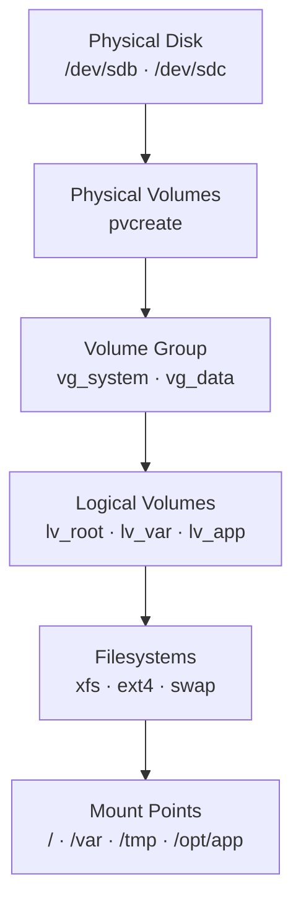
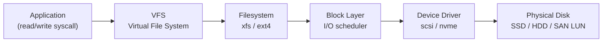

# Linux — How It Works

## Overview

Linux servers run RHEL, Ubuntu, or SLES as the base OS. All services are managed by **systemd**, storage is managed via **LVM2** (with dm-multipath for SAN), and security is enforced by **SELinux** (RHEL) or **AppArmor** (Ubuntu). Network configuration uses NetworkManager (`nmcli`) on RHEL and Netplan on Ubuntu.

## Kernel Subsystem Architecture


## Server Roles

| Role | Typical OS | vCPU | RAM | Notes |
|---|---|---|---|---|
| Application server | RHEL 8/9, Ubuntu 22.04 | 4–16 | 8–64 GB | Primary workload host |
| Automation node (Ansible) | RHEL 9 | 4 | 8 GB | Ansible control plane; no inbound access |
| Monitoring server | Ubuntu 22.04 | 8 | 16 GB | Prometheus, Grafana, exporters |
| NFS/SMB file host | RHEL 9 | 4 | 16 GB | Shared storage; LVM on SAN-backed LUNs |
| Container host | RHEL 9 | 8–32 | 16–128 GB | Podman/Docker workloads |
| Backup proxy | RHEL 9 | 8 | 16 GB | Veeam proxy or NetBackup media server |

## Disk Layout

Standard LVM partition layout — applied at provisioning via Kickstart or cloud-init:

```text
/boot          512 MB      xfs     (separate /boot partition — not in LVM)
VG: vg_system
  lv_root     20 GB       xfs     /
  lv_var      20 GB       xfs     /var
  lv_tmp       5 GB       xfs     /tmp (noexec,nosuid mount options)
  lv_home      5 GB       xfs     /home
  lv_swap      8 GB       swap    (= RAM, up to 16 GB max)

VG: vg_data (application data — sized per role)
  lv_app      100+ GB     xfs     /opt/<app>
```

## LVM Stack



## Storage Stack



## Network Stack

All production servers require bonded LACP uplinks and separate management/data VLANs:

```bash
# Configure bonded interface with VLAN (RHEL / nmcli)
nmcli con add type bond ifname bond0 bond.options "mode=802.3ad,miimon=100"
nmcli con add type ethernet ifname eth0 master bond0
nmcli con add type ethernet ifname eth1 master bond0
nmcli con add type vlan con-name bond0.100 dev bond0 id 100
nmcli con modify bond0.100 ipv4.addresses <ip>/<prefix> ipv4.gateway <gw> ipv4.method manual
```

## Key CLI Commands

```bash
# Service management (systemd)
systemctl status <service>
journalctl -u <service> -n 100 --no-pager

# Package updates
dnf check-update && dnf upgrade    # RHEL
apt-get update && apt-get upgrade  # Ubuntu

# LVM
pvs && vgs && lvs
lvextend -L +20G /dev/vg_data/lv_app && xfs_growfs /opt/app

# Network
ip -br addr && ip route show
ss -tulnp
ethtool <interface> | grep -E "Link detected|Speed"

# Storage
lsblk -o NAME,SIZE,TYPE,MOUNTPOINT,FSTYPE
multipath -ll
df -h && iostat -xz 1 5

# SAN / iSCSI
iscsiadm -m session
rescan-scsi-bus.sh

# Firewall
firewall-cmd --list-all          # RHEL
ufw status verbose               # Ubuntu
```
