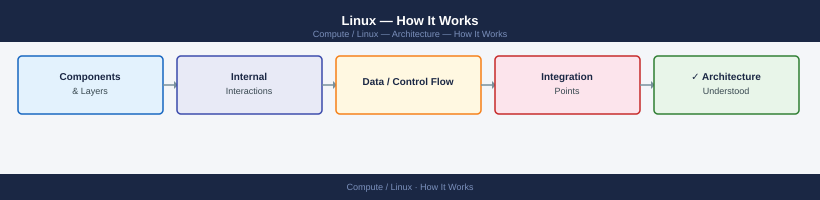
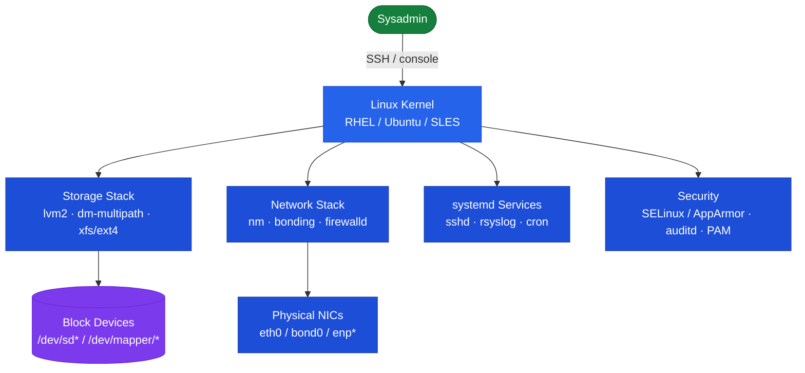
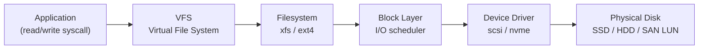

---
tags:
  - architecture
  - linux
---
# Linux — How It Works


<div class="kb-summary">
How It Works reference covering Overview, Kernel Subsystem Architecture, LVM Stack, Storage Stack, Network Stack and 1 more sections.

*Applies to: RHEL 8.x / 9.x · Ubuntu 22.04 / 24.04*
</div>



## Overview

Linux servers run RHEL, Ubuntu, or SLES as the base OS. All services are managed by **systemd**, storage is managed via **LVM2** (with dm-multipath for SAN), and security is enforced by **SELinux** (RHEL) or **AppArmor** (Ubuntu). Network configuration uses NetworkManager (`nmcli`) on RHEL and Netplan on Ubuntu.

## Kernel Subsystem Architecture




## Storage Stack



## Network Stack

All production servers require bonded LACP uplinks and separate management/data VLANs:

```bash
# Configure bonded interface with VLAN (RHEL / nmcli)
nmcli con add type bond ifname bond0 bond.options "mode=802.3ad,miimon=100"
nmcli con add type ethernet ifname eth0 master bond0
nmcli con add type ethernet ifname eth1 master bond0
nmcli con add type vlan con-name bond0.100 dev bond0 id 100
nmcli con modify bond0.100 ipv4.addresses <ip>/<prefix> ipv4.gateway <gw> ipv4.method manual
```

## Key CLI Commands

```bash
# Service management (systemd)
systemctl status <service>
journalctl -u <service> -n 100 --no-pager

# Package updates
dnf check-update && dnf upgrade    # RHEL
apt-get update && apt-get upgrade  # Ubuntu

# LVM
pvs && vgs && lvs
lvextend -L +20G /dev/vg_data/lv_app && xfs_growfs /opt/app

# Network
ip -br addr && ip route show
ss -tulnp
ethtool <interface> | grep -E "Link detected|Speed"

# Storage
lsblk -o NAME,SIZE,TYPE,MOUNTPOINT,FSTYPE
multipath -ll
df -h && iostat -xz 1 5

# SAN / iSCSI
iscsiadm -m session
rescan-scsi-bus.sh

# Firewall
firewall-cmd --list-all          # RHEL
ufw status verbose               # Ubuntu
```

---

## See also

- [Linux — Design Standards](../design-standards/)
- [Linux — Integrations](../integrations/)
- [Linux — Deploy](../../deploy/)
