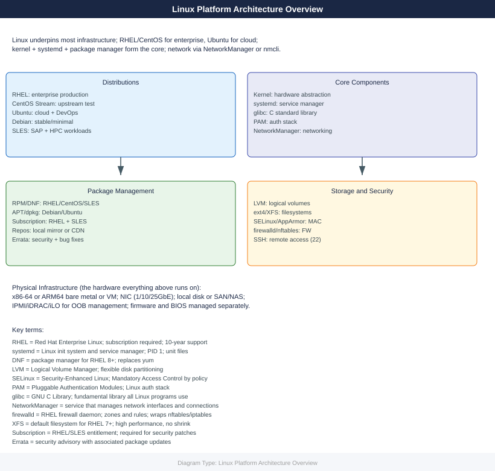
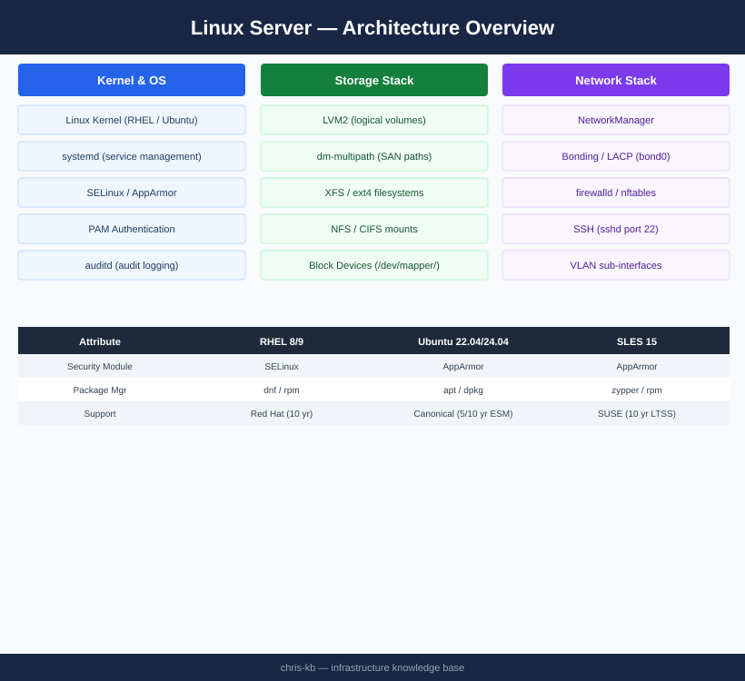

---
tags:
  - architecture
  - linux
---
# Linux — Architecture

Linux server infrastructure running RHEL and Ubuntu — systemd service management, LVM2 storage with dm-multipath, LACP bonded networking, SELinux/AppArmor security enforcement, and Ansible-driven automation.

*Applies to: RHEL 8.x / 9.x · Ubuntu 22.04 / 24.04*

  <a class="kb-card" href="how-it-works/">
    
⚙️

    
How It Works

    
Kernel subsystem architecture, server roles, LVM storage stack, network stack, and key CLI reference.

  </a>
  <a class="kb-card" href="integrations/">
    
🔗

    
Integrations

    
SAN/NFS storage connectivity, Ansible automation, monitoring (Prometheus/Grafana), and AD/LDAP auth.

  </a>
  <a class="kb-card" href="design-standards/">
    
📐

    
Design Standards

    
Disk layout standards, VLAN and bonding design, package repository policy, and hardening baseline.

  </a>

## Server Roles

| Role | Typical OS | vCPU | RAM | Notes |
|---|---|---|---|---|
| Application server | RHEL 8/9, Ubuntu 22.04 | 4–16 | 8–64 GB | Primary workload host |
| Automation node (Ansible) | RHEL 9 | 4 | 8 GB | Control plane; no inbound access |
| Monitoring server | Ubuntu 22.04 | 8 | 16 GB | Prometheus, Grafana, exporters |
| NFS/SMB file host | RHEL 9 | 4 | 16 GB | Shared storage; LVM on SAN-backed LUNs |
| Container host | RHEL 9 | 8–32 | 16–128 GB | Podman/Docker workloads |
| Backup proxy | RHEL 9 | 8 | 16 GB | Veeam proxy or NetBackup media server |

## Topology

