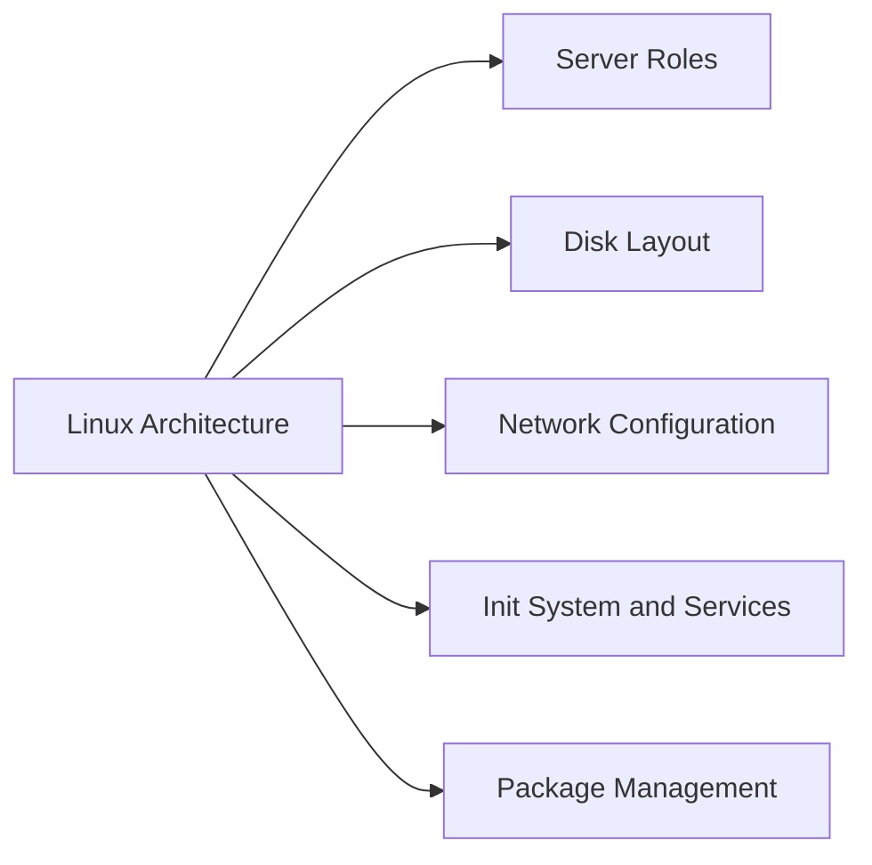

# Linux Architecture



## Server Roles

Linux servers fulfill multiple infrastructure roles:

| Role | Typical OS | vCPU | RAM | Notes |
|---|---|---|---|---|
| Application server | RHEL 8/9, Ubuntu 22.04 | 4–16 | 8–64 GB | Primary workload host |
| Automation node (Ansible) | RHEL 9 | 4 | 8 GB | Ansible control plane; no inbound access |
| Monitoring server | Ubuntu 22.04 | 8 | 16 GB | Prometheus, Grafana, exporters |
| NFS/SMB file host | RHEL 9 | 4 | 16 GB | Shared storage; LVM on SAN-backed LUNs |
| Container host | RHEL 9 | 8–32 | 16–128 GB | Podman/Docker workloads |
| Backup proxy (Linux) | RHEL 9 | 8 | 16 GB | Veeam proxy or NetBackup media server |

## Disk Layout

Standard LVM partition layout — applied at provisioning via Kickstart or cloud-init:

```
/boot          512 MB      xfs     (separate /boot partition — not in LVM)
VG: vg_system
  lv_root     20 GB       xfs     /
  lv_var      20 GB       xfs     /var
  lv_tmp       5 GB       xfs     /tmp (noexec,nosuid mount options)
  lv_home      5 GB       xfs     /home
  lv_swap      8 GB       swap    (= RAM, up to 16 GB max)

VG: vg_data (application data — sized per role)
  lv_app      100+ GB     xfs     /opt/<app>
```

LVM enables future resizing without OS reinstallation:
```bash
# Extend a volume
lvextend -L +20G /dev/vg_system/lv_var
xfs_growfs /var
```

## Network Configuration

Standard network configuration (nmcli / Netplan):

```bash
# RHEL — configure bonded interface with VLAN
nmcli con add type bond ifname bond0 bond.options "mode=802.3ad,miimon=100"
nmcli con add type ethernet ifname eth0 master bond0
nmcli con add type ethernet ifname eth1 master bond0
nmcli con add type vlan con-name bond0.100 dev bond0 id 100
nmcli con modify bond0.100 ipv4.addresses <ip>/<prefix> ipv4.gateway <gw> ipv4.method manual
```

All production servers require:
- Bonded uplinks (LACP) for redundancy
- Separate management IP (VLAN 10 or equivalent) and data IP (role-specific VLAN)
- DNS configured to internal resolvers

## Init System and Services

systemd manages all services:

```bash
# Common service management
systemctl status <service>
systemctl start <service>
systemctl enable <service>   # Persistent across reboots
journalctl -u <service> -n 100 --no-pager   # Recent logs
```

## Package Management

```bash
# RHEL (dnf)
dnf check-update             # List available updates
dnf upgrade                  # Apply all updates
dnf history                  # Review change log
subscription-manager status  # Verify RH subscription

# Ubuntu (apt)
apt-get update
apt-get upgrade -y
apt list --upgradable
ua status                    # Verify Ubuntu Advantage subscription
```

Repositories locked to approved internal mirrors — no direct internet access from production servers.
