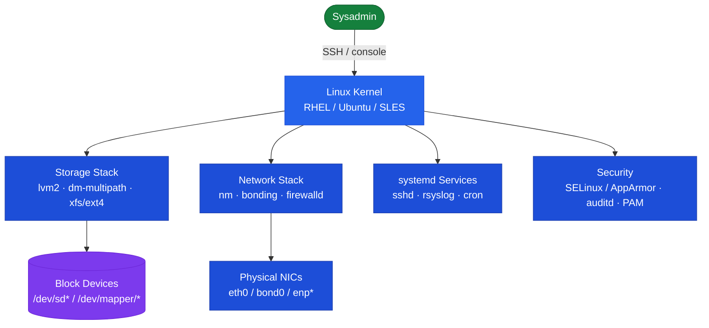

# Linux — Overview

Architecture overview, design principles, and topology.

## Server Roles

Linux servers fulfill multiple infrastructure roles:

| Role | Typical OS | vCPU | RAM | Notes |
|---|---|---|---|---|
| Application server | RHEL 8/9, Ubuntu 22.04 | 4–16 | 8–64 GB | Primary workload host |
| Automation node (Ansible) | RHEL 9 | 4 | 8 GB | Ansible control plane; no inbound access |
| Monitoring server | Ubuntu 22.04 | 8 | 16 GB | Prometheus, Grafana, exporters |
| NFS/SMB file host | RHEL 9 | 4 | 16 GB | Shared storage; LVM on SAN-backed LUNs |
| Container host | RHEL 9 | 8–32 | 16–128 GB | Podman/Docker workloads |
| Backup proxy (Linux) | RHEL 9 | 8 | 16 GB | Veeam proxy or NetBackup media server |

## Server Role Topology

---

## In this section

<a class="kb-card" href="components/"><strong>Components</strong>Core components, services, and technical specifications.</a>
<a class="kb-card" href="integrations/"><strong>Integrations</strong>Integration with other platforms and external systems.</a>
<a class="kb-card" href="standards/"><strong>Standards</strong>Sizing guidelines, design standards, and best practices.</a>

