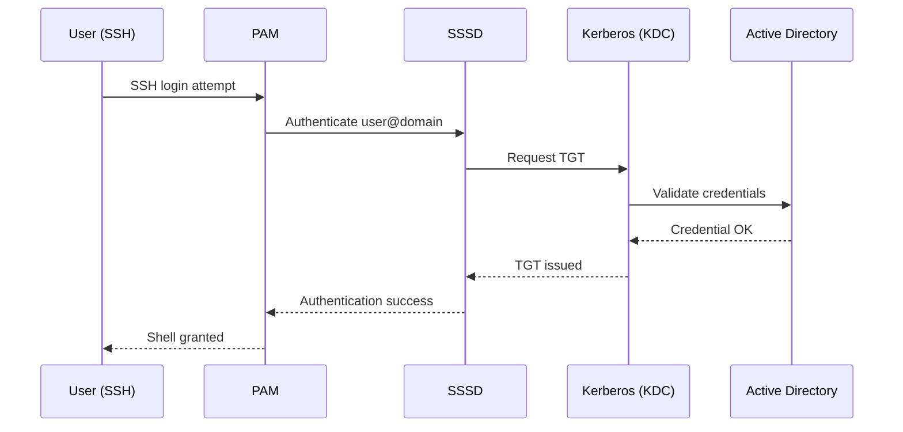
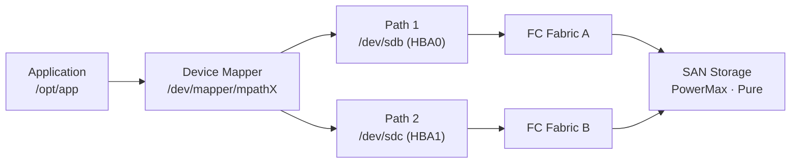

# Linux — Integrations


<div class="kb-summary">
Integration with other platforms and external systems.
</div>

## Active Directory Authentication Flow


```text
┌────────────────────────────────── Linux Architecture — Integrations ──────────────────────────────────┐
│                                                                                                       │
│   ┌───────────────────────────────────────────────────────────────────────────────────────────────┐   │
│   │                                       Integration Points                                      │   │
│   │        Identity: SSSD + realmd joins Linux hosts to Active Directory via Kerberos/LDAP        │   │
│   │            Storage: NFS/CIFS mounts, iSCSI initiator, multipath-tools for SAN LUNs            │   │
│   │       Monitoring: node_exporter → Prometheus → Grafana; rsyslog/journald → Elasticsearch      │   │
│   │       Config mgmt: Ansible (agentless SSH) · Puppet (agent) · Chef · SaltStack (minion)       │   │
│   └───────────────────────────────────────────────────────────────────────────────────────────────┘   │
│                                                                                                       │
│    Linux integrates with enterprise identity, storage, and observability stacks                       │
│                                                                                                       │
│                          ▼                                                 ▼                          │
│                                                                                                       │
│   ┌──────────────────────────────────────────────┐  ┌─────────────────────────────────────────────┐   │
│   │               Identity & Auth                │  │              Storage & Network              │   │
│   │           SSSD: caches AD queries            │  │          NFS v4.1: Kerberos mounts          │   │
│   │           realmd: domain join tool           │  │         iSCSI: open-iscsi initiator         │   │
│   │           Kerberos: kinit / klist            │  │         multipath: dm-multipath I/O         │   │
│   │           PAM: sssd module for AD            │  │         autofs: automount on demand         │   │
│   │           sudo rules: LDAP-sourced           │  │         CIFS/SMB: mount.cifs shares         │   │
│   └──────────────────────────────────────────────┘  └─────────────────────────────────────────────┘   │
│                                                                                                       │
│  Physical Infrastructure (the hardware everything above runs on):                                     │
│  x86-64 servers · HBAs/NICs · SAN switches · NAS appliances · iDRAC · Power & Cooling                 │
│                                                                                                       │
│  Key terms:                                                                                           │
│                                                                                                       │
│  SSSD        = System Security Services Daemon; caches LDAP/Kerberos identity lookups                 │
│  realmd      = Realm Discovery daemon; simplifies domain join with a single command                   │
│  Kerberos    = Ticket-based auth protocol; kinit obtains TGT from AD KDC                              │
│  NFS v4.1    = Network File System v4.1; adds pNFS parallel I/O and session trunking                  │
│  iSCSI       = IP-based SCSI protocol; carries SCSI commands over TCP/IP networks                     │
│  dm-multipath= Device Mapper multipath; aggregates multiple HBA paths to one block device             │
│  autofs      = Kernel automounter; mounts NFS/CIFS shares on access and unmounts on idle              │
│  node_exporter= Prometheus agent; exposes host metrics (CPU, mem, disk, net) on port 9100             │
│  Ansible     = Agentless automation over SSH; uses YAML playbooks for idempotent config               │
│  Puppet      = Agent-based config mgmt; enforces declared resource state on each run                  │
│  rsyslog     = Reliable syslog daemon; forwards structured log messages over UDP/TCP                  │
│  Elasticsearch= Distributed search and analytics engine for log aggregation at scale                  │
│                                                                                                       │
└───────────────────────────────────────────────────────────────────────────────────────────────────────┘
```

**Troubleshoot AD authentication:**

```bash
# Test user lookup
id <user>@<domain>
getent passwd <user>@<domain>

# Check SSSD logs
journalctl -u sssd -n 100
cat /var/log/sssd/sssd_<domain>.log | tail -100

# Clear SSSD cache (forces re-fetch from AD)
sss_cache -E
systemctl restart sssd

# Test Kerberos ticket acquisition
kinit <user>@<DOMAIN.FQDN>
klist
```

---

## Sudo Configuration for AD Groups

```bash
# /etc/sudoers.d/ad-groups — allow AD group full sudo access
%linux\ admins@domain.fqdn ALL=(ALL) ALL

# Allow passwordless sudo for a specific AD group
%linux\ ops@domain.fqdn ALL=(ALL) NOPASSWD: ALL
```

Note: AD group names with spaces require escaping the space with a backslash.

---

## Backup Agent Integration

**Veeam Agent for Linux:**

```bash
# Install Veeam Agent (RHEL — requires the Veeam repo added first)
rpm --import https://www.veeam.com/downloads/public.key
cat > /etc/yum.repos.d/veeam.repo << EOF
[veeam]
name=Veeam
baseurl=https://repository.veeam.com/backup/linux/agent/rpm/rhel/x86_64/
enabled=1
gpgcheck=1
gpgkey=https://www.veeam.com/downloads/public.key
EOF
dnf install veeam

# Start and enable the Veeam agent service
systemctl enable --now veeamagent

# Check agent status
veeam status
```

Registration to the Veeam Backup & Replication server is done from the VBR console: Protection Groups → Add Group → select the server by hostname.

---

## Monitoring Integration

**node_exporter (Prometheus metrics):**

```bash
# Install node_exporter (RHEL — via binary or package)
dnf install golang-github-prometheus-node-exporter  # EPEL repo required

# Or via binary
useradd -r -s /bin/false node_exporter
curl -L https://github.com/prometheus/node_exporter/releases/latest/download/node_exporter-*.linux-amd64.tar.gz | tar xz
mv node_exporter-*/node_exporter /usr/local/bin/
systemctl enable --now node_exporter

# Default listen port
ss -tlnp | grep 9100
```

**Verify Prometheus can scrape the node:**

```bash
curl http://<server-ip>:9100/metrics | head -20
```

---

## iSCSI Storage Connectivity

```bash
# Install iSCSI initiator (RHEL)
dnf install iscsi-initiator-utils
systemctl enable --now iscsid

# Set initiator IQN (unique per server — set before first login)
cat /etc/iscsi/initiatorname.iscsi
# Format: InitiatorName=iqn.YYYY-MM.reverse-domain:unique-name

# Discover targets on a storage portal
iscsiadm --mode discovery --type sendtargets --portal <storage-ip>

# Login to a specific target
iscsiadm --mode node --targetname <iqn> --portal <storage-ip> --login

# Check active sessions
iscsiadm --mode session -P 3

# Rescan for new LUNs
iscsiadm --mode session --rescan
```

---

## SAN Multipath Data Path



## Multipath Configuration

```bash
# Install and enable multipathd (RHEL)
dnf install device-mapper-multipath
systemctl enable --now multipathd

# Generate a default config (do not use defaults for production — review vendor recommendations)
mpathconf --enable --with_multipathd y

# Check multipath device map
multipath -l
multipath -ll  # verbose

# Check path states
multipath -v3 2>&1 | grep -E "checker|faulty|active"

# Flush and reload multipath map
multipath -F
multipath -r
```

Key `/etc/multipath.conf` settings for Dell/EMC and Pure Storage:

```text
defaults {
    polling_interval     5
    path_selector        "round-robin 0"
    path_grouping_policy multibus
    failback             immediate
    no_path_retry        fail
}
```

Consult the vendor's Linux Multipath Guide (Dell PowerMax, Pure Storage) for device-specific settings.
