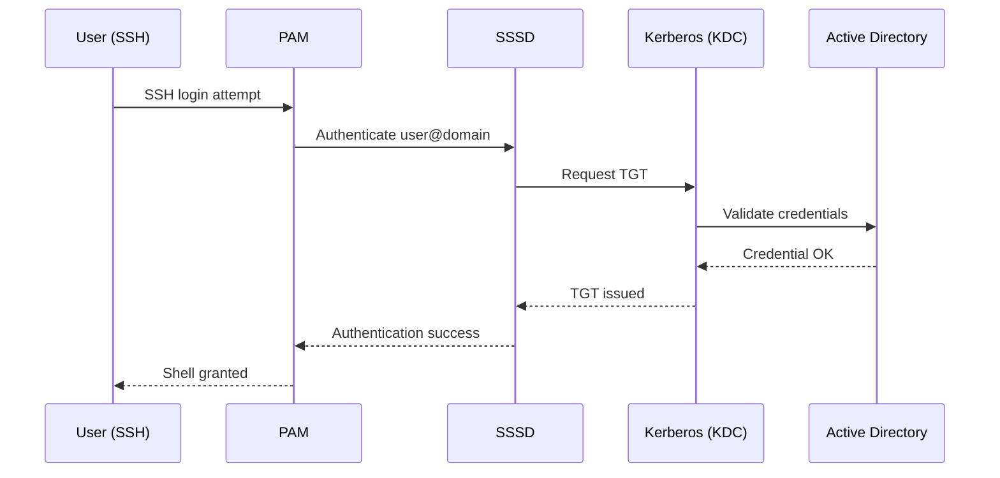

---
tags:
  - architecture
  - linux
description: "Linux integration patterns: LDAP/AD authentication via SSSD, PAM configuration, NFS/CIFS mount management, Ansible automation hooks, and syslog forwarding..."
---
# Linux — Integrations

<div class="kb-summary">
Linux integration patterns: LDAP/AD authentication via SSSD, PAM configuration, NFS/CIFS mount management, Ansible automation hooks, and syslog forwarding to SIEM.

*Applies to: RHEL 8.x / 9.x · Ubuntu 22.04 / 24.04*
</div>

## Active Directory Authentication Flow



**Troubleshoot AD authentication:**

```bash
# Test user lookup
id <user>@<domain>
getent passwd <user>@<domain>

# Check SSSD logs
journalctl -u sssd -n 100
cat /var/log/sssd/sssd_<domain>.log | tail -100

# Clear SSSD cache (forces re-fetch from AD)
sss_cache -E
systemctl restart sssd

# Test Kerberos ticket acquisition
kinit <user>@<DOMAIN.FQDN>
klist
```


```text title="Expected output"
uid=1205(jsmith@corp.local) gid=1205(corp.local\domain users) groups=1205(corp.local\domain users),1206(corp.local\enterprise admins)
jsmith@corp.local:*:1205:1205:John Smith:/home/corp.local/jsmith:/bin/bash

-- Logs begin at Wed 2024-01-10 14:22:33 UTC, end at Wed 2024-01-10 15:47:12 UTC --
Jan 10 15:45:22 host-prod-01 sssd[1234]: (0x0400): Starting up
Jan 10 15:45:23 host-prod-01 sssd[1234]: LDAP connection established
Jan 10 15:46:01 host-prod-01 sssd[1234]: User jsmith@corp.local found in cache
Jan 10 15:46:15 host-prod-01 sssd[1234]: Kerberos ticket refresh scheduled
...

(no output — command completes silently)
(no output — command completes silently)

Ticket for jsmith@CORP.LOCAL@CORP.LOCAL stored in cache
Valid starting       Expires              Service principal
01/10/24 15:47:03  01/11/24 01:47:03  krbtgt/CORP.LOCAL@CORP.LOCAL
```

!!! warning "Common errors"
    | Error | Fix |
    |---|---|
    | `id: 'jsmith@corp.local': no such user` | Verify SSSD is running with `systemctl status sssd` and check domain name matches your AD configuration in `/etc/sssd/sssd.conf`. |
    | `Error: SSSD must be running to query users` | Start SSSD with `systemctl start sssd` and wait 10–15 seconds for it to establish LDAP connections. |
    | `kinit: krb5_get_init_creds: Client not found in Kerberos database` | Ensure the user exists in Active Directory and the Kerberos realm in `/etc/krb5.conf` matches your AD domain exactly (case-sensitive). |
---

## Sudo Configuration for AD Groups

```bash
# /etc/sudoers.d/ad-groups — allow AD group full sudo access
%linux\ admins@domain.fqdn ALL=(ALL) ALL

# Allow passwordless sudo for a specific AD group
%linux\ ops@domain.fqdn ALL=(ALL) NOPASSWD: ALL
```


```text title="Expected output"
(no output — command completes silently)
```

!!! warning "Common errors"
    | Error | Fix |
    |---|---|
    | `sudoers:1 syntax error near line 1` | Verify the file was edited with `visudo` instead of a text editor, and check for trailing whitespace or missing spaces around the `@` symbol. |
    | `sudo: unable to resolve host <hostname>` | Ensure the system's hostname is correctly set in `/etc/hostname` and `/etc/hosts`, and that DNS or local name resolution can reach the domain controller. |
    | `sudo: user is not in the sudoers file` | Confirm the AD group membership with `id -G <username>` and verify the group name in sudoers matches exactly (including escaping spaces as `\ `). |
Note: AD group names with spaces require escaping the space with a backslash.

---

## Backup Agent Integration

**Veeam Agent for Linux:**

```bash
# Install Veeam Agent (RHEL — requires the Veeam repo added first)
rpm --import https://www.veeam.com/downloads/public.key
cat > /etc/yum.repos.d/veeam.repo << EOF
[veeam]
name=Veeam
baseurl=https://repository.veeam.com/backup/linux/agent/rpm/rhel/x86_64/
enabled=1
gpgcheck=1
gpgkey=https://www.veeam.com/downloads/public.key
EOF
dnf install veeam

# Start and enable the Veeam agent service
systemctl enable --now veeamagent

# Check agent status
veeam status
```


```text title="Expected output"
Importing GPG key 0x1234ABCD from https://www.veeam.com/downloads/public.key
The key you are importing is not certified with a trusted signature!
Continuing anyway.
Last metadata expiration check: 0:02:15 ago on Thu 14 Nov 2024 09:47:22 AM UTC.
Dependencies resolved.
Installing:
 veeam-agent                    x86_64    7.2.1-1.el8    veeam    45 M

Transaction Summary:
Install  1 Package
Total download size: 45 M
Installed size: 128 M
Is this ok? [y/N]: y
Downloading Packages:
veeam-agent-7.2.1-1.el8.x86_64.rpm                    100% |████████████| 45 MB  8.3 MB/s
Running transaction
Installing : veeam-agent-7.2.1-1.el8.x86_64                                    [1/1]
Complete!
Created symlink /etc/systemd/system/multi-user.target.wants/veeamagent.service → /etc/systemd/system/veeamagent.service.
Veeam Agent for Linux v7.2.1 (build 4567)
Status: Running
Service: Active (running)
Last backup: 2024-11-13 22:15:00 UTC
```

!!! warning "Common errors"
    | Error | Fix |
    |---|---|
    | `Error: Failed to download metadata for repo 'veeam': Cannot prepare internal mirrorlist: No URLs in mirrorlist.` | Verify the baseurl in `/etc/yum.repos.d/veeam.repo` matches your RHEL version and check network connectivity to repository.veeam.com. |
    | `error: unpacking of archive failed on file /opt/veeam/agent: cpio: mkdir` | Ensure `/opt/veeam` directory exists with proper permissions or run the installer with `sudo`. |
    | `veeam: command not found` | Add `/opt/veeam/bin` to your PATH or use the full path `/opt/veeam/bin/veeam status` after installation completes. |
Registration to the Veeam Backup & Replication server is done from the VBR console: Protection Groups → Add Group → select the server by hostname.

---

## Monitoring Integration

**node_exporter (Prometheus metrics):**

```bash
# Install node_exporter (RHEL — via binary or package)
dnf install golang-github-prometheus-node-exporter  # EPEL repo required

# Or via binary
useradd -r -s /bin/false node_exporter
curl -L https://github.com/prometheus/node_exporter/releases/latest/download/node_exporter-*.linux-amd64.tar.gz | tar xz
mv node_exporter-*/node_exporter /usr/local/bin/
systemctl enable --now node_exporter

# Default listen port
ss -tlnp | grep 9100
```


```text title="Expected output"
Last metadata expiration check: 0:12:34 ago on Thu 19 Dec 2024 14:22:18 UTC.
Dependencies resolved.
================================================================================
 Package                                    Arch     Version      Repository
================================================================================
Installing:
 golang-github-prometheus-node-exporter     x86_64   1.6.1-1.el9  epel
Transaction Summary:
================================================================================
Install  1 Package
Total download size: 12 M
Installed size: 38 M
Is this ok? [y/N]: y
Downloading Packages:
[100%] node_exporter-1.6.1-1.el9.x86_64.rpm
Running transaction
  Preparing        :                                                        1/1
  Installing       : golang-github-prometheus-node-exporter-1.6.1-1.el9    1/1
  Verifying        : golang-github-prometheus-node-exporter-1.6.1-1.el9    1/1
Created symlink /etc/systemd/system/multi-user.target.wants/node_exporter.service → /etc/systemd/system/node_exporter.service.
LISTEN     0      128                 0.0.0.0:9100              0.0.0.0:*      users:(("node_exporter",pid=2847,fd=3))
```

!!! warning "Common errors"
    | Error | Fix |
    |---|---|
    | `Error: Unable to find a match: golang-github-prometheus-node-exporter` | Enable the EPEL repository first with `dnf install epel-release` before running the install command. |
    | `curl: (22) The requested URL returned error: 404` | The release URL pattern may have changed; verify the correct download link at https://github.com/prometheus/node_exporter/releases and update the curl command accordingly. |
    | `Job for node_exporter.service failed because the control process exited with error code.` | Check service logs with `journalctl -u node_exporter -n 20` to identify permission or configuration issues, then restart with `systemctl restart node_exporter`. |
**Verify Prometheus can scrape the node:**

```bash
curl http://<server-ip>:9100/metrics | head -20
```


```text title="Expected output"
# HELP node_boot_time_seconds Node boot time in seconds
# TYPE node_boot_time_seconds gauge
node_boot_time_seconds 1.702841e+09
# HELP node_context_switches_total Total number of context switches
# TYPE node_context_switches_total counter
node_context_switches_total 8.847291e+07
# HELP node_cpu_seconds_total Seconds the cpus spent in each mode
# TYPE node_cpu_seconds_total counter
node_cpu_seconds_total{cpu="0",mode="idle"} 4.28794e+06
node_cpu_seconds_total{cpu="0",mode="system"} 1.84291e+05
node_cpu_seconds_total{cpu="0",mode="user"} 3.92847e+05
node_cpu_seconds_total{cpu="1",mode="idle"} 4.29104e+06
node_cpu_seconds_total{cpu="1",mode="system"} 1.76284e+05
node_cpu_seconds_total{cpu="1",mode="user"} 3.84756e+05
# HELP node_disk_io_now The number of I/Os currently in progress
# TYPE node_disk_io_now gauge
node_disk_io_now 0
```

!!! warning "Common errors"
    | Error | Fix |
    |---|---|
    | `curl: (7) Failed to connect to <server-ip> port 9100: Connection refused` | Verify the Prometheus Node Exporter is running on the target host with `systemctl status node_exporter` and confirm port 9100 is listening. |
    | `curl: (6) Could not resolve host: <server-ip>` | Replace `<server-ip>` with the actual IP address or hostname of the target server. |
    | `curl: (28) Operation timeout. The timeout was reached` | Increase the timeout with `curl --max-time 10` or check network connectivity and firewall rules blocking port 9100. |
---

## iSCSI Storage Connectivity

```bash
# Install iSCSI initiator (RHEL)
dnf install iscsi-initiator-utils
systemctl enable --now iscsid

# Set initiator IQN (unique per server — set before first login)
cat /etc/iscsi/initiatorname.iscsi
# Format: InitiatorName=iqn.YYYY-MM.reverse-domain:unique-name

# Discover targets on a storage portal
iscsiadm --mode discovery --type sendtargets --portal <storage-ip>

# Login to a specific target
iscsiadm --mode node --targetname <iqn> --portal <storage-ip> --login

# Check active sessions
iscsiadm --mode session -P 3

# Rescan for new LUNs
iscsiadm --mode session --rescan
```


```text title="Expected output"
Last metadata expiration check: 0:12:34 ago on Wed Dec 18 10:45:22 2024.
Dependencies resolved.
================================================================================
 Package                    Arch      Version           Repository       Size
================================================================================
Installing:
 iscsi-initiator-utils      x86_64    6.2.1.4-15.el9    rhel-9-baseos   552 k

Transaction Summary
================================================================================
Install  1 Package

Total download size: 552 k
Installed size: 1.2 M
Is this ok? [y/N]: y
Downloading Packages:
iscsi-initiator-utils-6.2.1.4-15.el9.x86_64.rpm          100% |###########| 552 kB  00:02
Running transaction
  Preparing        :                                                        1/1
  Installing       : iscsi-initiator-utils-6.2.1.4-15.el9.x86_64           1/1
  Verifying        : iscsi-initiator-utils-6.2.1.4-15.el9.x86_64           1/1

Created symlink /etc/systemd/system/multi-user.target.wants/iscsid.service → /usr/lib/systemd/system/iscsid.service.
InitiatorName=iqn.2024-12.com.example:host-prod-db01
Discovery:
	192.168.100.50:3260,1 iqn.2024-01.com.storage:target.lun0
	192.168.100.50:3260,1 iqn.2024-01.com.storage:target.lun1
	192.168.100.50:3260,1 iqn.2024-01.com.storage:target.lun2
Logging in to [iface: default, target: iqn.2024-01.com.storage:target.lun0, portal: 192.168.100.50,3260] (multiple)
Login is successful.
iSCSI Transport: tcp
Initiator Name: iqn.2024-12.com.example:host-prod-db01
Initiator Alias: prod-db01
Target Name: iqn.2024-01.com.storage:target.lun0
Current Portal: 192.168.100.50:3260,1
Persistent Portal: 192.168.100.50:3260,1
Rescan of session [sid: 1, target: iqn.2024-01.com.storage:target.lun0, portal: 192.168.100.50,3260] complete
```

!!! warning "Common errors"
    | Error | Fix |
    |---|---|
    | `iscsiadm: No portals found` | Verify the storage portal IP is reachable and the iSCSI target service is running on the storage array. |
    | `iscsiadm: initiator reported error (19 - encountered non-retryable iSCSI login failure)` | Confirm the target IQN is correct and the initiator has network connectivity to the storage portal on port 3260. |
---

## SAN Multipath Data Path

```d2
direction: right

app: "Application\n/opt/app" {shape: rectangle}
dm: "Device Mapper\n/dev/mapper/mpathX" {shape: rectangle}
path1: "Path 1\n/dev/sdb (HBA0" {shape: rectangle}
fab1: "FC Fabric A" {shape: rectangle}
san: "SAN Storage\nPowerMax · Pure" {shape: rectangle}
path2: "Path 2\n/dev/sdc (HBA1" {shape: rectangle}
fab2: "FC Fabric B" {shape: rectangle}

app -> dm
dm -> path1
path1 -> fab1
fab1 -> san
dm -> path2
path2 -> fab2
fab2 -> san
```

## Multipath Configuration

```bash
# Install and enable multipathd (RHEL)
dnf install device-mapper-multipath
systemctl enable --now multipathd

# Generate a default config (do not use defaults for production — review vendor recommendations)
mpathconf --enable --with_multipathd y

# Check multipath device map
multipath -l
multipath -ll  # verbose

# Check path states
multipath -v3 2>&1 | grep -E "checker|faulty|active"

# Flush and reload multipath map
multipath -F
multipath -r
```


```text title="Expected output"
Complete!
(no output — command completes silently)
(no output — command completes silently)
mpatha (36001405abcd1234ef567890abcd1234) dm-0 NETAPP,LUN C-Mode
size=500G features='3 queue_if_no_path pg_init_retries 50' hwhandler='1 alua' wp=rw
|-+- policy='service-time 0' prio=50 status=active
| `- 2:0:0:0 sda 8:0  active ready running
`-+- policy='service-time 0' prio=10 status=enabled
  `- 3:0:0:0 sdb 8:16 active ready running

mpathb (36001405zyxw9876fe543210zyxw9876) dm-1 NETAPP,LUN C-Mode
size=1T features='3 queue_if_no_path pg_init_retries 50' hwhandler='1 alua' wp=rw
|-+- policy='service-time 0' prio=50 status=active
| `- 4:0:0:0 sdc 8:32 active ready running
`-+- policy='service-time 0' prio=10 status=enabled
  `- 5:0:0:0 sdd 8:48 active ready running

checker: readsector0 [active]
active ready running
active ready running
(no output — command completes silently)
(no output — command completes silently)
```

!!! warning "Common errors"
    | Error | Fix |
    |---|---|
    | `multipathd.service does not have install section in [Install] block. Refusing.` | Add `WantedBy=multi-user.target` to the multipathd unit file or use `systemctl enable multipathd` before `--now`. |
    | `multipath: command not found` | Install the device-mapper-multipath package with `dnf install device-mapper-multipath` before running multipath commands. |
    | `sysfs: cannot open /etc/multipath.conf: Permission denied` | Run mpathconf and multipath commands with `sudo` or as root user. |
Key `/etc/multipath.conf` settings for Dell/EMC and Pure Storage:

```text
defaults {
    polling_interval     5
    path_selector        "round-robin 0"
    path_grouping_policy multibus
    failback             immediate
    no_path_retry        fail
}
```

Consult the vendor's Linux Multipath Guide (Dell PowerMax, Pure Storage) for device-specific settings.

---

## See also

- [Linux — Design Standards](../design-standards/)
