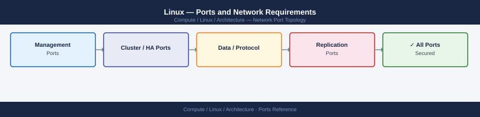

---
tags:
  - linux
  - compute
  - networking
  - firewall
  - ports
---
# Linux — Ports and Network Requirements

<div class="kb-summary">
Firewall port reference for Linux servers in a managed enterprise environment. Covers management access, monitoring, and the outbound ports required to keep Linux hosts updated and managed.

*Applies to: RHEL 8+ / Ubuntu 22.04+ and derivatives*
</div>


## Before you begin

- SSH (22) is the primary management channel — restrict to jump host source IPs in firewall rules and `/etc/ssh/sshd_config`
- Monitoring agents (Prometheus node_exporter, Zabbix agent) listen locally and are scraped or polled from the monitoring server
- Linux hosts need outbound access to package repositories for patching — restrict to approved mirror IPs in locked-down environments

---

## Inbound — Management Access

| Port | Protocol | Source | Purpose |
|---|---|---|---|
| 22 | TCP | Jump hosts, Ansible control node, management systems | SSH — primary management channel; restrict source IPs |

---

## Inbound — Monitoring Agents

| Port | Protocol | Source | Purpose |
|---|---|---|---|
| 9100 | TCP | Prometheus scraper | node_exporter — OS metrics (CPU, memory, disk, network) |
| 9090 | TCP | Prometheus scraper | Prometheus (if node acts as Prometheus server) |
| 10050 | TCP | Zabbix Server / Proxy | Zabbix agent (passive mode — Zabbix polls the agent) |

---

## Outbound — Monitoring and Event Reporting

| Port | Protocol | Destination | Purpose |
|---|---|---|---|
| 10051 | TCP | Zabbix Server / Proxy | Zabbix agent active mode — agent pushes data to Zabbix |
| 162 | UDP | SNMP trap receiver | SNMP traps (if SNMP agent configured with trap destination) |
| 514 | UDP/TCP | Syslog server | rsyslog/syslog-ng forwarding |

---

## Outbound — Time, DNS, and Updates

| Port | Protocol | Destination | Purpose |
|---|---|---|---|
| 123 | UDP | NTP server | chronyd/ntpd time synchronisation |
| 53 | TCP/UDP | DNS server | Name resolution |
| 443 | TCP | Package repos (RHEL satellite, Ubuntu mirror, EPEL) | OS and package updates (dnf/apt) |
| 443 | TCP | Red Hat CDN / RHSM server | Red Hat subscription registration (RHEL) |

---

## Application Ports

Application services (web servers, databases, etc.) expose their own ports on top of the base OS. See:
- [MySQL — Ports](../mysql/architecture/ports/)
- [PostgreSQL — Ports](../postgresql/architecture/ports/)

---

## Firewall Zone Summary

| From | To | Ports | Notes |
|---|---|---|---|
| Jump hosts | Linux host | 22 | SSH — restrict to jump host IPs only |
| Ansible / automation | Linux host | 22 | Same SSH channel |
| Prometheus | Linux host | 9100 | node_exporter scrape |
| Zabbix Server | Linux host | 10050 | Zabbix passive agent poll |
| Linux host | Syslog server | 514 UDP | Event log forwarding |
| Linux host | NTP server | 123 UDP | Time sync |
| Linux host | Package repo | 443 | OS patching |

---

## Verify

```bash
# From jump host — test SSH
ssh -o ConnectTimeout=5 user@<linux-host> uptime

# From Prometheus server — test node_exporter
curl -s http://<linux-host>:9100/metrics | head -5

# From Linux host — test NTP sync
chronyc tracking | grep "System time"

# From Linux host — test outbound DNS
dig @<dns-server> corp.local

# From Linux host — test package repo connectivity
curl -sk -o /dev/null -w "%{http_code}" https://<satellite-or-repo-host>/
```

---

## See also

- [Linux — Architecture](how-it-works/)
- [Linux — Operations](../operations/)
- [MySQL — Ports](../mysql/architecture/ports.md)
- [PostgreSQL — Ports](../postgresql/architecture/ports.md)
- [Ansible — Ports](../../../automation/ansible/architecture/ports.md)
