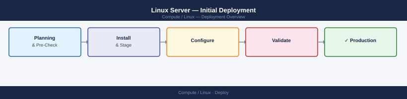
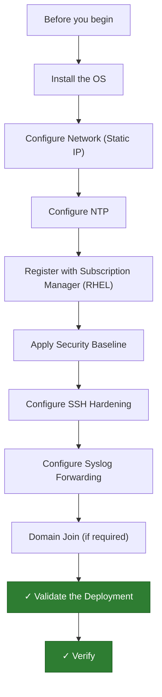

---
tags:
  - deployment
  - linux
search:
  boost: 1.5
---
# Linux Server — Initial Deployment

<div class="kb-summary">
Linux Server initial deployment: OS install, NTP, syslog forwarding, hardening baseline, optional domain join, and post-install validation.

*Applies to: RHEL 9 / Rocky Linux 9 (Ubuntu equivalents noted)*
</div>



This guide covers deploying a new Linux server from OS install through hardening, NTP, syslog forwarding, and optional domain join. Steps apply to RHEL 9 / Rocky Linux 9; Ubuntu equivalents are noted where commands differ.

---




## Before you begin

- **Access:** root or sudo-capable account on target hosts
- **Environment:** DNS, NTP, and network connectivity verified before starting
- **Change management:** change request approved; maintenance window scheduled
- **Rollback:** snapshot or backup taken immediately before deployment begins
- **Time estimate:** 30–90 minutes — do not start if less than 2 hours are available

---

## Install the OS

Boot from the RHEL/Rocky/Ubuntu Server ISO. Select **Minimal Install** (no GUI) to reduce the attack surface.

**Disk partitioning — recommended layout:**

| Mount Point | Minimum Size | Notes |
|-------------|-------------|-------|
| `/boot` | 1 GB | ext4 |
| `/boot/efi` | 600 MB | EFI systems only |
| `/` | 20 GB | xfs (RHEL) or ext4 (Ubuntu) |
| `/var` | 20 GB | Logs and spool; xfs |
| `/var/log` | 10 GB | Separate to prevent log flooding from filling `/` |
| `/home` | 10 GB | User data |
| `swap` | Equal to RAM (up to 8 GB) | |

Configure the network interface at install time if the installer supports it. Otherwise, configure it post-install as shown below.

---

## Configure Network (Static IP)

Use `nmcli` on RHEL/Rocky. On Ubuntu, edit `/etc/netplan/`.

**RHEL / Rocky:**

```bash
nmcli con mod <interface> \
    ipv4.addresses <IP>/<prefix> \
    ipv4.gateway <GW> \
    ipv4.dns "<DNS1> <DNS2>" \
    ipv4.method manual

nmcli con up <interface>
```

Verify:

```bash
ip addr show <interface>
ip route
ping -c 3 <GW>
ping -c 3 8.8.8.8
```

**Ubuntu (Netplan):**

Edit `/etc/netplan/00-installer-config.yaml`:

```yaml
network:
  version: 2
  ethernets:
    ens3:
      addresses:
        - <IP>/<prefix>
      routes:
        - to: default
          via: <GW>
      nameservers:
        addresses: [<DNS1>, <DNS2>]
      dhcp4: false
```

Apply:

```bash
netplan apply
```

---

## Configure NTP

Accurate time is required for Kerberos (domain join), log correlation, and certificate validity.

**RHEL / Rocky:**

```bash
dnf install chrony -y
systemctl enable --now chronyd
```

Edit `/etc/chrony.conf` — replace the default pool with your NTP server:

```text
server <NTP-server> iburst
```

Restart and verify:

```bash
systemctl restart chronyd
chronyc sources -v
chronyc tracking
```

`Reference ID` should show your NTP server, and `System time` offset should be under 100ms.

**Ubuntu:**

```bash
timedatectl set-ntp true
timedatectl show-timesync
```

---

## Register with Subscription Manager (RHEL)

If deploying RHEL (not Rocky/AlmaLinux), register with Red Hat Subscription Manager to enable package repos.

```bash
subscription-manager register \
    --username <redhat-user> \
    --password <redhat-password> \
    --auto-attach
```

Verify attached subscriptions:

```bash
subscription-manager status
subscription-manager list --consumed
```

For Rocky or AlmaLinux, repos are enabled by default — skip this step.

---

## Apply Security Baseline

Update all packages and install baseline security tooling.

```bash
# Full system update
dnf update -y

# Core security packages
dnf install -y aide firewalld

# Enable firewall
systemctl enable --now firewalld

# Verify SELinux is enforcing
sestatus
```

If SELinux is in permissive mode, set it to enforcing:

```bash
setenforce 1
sed -i 's/^SELINUX=permissive/SELINUX=enforcing/' /etc/selinux/config
```

Initialise AIDE (file integrity baseline) — this takes several minutes:

```bash
aide --init
mv /var/lib/aide/aide.db.new.gz /var/lib/aide/aide.db.gz
```

Schedule a daily integrity check:

```bash
echo "0 3 * * * root /usr/sbin/aide --check" >> /etc/cron.d/aide
```

---

## Configure SSH Hardening

Edit `/etc/ssh/sshd_config` to restrict SSH access:

```bash
# Disable root login
PermitRootLogin no

# Disable password authentication (key-based only)
PasswordAuthentication no

# Restrict to specific users or groups
AllowGroups sshusers wheel

# Use only strong ciphers
Ciphers aes256-gcm@openssh.com,aes128-gcm@openssh.com,aes256-ctr
MACs hmac-sha2-512,hmac-sha2-256

# Reduce idle timeout
ClientAliveInterval 300
ClientAliveCountMax 2

# Disable X11 forwarding
X11Forwarding no
```

Validate the configuration and restart:

```bash
sshd -t
systemctl restart sshd
```

Open the SSH port in the firewall:

```bash
firewall-cmd --permanent --add-service=ssh
firewall-cmd --reload
```

---

## Configure Syslog Forwarding

Forward logs to a central syslog server (e.g., a SIEM or syslog aggregator).

```bash
dnf install rsyslog -y
systemctl enable --now rsyslog
```

Add a remote target to `/etc/rsyslog.conf`:

```text
# Forward all logs to central syslog server (TCP)
*.* @@<syslog-server>:514
```

Restart and verify forwarding:

```bash
systemctl restart rsyslog
logger -p local0.info "Test message from $(hostname)"
```

Confirm the test message appears on the syslog server.

---

## Domain Join (if required)

Join the server to Active Directory using `realmd` and `sssd`.

```bash
dnf install -y sssd realmd oddjob oddjob-mkhomedir adcli samba-common-tools

# Discover the domain
realm discover corp.local

# Join the domain
realm join --user=<domain-admin> corp.local
```

Verify join status:

```bash
realm list
id <domain-user>@corp.local
```

Configure home directory creation on first login:

```bash
authselect select sssd with-mkhomedir --force
systemctl enable --now oddjobd
```

Restrict SSH access to specific AD groups:

```bash
realm permit -g "Linux Admins"
```

---

## Validate the Deployment

Run the following checks and confirm all pass before handing off the server.

```bash
# No failed services
systemctl --failed

# Network connectivity
ping -c 3 <gateway>
ping -c 3 <DNS-server>
nslookup corp.local

# NTP sync status
timedatectl status
chronyc tracking

# SELinux enforcing
sestatus

# Firewall active
firewall-cmd --state
firewall-cmd --list-all

# SSH hardening confirmed
sshd -T | grep -E 'permitrootlogin|passwordauthentication'
```

Expected results: `systemctl --failed` returns empty, `sestatus` shows `SELinux status: enabled` and `Current mode: enforcing`, and SSH hardening settings match what was configured.

---

## Verify

```bash
systemctl status <service-name>   # Active: running
journalctl -u <service-name> -n 20 --no-pager  # no ERROR lines
ss -tlnp | grep <port>            # service listening on expected port
```

---

## See also

- [Linux — Procedures](../operations/procedures/)
- [Linux — Common Issues](../troubleshooting/common-issues/)
- [Linux — How It Works](../architecture/how-it-works/)
