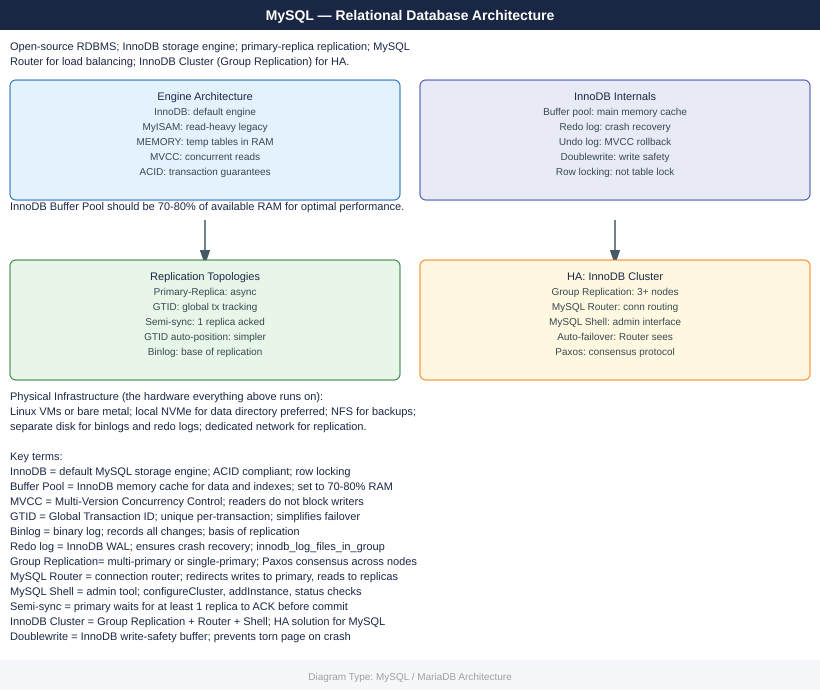
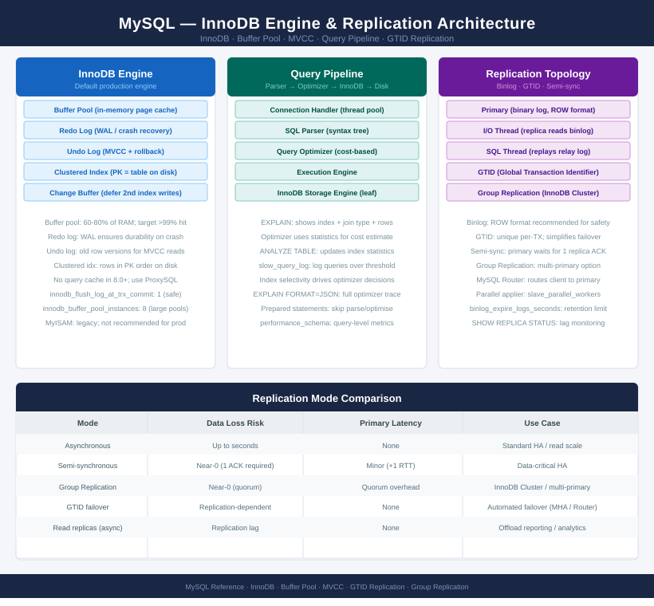

---
tags:
  - architecture
  - linux
---
# MySQL / MariaDB — Architecture

MySQL/MariaDB architecture: primary-replica replication topology, Galera cluster design, InnoDB buffer pool sizing, binary log retention, and storage layout.

*Applies to: MySQL 8.x · MariaDB 10.x*

  <a class="kb-card" href="how-it-works/">How It Works</a>
  <a class="kb-card" href="design-standards/">Design Standards</a>
  <a class="kb-card" href="integrations/">Integrations</a>

