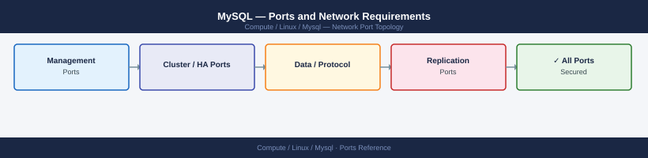

---
tags:
  - mysql
  - database
  - linux
  - networking
  - firewall
  - ports
---
# MySQL — Ports and Network Requirements

<div class="kb-summary">
Firewall port reference for MySQL and MySQL InnoDB Cluster. Covers client connections, X Protocol, Group Replication, and MySQL Shell admin.

*Applies to: MySQL 8.x Community / Enterprise*
</div>


## Inbound — Client Connections

| Port | Protocol | Source | Purpose |
|---|---|---|---|
| 3306 | TCP | Application servers, DBA workstations | MySQL classic protocol — standard SQL connections |
| 33060 | TCP | Application servers (X DevAPI clients) | MySQL X Protocol — document store, async queries |
| 33062 | TCP | Admin workstations | MySQL admin port — reserved for management connections even under max_connections limit |

## MySQL InnoDB Cluster / Group Replication (Node-to-Node)

| Port | Protocol | Between | Purpose |
|---|---|---|---|
| 3306 | TCP | Cluster members | Standard MySQL port used for group replication seed |
| 33061 | TCP | Cluster members | Group Replication internal communication |
| 6446 | TCP | MySQL Router → primary | MySQL Router write port |
| 6447 | TCP | MySQL Router → replicas | MySQL Router read port |

## Monitoring

| Port | Protocol | Source | Purpose |
|---|---|---|---|
| 9104 | TCP | Prometheus server | mysqld_exporter — MySQL metrics |

## Firewall Zone Summary

| From | To | Ports | Notes |
|---|---|---|---|
| App servers | MySQL | 3306 | Restrict to app server IPs only |
| Admin workstations | MySQL | 3306, 33062 | DBA access |
| Cluster nodes | Cluster nodes | 3306, 33061 | Group replication — bidirectional |
| Prometheus | MySQL | 9104 | Metrics scrape |

## Verify

```bash
# From app server
nc -zv <mysql-host> 3306

# From DBA workstation
mysql -h <mysql-host> -u root -p -e "SELECT @@version;"

# Cluster health check
mysqlsh admin@<cluster-host>:3306 -- cluster status
```


```text title="Expected output"
Connection to mysql-prod-01.internal 3306 port [tcp/mysql] succeeded!
mysql: [Warning] Using a password on the command line interface can be insecure.
+-----------+
| @@version |
+-----------+
| 8.0.35-27 |
+-----------+
The MySQL Shell version 8.0.34
{
    "clusterName": "mysql-cluster-prod",
    "defaultReplicaSet": {
        "name": "default",
        "primary": "mysql-prod-01.internal:3306",
        "status": "OK",
        "statusText": "Cluster is ONLINE and can tolerate up to ONE failure.",
        "topology": {
            "mysql-prod-01.internal:3306": {
                "address": "mysql-prod-01.internal:3306",
                "mode": "R/W",
                "status": "ONLINE",
                "version": "8.0.35-27"
            },
            "mysql-prod-02.internal:3306": {
                "address": "mysql-prod-02.internal:3306",
                "mode": "R/O",
                "status": "ONLINE",
                "version": "8.0.35-27"
            },
            "mysql-prod-03.internal:3306": {
                "address": "mysql-prod-03.internal:3306",
                "mode": "R/O",
                "status": "ONLINE",
                "version": "8.0.35-27"
            }
        }
    }
}
```

!!! warning "Common errors"
    **`Connection refused`** — Verify the MySQL service is running on the target host with `systemctl status mysql` and confirm the port is not blocked by firewall rules.
    **`Access denied for user 'root'@'<ip>'`** — Check the password is correct and the root user has permissions from that source IP in the `mysql.user` table.
    **`ERROR: Shell.Errors.RuntimeError: Error connecting to target server`** — Ensure MySQL Shell is installed, the cluster host is reachable, and the admin user credentials are valid.
## See also

- [MySQL — Architecture](../how-it-works/)
- [MySQL — Operations](../../operations/)
- [Linux — Ports](../../architecture/ports.md)
- [PostgreSQL — Ports](../../postgresql/architecture/ports.md)
