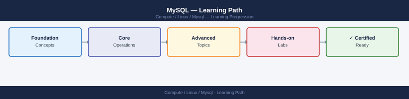

---
tags:
  - learning-path
  - linux
---
# MySQL — Learning Path

Recommended reading order for MySQL on Linux. Follow these stages in order to build a complete mental model before working with it in production.

*Applies to: MySQL 8.x · MariaDB 10.x*

| Stage | Focus | Time investment |
|-------|-------|----------------|
| 1 — Architecture | InnoDB engine, binary log, replication topology | 4–5 h |
| 2 — Deployment | Installation, my.cnf baseline, GTID replication | 2–3 h |
| 3 — Operations | Health checks, CLI tools, backup cadence | ongoing |
| 4 — Security | User privileges, TLS, audit log, hardening | 2–3 h |
| 5 — Troubleshooting | Slow queries, replication errors, deadlocks | as needed |

---

## Stage 1 — Architecture

**Goal**: Understand MySQL's InnoDB storage engine, the transaction log, and the replication pipeline before designing a production deployment.

**Read in this order**:

- [How It Works](../architecture/how-it-works/) — InnoDB engine internals (buffer pool, redo log ring buffer, undo log segments, MVCC multi-version read), the binary log (binlog) as the replication feed, and how reads and writes flow from client → connection thread → query cache (8.0: removed) → InnoDB buffer pool → disk
- [Design Standards](../architecture/design-standards/) — schema design principles (normalisation vs read-optimised denormalisation), primary key selection (surrogate integer vs UUID tradeoffs for InnoDB page layout), index strategy (covering index, prefix index), and replication topology choices (single primary, group replication, InnoDB Cluster)
- [Integrations](../architecture/integrations/) — application connection pooling via ProxySQL or MySQL Router for HA-transparent failover, backup tool selection (mysqldump for logical, Percona XtraBackup for hot physical), and monitoring via `performance_schema` and Percona Monitoring and Management (PMM)

**Key concepts before moving on**:

- InnoDB `buffer_pool_size` should be 60–80% of available RAM — undersizing it causes every read to go to disk
- GTID replication (`gtid_mode=ON, enforce_gtid_consistency=ON`) makes failover and replica promotion deterministic and safe
- `binlog_format=ROW` (default in 8.0) replicates the actual row changes, not the SQL statement — this is required for predictable replication of non-deterministic queries
- InnoDB uses row-level locking; deadlocks are normal and handled automatically — only investigate if deadlock rate is high

**Why first**: MySQL performance and HA choices — InnoDB buffer pool sizing, replication topology, index design — are largely irreversible at scale. Understand them before the first CREATE TABLE.

---

## Stage 2 — Deployment

**Goal**: Install MySQL with a secure baseline configuration and working replication before accepting application traffic.

**Read**:

- [Deploy](../deploy/) — RHEL/Ubuntu package installation from MySQL APT/YUM repository, `mysql_secure_installation` walkthrough, `my.cnf` baseline settings (buffer pool size, redo log size, `max_connections`, `character-set-server=utf8mb4`), and initial GTID replication setup (primary → replica)
- [Install & Upgrade](../operations/install-upgrade/) — in-place minor version upgrade (upgrade packages → restart → run `mysql_upgrade`), major version upgrade procedure (dump → upgrade server → import), and replica promotion during planned primary maintenance

**Deployment principles**:

- Separate data directory, binary log, and slow query log onto different mount points — mixed I/O from logs and data on the same disk causes contention
- Enable `slow_query_log = 1` and `long_query_time = 1` from day one — you cannot retroactively find slow queries that ran before logging was enabled
- Always set up replication (even a single replica) before going to production — adding a replica after the fact requires a cold copy or XtraBackup clone

---

## Stage 3 — Operations

**Goal**: Maintain MySQL health — monitoring replication lag, query performance, and disk growth on every shift.

**Read in this order**:

- [Health Checks](../operations/health-checks/) — run the routine first on every shift; `SHOW REPLICA STATUS\G` for replication lag and error, buffer pool hit ratio (`Innodb_buffer_pool_reads / Innodb_buffer_pool_read_requests`), long-running queries in `information_schema.processlist`, and data directory disk usage
- [CLI Reference](../operations/cli-reference/) — `mysql` client, `mysqladmin status/processlist`, `mysqlcheck --auto-repair`, `mysqlbinlog` for binary log inspection, `mysqldump`, `pt-query-digest` for slow log analysis, and `pt-online-schema-change` for live schema changes
- [Procedures](../operations/procedures/) — adding a replica from XtraBackup clone, promoting a replica to primary (stop replica → `RESET SLAVE ALL` → point app to new primary), binary log purge (`PURGE BINARY LOGS BEFORE DATE(NOW())`), and schema change with minimal locking
- [Backup & Restore](../operations/backup-restore/) — `mysqldump` daily logical backup schedule, Percona XtraBackup weekly full + daily incremental physical backup, binary log backup to S3 for PITR, and full restore testing on a separate instance monthly
- [Scripts](../operations/scripts/) — replication lag alerting script, slow query log digest cron via `pt-query-digest`, disk growth projection report, and user privilege audit via `information_schema.USER_PRIVILEGES`

**Daily rhythm**: Replication lag → buffer pool hit ratio → slow query log digest → binary log disk usage → disk usage trend.

---

## Stage 4 — Security

**Goal**: Enforce least-privilege database access, protect data at rest and in transit, and audit all administrative operations.

**Read**:

- [Access Control](../security/access-control/) — MySQL user and privilege model (`GRANT SELECT ON db.* TO 'app'@'10.0.0.%'`), host restriction in user@host format, principle of least privilege per application user, and `performance_schema.users_statistics` for privilege auditing
- [Authentication](../security/authentication/) — `caching_sha2_password` (MySQL 8.0 default, use for all new users), PAM plugin for OS-level authentication for DBAs, `validate_password` component for password strength enforcement, and connection attempt logging via `general_log` for audit periods
- [Encryption](../security/encryption/) — TLS client connections with `require_secure_transport = ON` and per-user `REQUIRE SSL`, InnoDB tablespace-level encryption at rest (`innodb_encrypt_tables`), and binary log encryption (`encrypt_binlog = ON` in MySQL 8.0)
- [Hardening](../security/hardening/) — removing anonymous users and test database post-install, disabling `LOCAL INFILE` (`local_infile = OFF`), binding to specific interfaces (`bind_address = 10.0.0.5`), enabling `audit_log` plugin for compliance-required audit trails, and OS-level `firewalld` rules limiting port 3306 access

---

## Stage 5 — Troubleshooting

**Goal**: Diagnose slow queries, replication failures, InnoDB deadlocks, and crash recovery without data loss.

**Read**:

- [Common Issues](../troubleshooting/common-issues/) — replication stopped (`Last_Error` in `SHOW REPLICA STATUS`: duplicate key, row not found, or UUID conflict), InnoDB deadlock loop causing repeated `1213` errors, table locked waiting (`INFORMATION_SCHEMA.INNODB_LOCK_WAITS`), buffer pool thrashing on low-memory host, and crash recovery from unclean shutdown
- [Diagnostics](../troubleshooting/diagnostics/) — slow query log analysis via `pt-query-digest`, `EXPLAIN` plan reading (full table scan vs index scan vs index range), `SHOW ENGINE INNODB STATUS` for lock waits and deadlock history, `pt-deadlock-logger` for persistent deadlock logging, and `performance_schema` wait event analysis
- [Escalation](../troubleshooting/escalation/) — MySQL Enterprise Support case creation with `mysqld --verbose` output and error log, Percona support for XtraBackup and ProxySQL issues, and data recovery specialists for InnoDB table corruption (`.ibd` file repair)

**Why last**: Troubleshooting makes most sense once you understand InnoDB locking behaviour, the replication pipeline, and what normal query execution plans look like on a healthy server.

---

## See also

- [Mysql — Deploy](../../deploy/)
- [Mysql — Procedures](../../operations/procedures/)
- [Mysql — Common Issues](../../troubleshooting/common-issues/)
