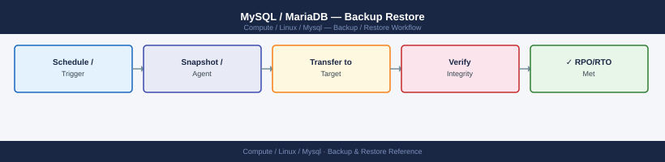

---
tags:
  - linux
  - operations
description: "MySQL/MariaDB backup: mysqldump --single-transaction, mysqlpump, xtrabackup full and incremental, binary log point-in-time restore, and retention..."
---
# MySQL / MariaDB — Backup Restore

<div class="kb-summary">
MySQL/MariaDB backup: `mysqldump --single-transaction`, `mysqlpump`, xtrabackup full and incremental, binary log point-in-time restore, and retention management.

*Applies to: RHEL / Ubuntu LTS*
</div>


## Before you begin

- **Access:** root or sudo-capable account on target hosts
- **Timing:** safe to run during business hours unless a step is marked ⚠ (causes interruption)
- **Dependencies:** no active upgrades or migrations on the same infrastructure
- **Logging:** capture command output — paste into the change record on completion

---

## Database — Backup Validation

```bash
# pgBackRest — check latest backup info
pgbackrest --stanza=<stanza-name> info

# List backup files
pgbackrest --stanza=<stanza-name> info --output=json | jq '.[] | .backup[-1]'

# Check WAL archiving is current
psql -U postgres -c "SELECT last_archived_wal, last_archived_time, last_failed_wal FROM pg_stat_archiver;"
```


```text title="Expected output"
stanza: main-db-prod
    status: ok
    cipher: none

    db (current)
        wal archive min/max (14-1): 000000010000000000000001/000000010000000000000042

        full backup: 20250115-093847F
            timestamp start/stop: 2025-01-15 09:38:47 / 2025-01-15 09:52:13
            wal included: 000000010000000000000001 to 000000010000000000000042
            database size: 2.1GB, database backup size: 2.1GB
            repo size: 856.3MB, repo backup size: 856.3MB

{
  "type": "full",
  "reference": [],
  "timestamp": 1736936327,
  "start-lsn": "0/3000028",
  "stop-lsn": "0/5A00000"
}

 last_archived_wal | last_archived_time      | last_failed_wal
-------------------+------------------------+-----------------
 000000010000000000000042 | 2025-01-15 10:15:33+00 | 
(1 row)
```

!!! warning "Common errors"
    | Error | Fix |
    |---|---|
    | `ERROR: stanza 'main-db-prod' not found` | Verify the stanza name matches your pgBackRest configuration in `/etc/pgbackrest.conf`. |
    | `psql: error: connection to server at "localhost" (127.0.0.1), port 5432 failed` | Ensure PostgreSQL is running with `systemctl status postgresql` and the postgres user has correct permissions. |
```bash
# PostgreSQL — verify backup with pgBackRest
pgbackrest --stanza=<stanza-name> check

# MySQL — verify xtrabackup integrity
xtrabackup --prepare --target-dir=/backup/mysql/latest/

# SQL Server — verify backup file checksum
RESTORE VERIFYONLY FROM DISK = '/backup/mssql/mydb_full.bak' WITH CHECKSUM;
```

```text title="Expected output"
pgBackRest 2.48 -- PostgreSQL Backup & Restore
stanza: prod-db-01
status: ok
backup path: /var/lib/pgbackrest/backup/prod-db-01
wal path: /var/lib/pgbackrest/wal/prod-db-01
last backup: 2024-01-15 03:45:22Z

xtrabackup version 8.0.35-30 based on MySQL 8.0.35
xtrabackup: recognized server version 8.0.35-30
xtrabackup: starting prepare
xtrabackup: using the following InnoDB configuration:
xtrabackup: Prepared backup completed successfully

Msg 3013, Level 16, State 1, Server 'SQLSERVER-01', Procedure sp_executesql
RESTORE VERIFYONLY successfully processed 1245 pages in 8.342 seconds (1.48 MB/sec).
```

!!! warning "Common errors"
    | Error | Fix |
    |---|---|
    | `pgbackrest: ERROR: backup path does not exist` | Verify the stanza name matches your pgBackRest configuration and the backup directory exists at the configured path. |
    | `xtrabackup: error: cannot access '/backup/mysql/latest/': No such file or directory` | Ensure the backup target directory path is correct and the xtrabackup process has read permissions on the backup files. |
    | `Msg 3201, Level 16, State 2: Cannot open backup device '/backup/mssql/mydb_full.bak'. Operating system error 2(The system cannot find the file specified.)` | Verify the backup file path is correct and the SQL Server service account has read permissions on the backup file location. |
```bash
# Restore to test instance
pgbackrest --stanza=<stanza-name> --pg1-path=/var/lib/pgsql/test-restore restore
# Start test instance and verify
pg_ctl -D /var/lib/pgsql/test-restore start
psql -p 5433 -U postgres -c "SELECT count(*) FROM pg_stat_user_tables;"
```

```text title="Expected output"
INFO: restore command begin 2.52: --stanza=prod-primary --pg1-path=/var/lib/pgsql/test-restore restore
INFO: check archive for backup info
INFO: restore backup set 20240115-093847F
INFO: remove invalid files before restore
INFO: restore file list (2847 files, 18.3 GB)
INFO: restore backup set 20240115-093847F complete
INFO: restore command end: completed successfully
waiting for server to start.... done
server started
 count 
-------
    42
(1 row)
```

!!! warning "Common errors"
    | Error | Fix |
    |---|---|
    | `FATAL: could not create shared memory segment: No space left on device` | Increase shared_buffers in postgresql.conf or reduce the value to fit available system memory. |
    | `ERROR: could not connect to server: Connection refused` | Verify pg_ctl started successfully and the port 5433 is not already in use by another PostgreSQL instance. |
    | `FATAL: directory "/var/lib/pgsql/test-restore" does not exist` | Create the restore directory with `mkdir -p /var/lib/pgsql/test-restore` and ensure proper ownership before running pgbackrest restore. |
```bash
# Copy backup to test directory
xtrabackup --prepare --target-dir=/restore/mysql-test/
rsync -a /restore/mysql-test/ /var/lib/mysql-test/
chown -R mysql: /var/lib/mysql-test/
mysqld_safe --datadir=/var/lib/mysql-test --socket=/tmp/mysql-test.sock &
mysql -S /tmp/mysql-test.sock -e "SHOW DATABASES;"
```
```sql
RESTORE DATABASE [TestRestore] FROM DISK = '/backup/mssql/prod_full.bak'
WITH MOVE 'proddb' TO '/var/opt/mssql/data/TestRestore.mdf',
     MOVE 'proddb_log' TO '/var/opt/mssql/data/TestRestore_log.ldf',
     REPLACE, STATS = 10;
-- Verify table counts match expected
USE TestRestore;
SELECT COUNT(*) FROM important_table;
```

---

## Verify

- Confirm the operation completed without errors in the log or management UI
- Verify the expected state change is visible (service running, object created, config applied)
- Document the outcome in the change record

---

## See also

- [Mysql — Procedures](../procedures/)
- [Mysql — Health Checks](../health-checks/)
- [Mysql — Common Issues](../../troubleshooting/common-issues/)
