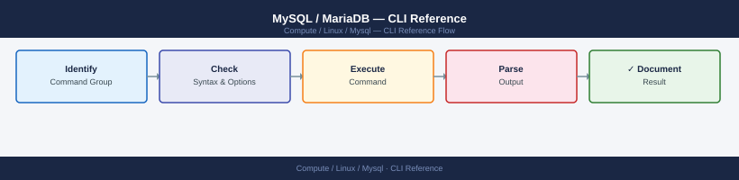

---
tags:
  - linux
  - operations
---
# MySQL / MariaDB — CLI Reference

<div class="kb-summary">
MySQL CLI reference — mysql client, mysqladmin, mysqldump, mysqlcheck, mysqlbinlog, and Percona pt-* tool quick reference.

*Applies to: RHEL / Ubuntu LTS*
</div>



```d2
direction: right

hub: "Linux\nOperations" {shape: hexagon}
mysql_client: "mysql client" {shape: rectangle}
mysqladmin: "mysqladmin" {shape: rectangle}
mysqldump: "mysqldump" {shape: rectangle}
mysqlcheck: "mysqlcheck" {shape: rectangle}
mysqlbinlog: "mysqlbinlog" {shape: rectangle}
percona_toolkit: "Percona Toolkit" {shape: rectangle}

hub -> mysql_client
hub -> mysqladmin
hub -> mysqldump
hub -> mysqlcheck
hub -> mysqlbinlog
hub -> percona_toolkit
```

## Before you begin

- **Access:** root or sudo-capable account on target hosts
- **Timing:** safe to run during business hours unless a step is marked ⚠ (causes interruption)
- **Dependencies:** no active upgrades or migrations on the same infrastructure
- **Logging:** capture command output — paste into the change record on completion

---

## mysql client

```bash
# Connect
mysql -h <host> -u <user> -p<password> <database>
mysql -u root -p                          # interactive, prompt for password
mysql -u root -p -e "SHOW DATABASES;"    # one-liner

# Useful session variables
SET SESSION long_query_time = 0;          # capture all queries in slow log
SHOW PROCESSLIST;                         # active connections
SHOW FULL PROCESSLIST;                    # full query text
KILL <process_id>;                        # kill a blocking query
```

## mysqladmin

```bash
mysqladmin -u root -p status              # uptime, queries/sec, threads
mysqladmin -u root -p extended-status     # all status variables
mysqladmin -u root -p variables           # all config variables
mysqladmin -u root -p flush-logs          # rotate logs
mysqladmin -u root -p processlist         # same as SHOW PROCESSLIST
mysqladmin -u root -p ping                # quick reachability check
```

## mysqldump

```bash
# Full DB dump (InnoDB consistent snapshot)
mysqldump -u root -p --single-transaction --routines --triggers --all-databases > full.sql

# Single database
mysqldump -u root -p --single-transaction mydb > mydb.sql

# Compressed
mysqldump -u root -p --single-transaction mydb | gzip > mydb_$(date +%F).sql.gz

# Restore
mysql -u root -p mydb < mydb.sql
```

## mysqlcheck

```bash
mysqlcheck -u root -p --all-databases     # check all tables
mysqlcheck -u root -p --optimize mydb     # reclaim fragmented space
mysqlcheck -u root -p --repair mydb       # repair MyISAM corruption
```

## mysqlbinlog

```bash
# View binlog events
mysqlbinlog /var/lib/mysql/mysql-bin.000001 | less

# PITR: apply binlog from specific time
mysqlbinlog --start-datetime="2026-06-08 10:00:00" \
            --stop-datetime="2026-06-08 10:30:00" \
            /var/lib/mysql/mysql-bin.000001 | mysql -u root -p
```

## Percona Toolkit

```bash
pt-query-digest /var/log/mysql/slow.log   # analyse slow query log
pt-table-checksum --host=primary --user=root   # verify replica consistency
pt-online-schema-change                   # non-blocking ALTER TABLE
pt-kill --busy-time 300 --kill            # kill queries running > 5 min
```

---

## Verify

- Confirm the operation completed without errors in the log or management UI
- Verify the expected state change is visible (service running, object created, config applied)
- Document the outcome in the change record

---

## See also

- [Mysql — Procedures](procedures/)
- [Mysql — Scripts](scripts/)
- [Mysql — Health Checks](health-checks/)
