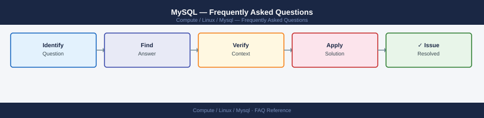

---
tags:
  - mysql
  - faq
  - operations
---
# MySQL — Frequently Asked Questions

Common questions about MySQL operations, configuration, and troubleshooting. For step-by-step procedures, see the <a href="index.md">Operations</a> section.

## General

**Q: What MySQL version is recommended for new deployments?**
A: MySQL 8.0 LTS or 8.4 LTS (Innovation release). Avoid 5.7 — EOL October 2023. Check with `mysql --version` or `SELECT VERSION();` from the MySQL prompt.

**Q: How do I check the current MySQL version?**
A: `mysql --version`

## Configuration

**Q: What is the default InnoDB buffer pool size and when should it change?**
A: Default is 128 MB — far too small for production. Set to 70-80% of available RAM: `innodb_buffer_pool_size = 12G` in `my.cnf`. Restart MySQL after changing this parameter.

**Q: How do I enable MySQL binary logging for replication or point-in-time recovery?**
A: Add `log_bin = /var/log/mysql/mysql-bin.log` and `server_id = 1` to `my.cnf`. Restart MySQL. Verify with `SHOW VARIABLES LIKE 'log_bin';`. Required for replication and PITR.

## Operations

**Q: How do I perform a MySQL minor version upgrade without downtime?**
A: For replicated setups: upgrade the replica first, promote it, then upgrade the old primary. Use `CHANGE MASTER TO` to re-establish replication. For standalone, schedule a maintenance window.

**Q: What is the correct procedure to add a new MySQL replica?**
A: Take a consistent dump with `mysqldump --single-transaction --master-data=2`, restore to new host, then run `CHANGE MASTER TO` with the binary log position. Verify with `SHOW SLAVE STATUS\G`.

## Troubleshooting

**Q: MySQL shows 'Too many connections'. What does it mean?**
A: Active connections hit `max_connections` limit (default 151). Increase: `SET GLOBAL max_connections = 500;`. Also check for connection leaks in the application — use connection pooling (ProxySQL or application-level).

**Q: Query performance degraded — where do I start?**
A: Enable the slow query log (`slow_query_log = 1`, `long_query_time = 1`). Use `EXPLAIN` on slow queries. Check `SHOW ENGINE INNODB STATUS` for lock waits. Review index usage with `sys.schema_unused_indexes`.

## Backup and Recovery

**Q: How often should I back up MySQL?**
A: Full dump weekly (`mysqldump` or `xtrabackup`), binary log backups every 15-30 minutes for PITR. Test restores monthly. For critical databases, use MySQL Enterprise Backup or Percona XtraBackup for hot backups.

**Q: Can I restore a single table without a full database restore?**
A: Yes — with `mysqldump`, restore the specific table: `mysql db_name < table_dump.sql`. With InnoDB transportable tablespaces (`DISCARD TABLESPACE` / `IMPORT TABLESPACE`) for large tables.

## See Also

- [MySQL Operations](index.md)
- [MySQL Troubleshooting](../../../troubleshooting/index.md)
