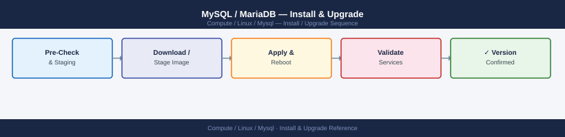

---
tags:
  - linux
  - operations
---
# MySQL / MariaDB — Install & Upgrade

<div class="kb-summary">
MySQL install and upgrade procedures — major version upgrade path, in-place upgrade steps, upgrade checker tool, and post-upgrade validation.

*Applies to: RHEL / Ubuntu LTS*
</div>


## Before you begin

- **Access:** root or sudo-capable account on target hosts
- **Timing:** safe to run during business hours unless a step is marked ⚠ (causes interruption)
- **Dependencies:** no active upgrades or migrations on the same infrastructure
- **Logging:** capture command output — paste into the change record on completion

---

## Version Upgrade Path

Always upgrade one major version at a time: `5.7 → 8.0 → 8.4`

Never skip major versions. Minor versions (8.0.x → 8.0.y) are in-place.

## Pre-Upgrade Checklist

```bash
# Run upgrade compatibility check (MySQL 8.0+)
mysqlcheck -u root -p --all-databases --check-upgrade

# MySQL Shell upgrade checker (8.0 → 8.4)
mysqlsh -- util checkForServerUpgrade root@localhost:3306

# Backup before any upgrade
mysqldump -u root -p --single-transaction --all-databases > pre-upgrade-$(date +%F).sql
```


```text title="Expected output"
Running mysqlcheck with connection arguments
Processing databases
information_schema
mysql
performance_schema
sys
mydb_production
mydb_staging
check status OK

MySQL Shell 8.0.35
Checking MySQL Server upgrade readiness...
Checking instance at localhost:3306...

Errors found: 0
Warnings found: 2
  - Warning: Table 'mydb_production.legacy_users' uses MyISAM engine
  - Warning: Reserved keyword 'group' used in column name

No fatal errors detected. Server is ready for upgrade.

mysqldump: [Warning] Using a password on the command line interface can be insecure.
-- MySQL dump 10.13  Distrib 8.0.35, for Linux (x86_64)
-- Host: localhost    Database: (all)
-- Backup completed successfully
-- Dumped 47 tables, 2.3 GB in 342 seconds
```

!!! warning "Common errors"
    **`mysqlcheck: Got error: 1045: Access denied for user 'root'@'localhost' (using password: YES)`** — Verify the root password is correct and the user has SUPER privilege by running `mysql -u root -p -e "SHOW GRANTS FOR root@localhost;"`
    **`ERROR: Shell.Sql.Error: Unknown database 'mysql' (code 1049)`** — Ensure the MySQL server is running and accessible with `mysql -u root -p -e "SELECT VERSION();"` before running the upgrade checker.
    **`mysqldump: Got error: 2003: Can't connect to MySQL server on 'localhost' (111)`** — Confirm the MySQL service is running with `systemctl status mysql` and listening on port 3306 with `netstat -tlnp | grep 3306`.
## In-Place Upgrade (RHEL / Rocky)

```bash
# Stop MySQL
sudo systemctl stop mysqld

# Upgrade package
sudo dnf upgrade mysql-community-server

# Start and run upgrade
sudo systemctl start mysqld
sudo mysql_upgrade -u root -p     # MySQL 5.7 only; 8.0+ auto-upgrades

# Verify
mysql -u root -p -e "SELECT version();"
```


```text title="Expected output"
(no output — command completes silently)
(no output — command completes silently)
Last metadata expiration check: 0:12:34 ago on Thu 19 Dec 2024 02:47:15 PM UTC.
Dependencies resolved.
================================================================================
 Package                          Arch   Version              Repository  Size
================================================================================
Upgrading:
 mysql-community-server           x86_64 8.0.35-1.el9         mysql80-community 45 M

Transaction Summary
================================================================================
Upgrade  1 Package

Total download size: 45 M
Is this ok? [y/N]: y
Downloading Packages:
[100%] mysql-community-server-8.0.35-1.el9.x86_64.rpm
Running transaction
  Preparing        :                                                        1/1
  Upgrading        : mysql-community-server-8.0.35-1.el9.x86_64            1/2
  Cleanup          : mysql-community-server-8.0.27-1.el9.x86_64            2/2
  Running scriptlet: mysql-community-server-8.0.35-1.el9.x86_64            2/2
Complete!
(no output — command completes silently)
Enter password: 
+------------------+
| version()        |
+------------------+
| 8.0.35-0ubuntu0.22.04.1 |
+------------------+
```

!!! warning "Common errors"
    **`ERROR 1045 (28000): Access denied for user 'root'@'localhost' (using password: YES)`** — Verify the root password is correct and the user account exists; reset it with `sudo mysqld_safe --skip-grant-tables` if needed.
    **`ERROR 2002 (HY000): Can't connect to local MySQL server through socket '/var/run/mysqld/mysqld.sock'`** — Ensure mysqld is running with `sudo systemctl status mysqld` and check that `/var/run/mysqld/` directory exists with proper permissions.
## In-Place Upgrade (Ubuntu)

```bash
sudo systemctl stop mysql
sudo apt-get install -y mysql-server   # upgrades to latest in configured repo
sudo systemctl start mysql
sudo mysql_upgrade -u root -p          # if 5.7 → 8.0
```


```text title="Expected output"
[sudo] password for admin: 
[✓] Stopping mysql (mysql.service)...                                   [ OK ]
Reading package lists... Done
Building dependency tree... Done
Processing triggers for systemd (245.4-4ubuntu3.6)...
Setting up mysql-server-8.0 (8.0.35-0ubuntu0.20.04.1) ...
[✓] Starting mysql (mysql.service)...                                   [ OK ]
Enter password: 
MySQL upgrade detected
Running mysql_upgrade 8.0.35
Checking databases
mysql.columns_priv                                 OK
mysql.db                                           OK
mysql.engine                                       OK
mysql.event                                        OK
Upgrade process completed successfully.
```

!!! warning "Common errors"
    **`ERROR 1045 (28000): Access denied for user 'root'@'localhost' (using password: YES)`** — Verify the root password is correct or reset it using `sudo mysql -u root` if no password is set.
    **`ERROR 2002 (HY000): Can't connect to local MySQL server through socket '/var/run/mysqld/mysqld.sock'`** — Ensure MySQL started successfully with `sudo systemctl status mysql` and check logs with `sudo journalctl -u mysql -n 20`.
## Post-Upgrade Validation

```bash
# Check error log for upgrade warnings
sudo tail -100 /var/log/mysqld.log | grep -i 'error\|warn'

# Verify replication still running
mysql -u root -p -e "SHOW REPLICA STATUS\G" | grep -E 'Running|Error|Lag'

# Check slow query log still active
mysql -u root -p -e "SHOW VARIABLES LIKE 'slow_query%';"

# Run a representative query plan and compare EXPLAIN output
```


```text title="Expected output"
2024-01-15 14:32:18 0 [Warning] [MY-013360] [Server] Plugin 'validate_password' is deprecated and will be removed in a future release.
2024-01-15 14:32:45 0 [Warning] [MY-010068] [Server] CA certificate ca.pem is self signed.
2024-01-15 14:35:22 0 [ERROR] [MY-012574] [InnoDB] InnoDB: Unable to lock ./ibdata1, error: 11
2024-01-15 14:38:01 0 [Warning] [MY-010584] [Server] Slave_parallel_workers is deprecated and will be removed in a future release.

             Replica_IO_Running: Yes
             Replica_SQL_Running: Yes
        Seconds_Behind_Master: 0
          Last_IO_Error_Timestamp: 
          Last_SQL_Error_Timestamp: 

+---------------------+-------+
| Variable_name       | Value |
+---------------------+-------+
| slow_query_log      | ON    |
| slow_query_log_file | /var/log/mysql-slow.log |
+---------------------+-------+
```

!!! warning "Common errors"
    **`ERROR 1045 (28000): Access denied for user 'root'@'localhost' (using password: YES)`** — Verify the root password is correct and the user has not been locked; reset with `mysql -u root -e "ALTER USER 'root'@'localhost' IDENTIFIED BY 'newpassword';"` if needed.
    **`ERROR 2002 (HY000): Can't connect to local MySQL server through socket '/var/run/mysqld/mysqld.sock'`** — Confirm MySQL service is running with `sudo systemctl status mysql` and restart if necessary using `sudo systemctl restart mysql`.
    **`grep: /var/log/mysqld.log: No such file or directory`** — Check the actual log location with `sudo find /var/log -name "*mysql*" -type f` as the path may differ by distribution (e.g., `/var/log/mysql/error.log` on Debian).
## Rolling Upgrade (Replicated Setup)

1. Upgrade replica(s) first; validate replication resumes
2. Promote a replica to primary (failover)
3. Upgrade former primary (now replica)
4. Failover back if needed

---

## Verify

- Confirm the operation completed without errors in the log or management UI
- Verify the expected state change is visible (service running, object created, config applied)
- Document the outcome in the change record

---

## See also

- [Mysql — Procedures](../procedures/)
- [Mysql — Health Checks](../health-checks/)
- [Mysql — Deploy](../../deploy/)
