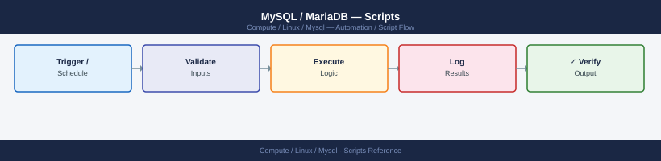

---
tags:
  - linux
  - operations
---
# MySQL / MariaDB — Scripts

<div class="kb-summary">
MySQL automation scripts — nightly backup, slow query report, replication lag alert, connection count monitoring, and table size report.

*Applies to: RHEL / Ubuntu LTS*
</div>


## Before you begin

- **Access:** root or sudo-capable account on target hosts
- **Timing:** safe to run during business hours unless a step is marked ⚠ (causes interruption)
- **Dependencies:** no active upgrades or migrations on the same infrastructure
- **Logging:** capture command output — paste into the change record on completion

---

## Nightly Backup Script

```bash
#!/bin/bash
# /opt/scripts/mysql-backup.sh
BACKUP_DIR="/backup/mysql/$(date +%F)"
PASS="$(cat /etc/mysql-backup.pass)"
mkdir -p "$BACKUP_DIR"

mysqldump -u backup_user -p"$PASS" \
  --single-transaction --routines --triggers \
  --all-databases | gzip > "$BACKUP_DIR/full.sql.gz"

# Retain 14 days
find /backup/mysql/ -maxdepth 1 -type d -mtime +14 -exec rm -rf {} +
echo "Backup complete: $BACKUP_DIR"
```

## Replication Lag Monitor

```bash
#!/bin/bash
# Alert if replica lag > 30 seconds
LAG=$(mysql -u monitor -p"$PASS" -Nse \
  "SHOW REPLICA STATUS" 2>/dev/null | awk '{print $43}')
if [ -n "$LAG" ] && [ "$LAG" -gt 30 ]; then
  echo "CRITICAL: Replication lag ${LAG}s on $(hostname)" | \
    mail -s "MySQL Replication Alert" dba@example.com
fi
```

## Connection Count Report

```bash
#!/bin/bash
# Log connection counts to CSV for trending
mysql -u monitor -p"$PASS" -Nse \
  "SELECT NOW(), VARIABLE_VALUE FROM performance_schema.global_status
   WHERE VARIABLE_NAME='Threads_connected';" \
  >> /var/log/mysql-connections.csv
```

## Table Size Report

```sql
-- Top 20 largest tables with row counts
SELECT
  TABLE_SCHEMA AS db,
  TABLE_NAME AS tbl,
  ROUND((DATA_LENGTH + INDEX_LENGTH) / 1024 / 1024, 1) AS size_mb,
  TABLE_ROWS AS approx_rows
FROM information_schema.TABLES
WHERE TABLE_SCHEMA NOT IN ('information_schema','mysql','performance_schema','sys')
ORDER BY (DATA_LENGTH + INDEX_LENGTH) DESC
LIMIT 20;
```

## Slow Query Report

```bash
# Weekly summary from slow query log
pt-query-digest \
  --since "$(date -d '7 days ago' +'%F %T')" \
  /var/log/mysql/slow.log \
  > /var/log/mysql-slow-report-$(date +%F).txt
```

## Index Usage Report

```sql
-- Find unused indexes (zero scans since last restart)
SELECT OBJECT_SCHEMA, OBJECT_NAME, INDEX_NAME
FROM performance_schema.table_io_waits_summary_by_index_usage
WHERE INDEX_NAME IS NOT NULL
  AND COUNT_STAR = 0
  AND OBJECT_SCHEMA NOT IN ('mysql','sys')
ORDER BY OBJECT_SCHEMA, OBJECT_NAME;
```

---

## Verify

- Confirm the operation completed without errors in the log or management UI
- Verify the expected state change is visible (service running, object created, config applied)
- Document the outcome in the change record

---

## See also

- [Mysql — Procedures](../procedures/)
- [Mysql — CLI Reference](../cli-reference/)
- [Mysql — Health Checks](../health-checks/)
