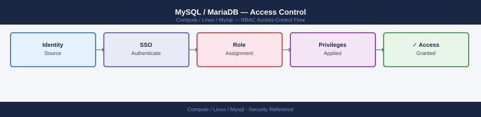

---
tags:
  - linux
  - security
---
# MySQL / MariaDB — Access Control

<div class="kb-summary">
MySQL access control — user creation, GRANT/REVOKE, privilege hierarchy, role-based access, and auditing who has access to what.

*Applies to: RHEL / Ubuntu LTS*
</div>


## Before you begin

- **Access:** root or sudo-capable account on target hosts
- **Change management:** security changes require CAB approval in most environments
- **Rollback plan:** document current state before any security control change
- **Testing:** validate in a non-production environment first where possible

---

## User Management

```sql
-- Create user restricted to app server subnet
CREATE USER 'appuser'@'10.0.1.%' IDENTIFIED BY 'StrongPassword1!';

-- Create read-only reporting user
CREATE USER 'reporter'@'10.0.2.10' IDENTIFIED BY 'ReportPass1!';

-- Drop user
DROP USER 'olduser'@'%';

-- Change password
ALTER USER 'appuser'@'10.0.1.%' IDENTIFIED BY 'NewPass1!';
```

## GRANT Statements

```sql
-- Application user: DML on one database
GRANT SELECT, INSERT, UPDATE, DELETE ON app_prod.* TO 'appuser'@'10.0.1.%';

-- Read-only access
GRANT SELECT ON reporting.* TO 'reporter'@'10.0.2.10';

-- DBA user: all on all
GRANT ALL PRIVILEGES ON *.* TO 'dba'@'localhost' WITH GRANT OPTION;

-- Apply changes
FLUSH PRIVILEGES;
```

## Roles (MySQL 8.0+)

```sql
-- Create a role
CREATE ROLE 'app_read', 'app_write';
GRANT SELECT ON app_prod.* TO 'app_read';
GRANT INSERT, UPDATE, DELETE ON app_prod.* TO 'app_write';

-- Assign role to user
GRANT 'app_read', 'app_write' TO 'appuser'@'10.0.1.%';
SET DEFAULT ROLE ALL TO 'appuser'@'10.0.1.%';
```

## Auditing Privileges

```sql
-- What can a specific user do?
SHOW GRANTS FOR 'appuser'@'10.0.1.%';

-- All users and their hosts
SELECT user, host, authentication_string FROM mysql.user;

-- All grants across all users
SELECT * FROM information_schema.USER_PRIVILEGES;

-- Object-level grants
SELECT * FROM information_schema.SCHEMA_PRIVILEGES WHERE GRANTEE LIKE '%appuser%';
```

## Privilege Hierarchy

| Level | Scope | Example |
|---|---|---|
| Global | All databases | `GRANT ALL ON *.*` |
| Database | One schema | `GRANT SELECT ON db.*` |
| Table | One table | `GRANT SELECT ON db.table` |
| Column | Specific columns | `GRANT SELECT (col1, col2) ON db.table` |

---

## See also

- [Mysql — Authentication](authentication/)
- [Mysql — Hardening](hardening/)
- [Mysql — Encryption](encryption/)
