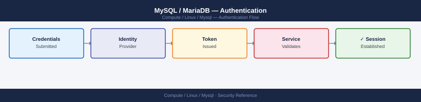

---
tags:
  - linux
  - security
description: "MySQL authentication — auth plugins (caching_sha2, mysql_native_password, auth_socket), SSL/TLS client certs, and password policy configuration."
---
# MySQL / MariaDB — Authentication

<div class="kb-summary">
MySQL authentication — auth plugins (caching_sha2, mysql_native_password, auth_socket), SSL/TLS client certs, and password policy configuration.

*Applies to: RHEL / Ubuntu LTS*
</div>


## Before you begin

- **Access:** root or sudo-capable account on target hosts
- **Change management:** security changes require CAB approval in most environments
- **Rollback plan:** document current state before any security control change
- **Testing:** validate in a non-production environment first where possible

---

## Authentication Plugins

| Plugin | MySQL version | Notes |
|---|---|---|
| `caching_sha2_password` | 8.0+ default | SHA-256 with RSA key exchange; requires SSL or RSA key |
| `mysql_native_password` | Legacy default | SHA1; weaker; still supported; required for older clients |
| `auth_socket` | Linux only | Authenticates by OS socket user; no password; `root@localhost` |

```sql
-- Check which plugin a user uses
SELECT user, host, plugin FROM mysql.user;

-- Change plugin for compatibility with old clients
ALTER USER 'appuser'@'%' IDENTIFIED WITH mysql_native_password BY 'Pass1!';

-- Use socket auth for root (password-free from OS root)
ALTER USER 'root'@'localhost' IDENTIFIED WITH auth_socket;
```

## Password Policy

```sql
-- View current policy
SHOW VARIABLES LIKE 'validate_password%';

-- Configure (MySQL 8.0+)
SET GLOBAL validate_password.policy = MEDIUM;  -- LOW / MEDIUM / STRONG
SET GLOBAL validate_password.length = 12;
SET GLOBAL validate_password.mixed_case_count = 1;
SET GLOBAL validate_password.number_count = 1;
SET GLOBAL validate_password.special_char_count = 1;
```

## SSL/TLS Client Certificate Authentication

```sql
-- Require SSL for a user
ALTER USER 'secure_user'@'%' REQUIRE SSL;

-- Require specific certificate CN
ALTER USER 'cert_user'@'%' REQUIRE SUBJECT '/CN=app-server-01';
```

```bash
# Connect with client certificate
mysql -u cert_user \
  --ssl-ca=/etc/mysql/ca-cert.pem \
  --ssl-cert=/etc/mysql/client-cert.pem \
  --ssl-key=/etc/mysql/client-key.pem
```


```text title="Expected output"
Welcome to the MySQL monitor.  Commands end with ; or \g.
Your MySQL connection id is 42857
Server version: 8.0.35-0ubuntu0.22.04.1 (Ubuntu)

Copyright (c) 2000, 2023, Oracle and/or its affiliates.

Oracle is a registered trademark of Oracle Corporation and/or its
affiliates. Other names may be trademarks of their respective
owners.

Type 'help;' or '\h' for help. Type '\c' to clear the current input statement.

mysql>
```

!!! warning "Common errors"
    | Error | Fix |
    |---|---|
    | `ERROR 2026 (HY000): SSL connection error: error:00000000:lib(0):func(0):reason(0)` | Verify certificate files exist and are readable with `ls -la /etc/mysql/*.pem` and check file permissions are 600 or 644. |
    | `ERROR 1045 (28000): Access denied for user 'cert_user'@'localhost' (using password: NO)` | Ensure the MySQL user `cert_user` is created with `CREATE USER 'cert_user'@'%' IDENTIFIED BY 'password' REQUIRE X509;` and grant appropriate privileges. |
    | `ERROR 2003 (HY000): Can't connect to MySQL server on 'localhost' (111)` | Verify MySQL server is running with `systemctl status mysql` and check that the host is correct (add `-h hostname` if connecting remotely). |
## Account Locking

```sql
-- Lock an account
ALTER USER 'appuser'@'%' ACCOUNT LOCK;

-- Unlock
ALTER USER 'appuser'@'%' ACCOUNT UNLOCK;

-- Auto-lock after failed attempts (MySQL 8.0+)
ALTER USER 'appuser'@'%' FAILED_LOGIN_ATTEMPTS 5 PASSWORD_LOCK_TIME 1;
```

---

## See also

- [Mysql — Access Control](../access-control/)
- [Mysql — Hardening](../hardening/)
- [Mysql — Encryption](../encryption/)
