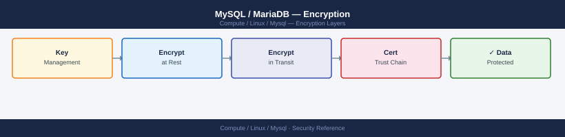

---
tags:
  - linux
  - security
---
# MySQL / MariaDB — Encryption

<div class="kb-summary">
MySQL encryption — InnoDB tablespace encryption (TDE), SSL/TLS for connections, encrypted backups, and keyring plugin configuration.

*Applies to: RHEL / Ubuntu LTS*
</div>



```d2
direction: down

external: External / Untrusted {shape: rectangle}
innodb_tablespace_encryption_tde: "InnoDB Tablespace Encryption (TDE)" {shape: rectangle}
ssltls_for_client_connections: "SSL/TLS for Client Connections" {shape: rectangle}
binlog_encryption: "Binlog Encryption" {shape: rectangle}
backup_encryption: "Backup Encryption" {shape: rectangle}
key_rotation: "Key Rotation" {shape: rectangle}
core: "Linux Core" {shape: hexagon}

external -> innodb_tablespace_encryption_tde: traffic in
innodb_tablespace_encryption_tde -> ssltls_for_client_connections
ssltls_for_client_connections -> binlog_encryption
binlog_encryption -> backup_encryption
backup_encryption -> key_rotation
key_rotation -> core: secured path
```

## Before you begin

- **Access:** root or sudo-capable account on target hosts
- **Change management:** security changes require CAB approval in most environments
- **Rollback plan:** document current state before any security control change
- **Testing:** validate in a non-production environment first where possible

---

## InnoDB Tablespace Encryption (TDE)

Requires a keyring plugin. MySQL 8.0+ includes `component_keyring_file`.

```ini
# /etc/mysql/mysql.conf.d/mysqld.cnf
early-plugin-load = keyring_file.so
keyring_file_data = /var/lib/mysql-keyring/keyring
```

```sql
-- Enable encryption for a table
CREATE TABLE sensitive (id INT, data VARCHAR(255)) ENCRYPTION='Y';

-- Encrypt an existing table
ALTER TABLE users ENCRYPTION='Y';

-- Check which tables are encrypted
SELECT TABLE_SCHEMA, TABLE_NAME, CREATE_OPTIONS
FROM information_schema.TABLES
WHERE CREATE_OPTIONS LIKE '%ENCRYPTION%';

-- Enable default encryption for all new InnoDB tables
SET GLOBAL default_table_encryption = ON;
```

## SSL/TLS for Client Connections

```bash
# Generate CA and server certs (if not auto-generated)
mysql_ssl_rsa_setup --datadir=/var/lib/mysql

# Verify SSL is active
mysql -u root -p -e "SHOW VARIABLES LIKE 'have_ssl';"
# Expect: have_ssl = YES
```

```sql
-- Confirm active connection uses SSL
STATUS;   -- look for "SSL: Cipher in use is ..."

-- Require SSL for all connections from a specific user
ALTER USER 'appuser'@'%' REQUIRE SSL;
```

## Binlog Encryption

```ini
[mysqld]
binlog_encryption = ON    # MySQL 8.0.14+
```

## Backup Encryption

```bash
# Percona XtraBackup with AES256
xtrabackup --backup --encrypt=AES256 \
  --encrypt-key-file=/etc/xtrabackup.key \
  --target-dir=/backup/xb-$(date +%F)
```

## Key Rotation

```sql
-- Rotate the master key (re-encrypts all tablespace keys)
ALTER INSTANCE ROTATE INNODB MASTER KEY;
```

---

## See also

- [Mysql — Hardening](hardening/)
- [Mysql — Authentication](authentication/)
- [Mysql — Access Control](access-control/)
