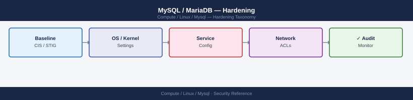

---
tags:
  - linux
  - security
---
# MySQL / MariaDB — Hardening

<div class="kb-summary">
MySQL hardening — removing defaults, binding to specific interfaces, disabling LOAD DATA LOCAL, audit plugin, and CIS benchmark key controls.

*Applies to: RHEL / Ubuntu LTS*
</div>


## Before you begin

- **Access:** root or sudo-capable account on target hosts
- **Change management:** security changes require CAB approval in most environments
- **Rollback plan:** document current state before any security control change
- **Testing:** validate in a non-production environment first where possible

---

## Post-Install Hardening Steps

```bash
# 1. Run secure installation wizard
sudo mysql_secure_installation
# Sets root password, removes anonymous users, disables remote root, removes test DB

# 2. Verify no anonymous users remain
mysql -u root -p -e "SELECT user, host FROM mysql.user WHERE user='';"

# 3. Verify no remote root access
mysql -u root -p -e "SELECT user, host FROM mysql.user WHERE user='root' AND host != 'localhost';"
```

## Configuration Hardening (`mysqld.cnf`)

```ini
[mysqld]
# Bind to specific IP — never 0.0.0.0 in production
bind-address = 127.0.0.1

# Disable LOAD DATA LOCAL (file exfiltration risk)
local_infile = OFF

# Disable symbolic links
symbolic-links = 0

# Restrict file operations to datadir
secure_file_priv = /var/lib/mysql-files/

# Disable general query log in production (contains all queries including passwords)
general_log = OFF

# Enable slow query log for tuning
slow_query_log = ON
long_query_time = 2
```

## OS-Level Controls

```bash
# MySQL process should run as mysql user
ps aux | grep mysqld   # uid should be mysql

# Datadir permissions
ls -la /var/lib/mysql   # should be mysql:mysql 750

# Restrict config file
sudo chmod 640 /etc/mysql/mysql.conf.d/mysqld.cnf
sudo chown root:mysql /etc/mysql/mysql.conf.d/mysqld.cnf
```

## Audit Logging

```sql
-- MySQL Enterprise Audit (commercial) or MariaDB Audit Plugin
INSTALL PLUGIN server_audit SONAME 'server_audit.so';
SET GLOBAL server_audit_logging = ON;
SET GLOBAL server_audit_events = 'CONNECT,QUERY_DDL,QUERY_DML';
SET GLOBAL server_audit_file_path = '/var/log/mysql/audit.log';
```

## Key CIS Benchmark Controls

| Control | Check |
|---|---|
| No anonymous accounts | `SELECT user FROM mysql.user WHERE user=''` → 0 rows |
| No remote root | `SELECT host FROM mysql.user WHERE user='root' AND host != 'localhost'` → 0 rows |
| `local_infile = OFF` | `SHOW VARIABLES LIKE 'local_infile'` → OFF |
| `log_error` set | `SHOW VARIABLES LIKE 'log_error'` → path set |
| SSL enabled | `SHOW VARIABLES LIKE 'have_ssl'` → YES |

---

## See also

- [Mysql — Authentication](../authentication/)
- [Mysql — Access Control](../access-control/)
- [Mysql — Encryption](../encryption/)
