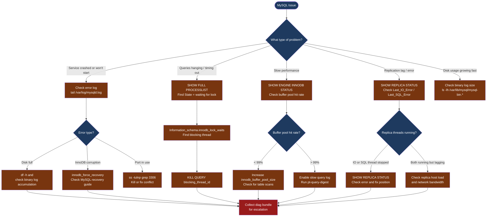

---
tags:
  - linux
  - troubleshooting
search:
  boost: 1.5
---
# MySQL / MariaDB — Diagnostics

<div class="kb-summary">
MySQL diagnostic commands: read the error log, inspect active sessions with SHOW FULL PROCESSLIST, find lock contention with innodb_lock_waits, analyse InnoDB status for deadlocks and buffer pool health, identify slow queries with pt-query-digest, and check replication status.

*Applies to: MySQL 8.x and MariaDB 10.x on RHEL / Ubuntu LTS*
</div>




```d2
direction: down

symptom: Identify Symptom {shape: diamond}
step_1_check_the_error_log_and_servi: "Step 1 — Check the error log and service status" {shape: rectangle}
step_2_check_active_connections_and_: "Step 2 — Check active connections and long-running queries" {shape: rectangle}
step_3_find_and_resolve_lock_content: "Step 3 — Find and resolve lock contention" {shape: rectangle}
step_4_check_innodb_engine_status: "Step 4 — Check InnoDB engine status" {shape: rectangle}
step_5_enable_and_analyse_the_slow_q: "Step 5 — Enable and analyse the slow query log" {shape: rectangle}
step_6_check_replication_status: "Step 6 — Check replication status" {shape: rectangle}
resolution: Resolve or Escalate {shape: oval}

symptom -> step_1_check_the_error_log_and_servi: investigate
symptom -> step_2_check_active_connections_and_: investigate
symptom -> step_3_find_and_resolve_lock_content: investigate
symptom -> step_4_check_innodb_engine_status: investigate
symptom -> step_5_enable_and_analyse_the_slow_q: investigate
symptom -> step_6_check_replication_status: investigate
step_1_check_the_error_log_and_servi -> resolution
step_2_check_active_connections_and_ -> resolution
step_3_find_and_resolve_lock_content -> resolution
step_4_check_innodb_engine_status -> resolution
step_5_enable_and_analyse_the_slow_q -> resolution
step_6_check_replication_status -> resolution
```

## Before you begin

- **Access:** root or a MySQL account with `PROCESS`, `SUPER`, and `REPLICATION CLIENT` privileges; OS sudo for log access
- **Gather first:** the exact error message (from client or MySQL error log), the database name, the table or query involved, and whether the issue started suddenly or has been gradual
- **Scope:** confirm whether the issue affects one query, one table, one database, the whole server, or only the replica
- **Do not run KILL arbitrarily:** identify the blocking session before killing anything — the blocked session may be a long-running legitimate transaction

---

## Step 1 — Check the error log and service status

```bash
# Check if MySQL is running
systemctl status mysqld   # RHEL
systemctl status mysql    # Ubuntu

# Error log location (RHEL)
sudo tail -100 /var/log/mysqld.log

# Error log location (Ubuntu)
sudo tail -100 /var/log/mysql/error.log

# systemd journal (works on both)
sudo journalctl -u mysqld --since "1 hour ago" | tail -100

# Watch error log in real time
sudo tail -f /var/log/mysqld.log | grep -i 'error\|warning\|crash\|abort'

# Common error patterns:
#   [ERROR] InnoDB: Detected table corruption — check disk health
#   [ERROR] Table './db/table' is marked as crashed — run REPAIR TABLE
#   Can't create a new thread — OS thread limit or ulimit issue
#   Access denied for user — credential or privilege problem
#   [ERROR] Disk is full — clear binary logs or add disk
```

---

## Step 2 — Check active connections and long-running queries

```sql
-- All active queries with full text
SHOW FULL PROCESSLIST;
-- Columns: Id, User, Host, db, Command, Time, State, Info (full query)
-- Look for: State = "Waiting for lock", "Sending data" for a long time
-- Time column = seconds the query has been running

-- Long-running transactions (> 60 seconds)
SELECT trx_id, trx_started, trx_state,
       now() - trx_started AS duration_sec,
       trx_mysql_thread_id AS thread_id,
       left(trx_query, 100) AS query
FROM information_schema.innodb_trx
WHERE (now() - trx_started) > 60
ORDER BY duration_sec DESC;
-- "idle in transaction" for > 60 sec = common lock holder; consider killing
```

---

## Step 3 — Find and resolve lock contention

```sql
-- Who is blocking whom (MySQL 8.0+)
SELECT r.trx_id                   AS waiting_trx,
       r.trx_mysql_thread_id      AS waiting_thread,
       r.trx_query                AS waiting_query,
       b.trx_id                   AS blocking_trx,
       b.trx_mysql_thread_id      AS blocking_thread,
       b.trx_query                AS blocking_query
FROM performance_schema.data_lock_waits w
JOIN information_schema.innodb_trx b ON b.trx_id = w.blocking_engine_transaction_id
JOIN information_schema.innodb_trx r ON r.trx_id = w.requesting_engine_transaction_id;

-- For MySQL 5.7 / MariaDB (older information_schema tables)
SELECT r.trx_id waiting_trx, b.trx_id blocking_trx,
       r.trx_mysql_thread_id waiting_thread, b.trx_mysql_thread_id blocking_thread,
       left(r.trx_query, 80) waiting_query
FROM information_schema.innodb_lock_waits w
JOIN information_schema.innodb_trx b ON b.trx_id = w.blocking_trx_id
JOIN information_schema.innodb_trx r ON r.trx_id = w.requesting_trx_id;

-- Cancel the blocking query (graceful — waits for a safe point)
KILL QUERY <blocking_thread_id>;

-- Kill the blocking connection entirely (disconnects the client)
KILL <blocking_thread_id>;
-- Only use KILL CONNECTION if KILL QUERY does not release the lock within 30 seconds
```

---

## Step 4 — Check InnoDB engine status

```sql
-- Full InnoDB diagnostic dump
SHOW ENGINE INNODB STATUS\G
-- Key sections to read:
--   LATEST DETECTED DEADLOCK: shows the queries and locks involved in the last deadlock
--   TRANSACTIONS: lists all active transactions and their lock state
--   BUFFER POOL AND MEMORY: shows buffer pool hit rate

-- Buffer pool hit rate (should be > 99% in steady state)
SHOW STATUS LIKE 'Innodb_buffer_pool_read%';
-- hit_rate % = Reads_requests / (Read_requests + Reads) * 100
-- < 99% = too much disk I/O; consider increasing innodb_buffer_pool_size

-- Check current buffer pool size
SHOW VARIABLES LIKE 'innodb_buffer_pool_size';
-- Rule of thumb: 70-80% of available RAM for a dedicated MySQL server

-- Check for pending I/O operations
SHOW ENGINE INNODB STATUS\G
-- Look for: "Pending normal aio reads" > 0 = disk I/O bottleneck
```

---

## Step 5 — Enable and analyse the slow query log

```sql
-- Enable slow query log temporarily (no restart required)
SET GLOBAL slow_query_log = ON;
SET GLOBAL long_query_time = 1;       -- log queries > 1 second
SET GLOBAL log_queries_not_using_indexes = ON;  -- also log full scans

-- Check current slow query log path
SHOW VARIABLES LIKE 'slow_query_log_file';
```

```bash
# Analyse slow query log with Percona pt-query-digest
# Install: yum install percona-toolkit (RHEL) or apt install percona-toolkit (Ubuntu)
pt-query-digest /var/log/mysql/slow.log | head -200
# Output: top queries ranked by total execution time
# Look for: highest "total" and "mean" execution times; "Rows examine" >> "Rows sent"

# EXPLAIN a specific slow query
mysql -u root -p -e "EXPLAIN SELECT * FROM db.table WHERE col = 'value'\G"
# Look for:
#   type = ALL → full table scan (needs an index)
#   type = index → full index scan (may still be slow on large tables)
#   rows = high number → optimizer is scanning many rows
#   Extra = Using filesort → sort is happening in memory/disk (costly)
```

---

## Step 6 — Check replication status

```sql
-- Show replica status (MySQL 8.0+ uses REPLICA; 5.7 and MariaDB use SLAVE)
SHOW REPLICA STATUS\G
-- Key fields:
--   Replica_IO_Running:    Yes = IO thread connected to primary and reading binlog
--   Replica_SQL_Running:   Yes = SQL thread applying events from relay log
--   Seconds_Behind_Source: lag in seconds (0 = in sync; NULL = IO thread not running)
--   Last_IO_Error:         why the IO thread stopped (e.g., can't connect to primary)
--   Last_SQL_Error:        why the SQL thread stopped (e.g., duplicate key, row not found)
--   Relay_Log_File, Relay_Log_Pos: current relay log position being applied

-- If SQL thread stopped with a specific error and you need to skip one event (use rarely)
SET GLOBAL SQL_REPLICA_SKIP_COUNTER = 1;
START REPLICA SQL_THREAD;
-- Only skip if the event is genuinely safe to skip (e.g., non-critical duplicate insert)

-- Check binary log status on the primary
SHOW BINARY LOG STATUS\G
-- Shows: current binlog file and position; share this with replica for position verification
```

---

## Step 7 — Collect diagnostic snapshot for escalation

```bash
# All-in-one diagnostic capture
{
  echo "=== MySQL version ==="
  mysql -u root -p -e "SELECT VERSION();"
  echo "=== Active processes ==="
  mysql -u root -p -e "SHOW FULL PROCESSLIST;"
  echo "=== Long-running transactions ==="
  mysql -u root -p -e "SELECT trx_id, trx_state, now()-trx_started AS dur_sec, trx_query FROM information_schema.innodb_trx ORDER BY dur_sec DESC;"
  echo "=== InnoDB status ==="
  mysql -u root -p -e "SHOW ENGINE INNODB STATUS\G"
  echo "=== Replication status ==="
  mysql -u root -p -e "SHOW REPLICA STATUS\G" 2>/dev/null || \
    mysql -u root -p -e "SHOW SLAVE STATUS\G"
  echo "=== Binary log list ==="
  mysql -u root -p -e "SHOW BINARY LOGS;"
  echo "=== Disk usage ==="
  df -h /var/lib/mysql
  echo "=== Error log (last 100 lines) ==="
  sudo tail -100 /var/log/mysqld.log 2>/dev/null || \
    sudo tail -100 /var/log/mysql/error.log
} 2>&1 > /tmp/mysql-diag-$(date +%F-%H%M).txt
```

---

## Log locations

| Source | Path / Command | What to look for |
|---|---|---|
| Error log (RHEL) | `/var/log/mysqld.log` | Service errors, crash, InnoDB issues |
| Error log (Ubuntu) | `/var/log/mysql/error.log` | Same |
| Slow query log | Configured path (`SHOW VARIABLES LIKE 'slow_query_log_file'`) | Queries exceeding long_query_time |
| Binary logs | `/var/lib/mysql/mysql-bin.*` | Replication position, DML history |
| systemd journal | `journalctl -u mysqld --since "1h ago"` | Service start/stop, OOM events |

---

## See also

- [MySQL — Common Issues](common-issues/)
- [MySQL — Escalation](escalation/)
- [MySQL — Health Checks](../operations/health-checks/)

## Verify resolution

- `SHOW FULL PROCESSLIST` shows no sessions with State = "Waiting for lock" for more than a few seconds
- `SHOW ENGINE INNODB STATUS\G` buffer pool hit rate > 99%
- `SHOW REPLICA STATUS\G` shows `Replica_IO_Running: Yes`, `Replica_SQL_Running: Yes`, `Seconds_Behind_Source: 0`
- The original slow query now returns within expected time; `EXPLAIN` shows Index Scan, not ALL
- No new ERROR or PANIC entries in the error log in the last 15 minutes
