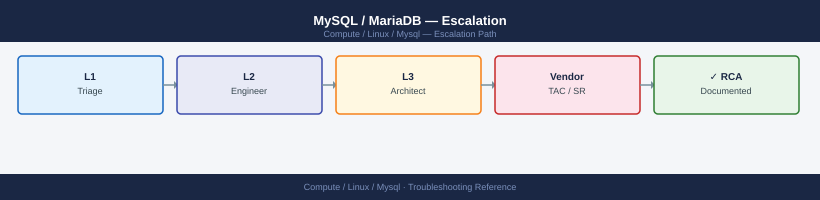
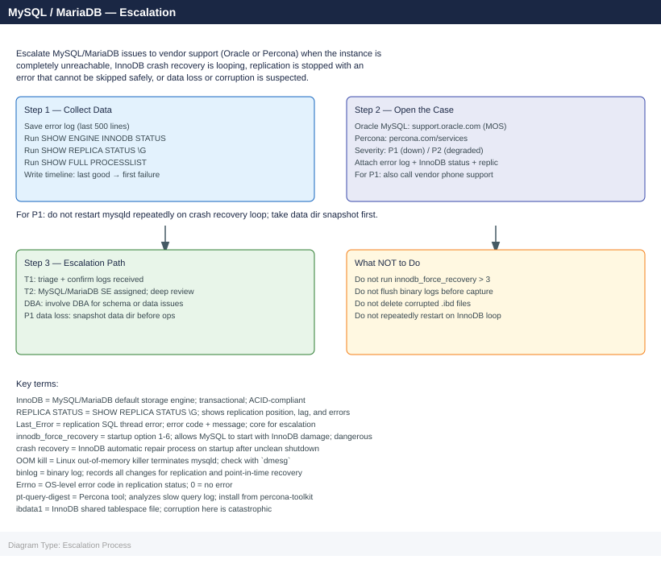
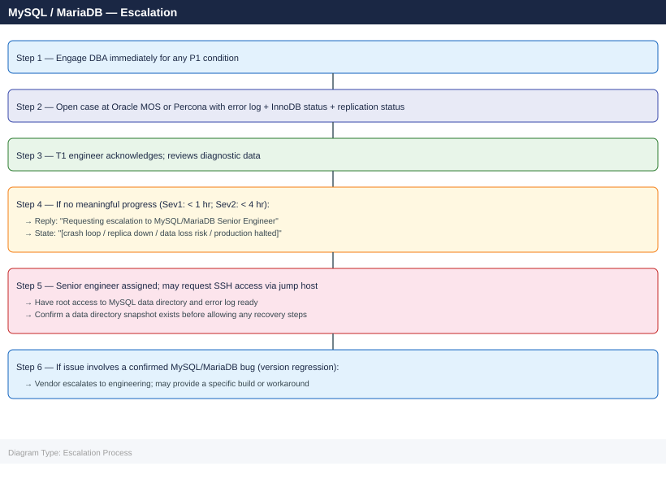

---
tags:
  - linux
  - troubleshooting
search:
  boost: 1.5
description: "How to escalate MySQL and MariaDB issues to Oracle MySQL support or Percona support: what data to collect, how to capture InnoDB status and replication..."
---
# MySQL / MariaDB — Escalation

<div class="kb-summary">
How to escalate MySQL and MariaDB issues to Oracle MySQL support or Percona support: what data to collect, how to capture InnoDB status and replication state, step-by-step case creation, and the escalation path when progress stalls.

*Applies to: MySQL 8.x / MariaDB 10.x on RHEL / Ubuntu LTS*
</div>





---

```d2
direction: down

symptom: Identify Symptom {shape: diamond}
when_to_escalate_immediately: "When to Escalate Immediately" {shape: rectangle}
preescalation_selfcheck: "Pre-Escalation Self-Check" {shape: rectangle}
stepbystep_data_collection: "Step-by-Step Data Collection" {shape: rectangle}
how_to_open_the_case: "How to Open the Case" {shape: rectangle}
escalation_path: "Escalation Path" {shape: rectangle}
what_not_to_do: "What NOT to Do" {shape: rectangle}
resolution: Resolve or Escalate {shape: oval}

symptom -> when_to_escalate_immediately: investigate
symptom -> preescalation_selfcheck: investigate
symptom -> stepbystep_data_collection: investigate
symptom -> how_to_open_the_case: investigate
symptom -> escalation_path: investigate
symptom -> what_not_to_do: investigate
when_to_escalate_immediately -> resolution
preescalation_selfcheck -> resolution
stepbystep_data_collection -> resolution
how_to_open_the_case -> resolution
escalation_path -> resolution
what_not_to_do -> resolution
```

## Before you begin

- **Access required:** MySQL `root` user or an account with `SUPER`, `REPLICATION CLIENT`, and `PROCESS` privileges; root or `sudo` on the Linux host; Oracle My Oracle Support (MOS) account (for Oracle MySQL Enterprise) or Percona account (for Percona support)
- **Do NOT restart mysqld repeatedly** when InnoDB crash recovery is looping — each failed restart attempt may make corruption worse; take a filesystem snapshot or `rsync` of the data directory first
- **Do NOT set `innodb_force_recovery` above 3** without explicit DBA or vendor guidance — levels 4–6 permanently disable redo log processing and can destroy data
- **Do NOT delete `.ibd` files** during a crash recovery — InnoDB tablespace files contain the actual table data; deleting them causes permanent data loss

---

## When to Escalate Immediately

Escalate to the DBA or vendor support without delay for any of these:

- **MySQL unreachable** — `systemctl status mysqld` shows failed; all connections refused
- **InnoDB crash recovery loop** — mysqld restarts repeatedly with InnoDB recovery errors
- **Replication stopped with `Errno != 0`** and the error cannot be skipped safely (data mismatch)
- **Disk full on data or log directory** — writes failing; data directory at 100%
- **OOM kill** — `dmesg | grep -i "Out of memory"` shows mysqld killed
- **Data corruption suspected** — `SHOW ENGINE INNODB STATUS` shows corruption errors; tables return incomplete data
- **`Seconds_Behind_Source` > 1 hour sustained** with no long-running transactions to explain it

---

## Pre-Escalation Self-Check

Run these before opening the case.

| Check | Command | Expected result |
|---|---|---|
| MySQL service status | `systemctl status mysqld` or `mysqld_safe` | Active (running) |
| MySQL version | `mysqld --version` or `SELECT version()` | Note full version |
| Replication status | `SHOW REPLICA STATUS\G` | `Slave_SQL_Running: Yes`; `Last_Errno: 0` |
| Replication lag | `SHOW REPLICA STATUS\G` → `Seconds_Behind_Source` | Close to 0 |
| InnoDB status | `SHOW ENGINE INNODB STATUS\G` | No deadlock section; no corruption messages |
| Disk space | `df -h /var/lib/mysql` | Below 80% used |
| Active connections | `SHOW PROCESSLIST` | No sessions stuck in `Waiting for lock` > 60 sec |
| Error log recent | `tail -50 /var/log/mysqld.log` | No `[ERROR]` entries in the last hour |

---

## Step-by-Step Data Collection

### 1. Get the MySQL version and configuration

```bash
# MySQL/MariaDB version
mysqld --version
mysql -u root -p -e "SELECT VERSION(), @@datadir, @@innodb_buffer_pool_size, @@max_connections;"

# Key variables
mysql -u root -p -e "SHOW GLOBAL VARIABLES LIKE 'innodb%';" > /tmp/innodb-vars.txt
mysql -u root -p -e "SHOW GLOBAL STATUS;" > /tmp/global-status.txt
```


```text title="Expected output"
mysqld  Ver 8.0.35-0ubuntu0.20.04.1 for Linux on x86_64 (Ubuntu)
Enter password: 
VERSION()	@@datadir	@@innodb_buffer_pool_size	@@max_connections
8.0.35	/var/lib/mysql	1073741824	151
Variable_name	Value
innodb_abort_on_paint	OFF
innodb_adaptive_flushing	ON
innodb_adaptive_flushing_lwm	10
innodb_adaptive_hash_index	ON
innodb_adaptive_hash_index_parts	8
...
(no output — command completes silently)
(no output — command completes silently)
```

!!! warning "Common errors"
    **`ERROR 1045 (28000): Access denied for user 'root'@'localhost' (using password: YES)`** — Verify the root password is correct or use `mysql -u root -p` without `-p` if no password is set.
    **`ERROR 2002 (HY000): Can't connect to local MySQL server through socket '/var/run/mysqld/mysqld.sock'`** — Ensure MySQL/MariaDB service is running with `sudo systemctl start mysql` or `sudo systemctl start mariadb`.
    **`bash: mysqld: command not found`** — Add the MySQL bin directory to PATH with `export PATH=$PATH:/usr/sbin:/usr/local/mysql/bin` or use the full path `/usr/sbin/mysqld --version`.
### 2. Save the error log

```bash
# Error log path varies by distribution
# RHEL/CentOS: /var/log/mysqld.log
# Ubuntu/Debian: /var/log/mysql/error.log
# or check: mysql -u root -p -e "SHOW VARIABLES LIKE 'log_error';"

sudo tail -500 /var/log/mysqld.log > /tmp/mysql-error-$(date +%Y%m%d%H%M).log

# Check for OOM kill in system log
sudo dmesg | grep -i "out of memory\|kill process\|mysqld" > /tmp/dmesg-mysql.txt
sudo grep -i "mysqld\|mysql\|oom" /var/log/messages 2>/dev/null | tail -100 >> /tmp/dmesg-mysql.txt
```


```text title="Expected output"
tail: cannot open '/var/log/mysqld.log' for reading: No such file or directory
(no output — command completes silently)
(no output — command completes silently)
```

!!! warning "Common errors"
    **`tail: cannot open '/var/log/mysqld.log' for reading: No such file or directory`** — Verify the correct log path for your distribution by running `mysql -u root -p -e "SHOW VARIABLES LIKE 'log_error';"` first.
    **`sudo: no tty present and no askpass program specified`** — Run the commands with a TTY or configure passwordless sudo for the mysql log paths in sudoers.
    **`grep: /var/log/messages: No such file or directory`** — This is expected on systemd-based systems; use `sudo journalctl -u mysql -n 100` instead to check the system journal.
### 3. Capture InnoDB status (critical for crash and lock issues)

```bash
mysql -u root -p -e "SHOW ENGINE INNODB STATUS\G" > /tmp/innodb-status-$(date +%Y%m%d%H%M).txt

# Look for:
# - LATEST DETECTED DEADLOCK section
# - FILE I/O section for errors
# - BUFFER POOL AND MEMORY section
# - TRANSACTIONS section for long-running transactions
```


```text title="Expected output"
mysql: [Warning] Using a password on the command line interface can be insecure.
(no output — command completes silently)
```

!!! warning "Common errors"
    **`mysql: [Warning] Using a password on the command line interface can be insecure.`** — Use a MySQL options file (~/.my.cnf) with [client] section containing password, or use mysql_config_editor to store credentials securely.
    **`ERROR 1045 (28000): Access denied for user 'root'@'localhost'`** — Verify the root password is correct and the user has SUPER privilege; use `mysql -u root -p` interactively to test credentials first.
    **`bash: /tmp/innodb-status-20250115143022.txt: Permission denied`** — Ensure the /tmp directory is writable by the user running the command, or redirect to a directory with write permissions like `~/innodb-status.txt`.
### 4. Capture replication status (if replica)

```bash
# On the replica server
mysql -u root -p -e "SHOW REPLICA STATUS\G" > /tmp/replica-status-$(date +%Y%m%d%H%M).txt

# On the primary: check binary log position
mysql -u root -p -e "SHOW MASTER STATUS\G" > /tmp/master-status.txt

# Binary log list
mysql -u root -p -e "SHOW BINARY LOGS;" > /tmp/binlog-list.txt
```


```text title="Expected output"
Enter password: 
Enter password: 
Enter password: 
# /tmp/replica-status-202401151430.txt contains:
*************************** 1. row ***************************
             Replica_IO_State: Waiting for source to send event
                  Source_Host: 10.45.12.8
                  Source_User: repl_user
                  Source_Port: 3306
                Source_Log_File: mysql-bin.000047
            Read_Master_Log_Pos: 156284391
                 Relay_Log_File: relay-bin.000089
                  Relay_Log_Pos: 156284504
          Relay_Master_Log_File: mysql-bin.000047
               Slave_IO_Running: Yes
              Slave_SQL_Running: Yes
                 Seconds_Behind_Master: 0

# /tmp/master-status.txt contains:
*************************** 1. row ***************************
             File: mysql-bin.000047
         Position: 156284391
     Binlog_Do_DB: 
 Binlog_Ignore_DB: 
Executed_Gtid_Set: 8e4a2c91-7f3b-11ed-9a1c-0242ac110002:1-4521847

# /tmp/binlog-list.txt contains:
+------------------+-----------+-----------+
| Log_name         | File_size | Encrypted |
+------------------+-----------+-----------+
| mysql-bin.000045 | 536870912 | N         |
| mysql-bin.000046 | 536870912 | N         |
| mysql-bin.000047 | 156284391 | N         |
+------------------+-----------+-----------+
```

!!! warning "Common errors"
    **`ERROR 1045 (28000): Access denied for user 'root'@'localhost' (using password: YES)`** — Verify the root password is correct and the user has REPLICATION CLIENT privilege; use `mysql -u root -p -e "SHOW GRANTS FOR root@localhost;"` to confirm permissions.
    **`ERROR 2003 (HY000): Can't connect to MySQL server on '10.45.12.8' (111)`** — Ensure the MySQL service is running on the target host with `systemctl status mysql` and that the firewall allows port 3306 from the replica server.
    **`ERROR 1227 (42000): Access denied; you need (at least one of) the REPLICATION CLIENT privilege(s) for this operation`** — Grant the required privilege with `GRANT REPLICATION CLIENT ON *.* TO 'root'@'localhost';` on the primary server.
### 5. Capture active process list and blocking

```bash
# Full process list
mysql -u root -p -e "SHOW FULL PROCESSLIST;" > /tmp/processlist.txt

# Sessions waiting for locks
mysql -u root -p << 'SQL' > /tmp/lock-waits.txt
SELECT r.trx_id AS waiting_trx,
       r.trx_query AS waiting_query,
       b.trx_id AS blocking_trx,
       b.trx_query AS blocking_query,
       b.trx_started
FROM information_schema.INNODB_TRX b
JOIN information_schema.INNODB_TRX r
  ON r.trx_wait_started IS NOT NULL;
SQL
```


```text title="Expected output"
mysql: [Warning] Using a password on the command line is insecure.
(no output — command completes silently)
mysql: [Warning] Using a password on the command line is insecured.
(no output — command completes silently)

$ cat /tmp/processlist.txt
     Id	User	Host	db	Command	Time	State	Info
      5	root	localhost	NULL	Query	0	init	SHOW FULL PROCESSLIST
     12	app_user	192.168.1.45:52341	production	Query	2	Sending data	SELECT * FROM orders WHERE status='pending'
     18	app_user	192.168.1.46:52342	production	Sleep	45	NULL	NULL
     24	replication	192.168.1.50:3306	NULL	Binlog Dump	3600	Master has sent all binlog to slave	NULL

$ cat /tmp/lock-waits.txt
waiting_trx	waiting_query	blocking_trx	blocking_query	trx_started
trx_12345	UPDATE inventory SET qty=qty-1 WHERE id=999	trx_12340	UPDATE inventory SET qty=qty+5 WHERE id=999	2024-01-15 14:23:18
trx_12346	DELETE FROM orders WHERE order_id=5001	trx_12345	SELECT * FROM orders WHERE order_id=5001 FOR UPDATE	2024-01-15 14:23:22
```

!!! warning "Common errors"
    **`mysql: [Warning] Using a password on the command line is insecure.`** — Use a MySQL options file (~/.my.cnf) with [client] section containing user and password, or use mysql_config_editor to store credentials securely.
    **`ERROR 1045 (28000): Access denied for user 'root'@'localhost' (using password: YES)`** — Verify the root password is correct and the user has PROCESS and SUPER privileges with `GRANT PROCESS, SUPER ON *.* TO 'root'@'localhost';`.
    **`ERROR 1064 (42000): You have an error in your SQL syntax`** — Ensure the heredoc SQL block uses proper quoting and that all table names in information_schema match your MySQL version (use SHOW TABLES IN information_schema to verify).
### 6. Write the timeline

```text
MySQL version: 8.0.36 (Community) / MariaDB 10.11.7 (Enterprise)
Host: db-prod-01.corp.local (RHEL 8.9, 32 GB RAM)
Role: Primary (db-prod-01) with 2 replicas (db-prod-02, db-prod-03)
Issue first observed: 2026-06-14 07:00 UTC
Last confirmed replication sync: 2026-06-14 06:30 UTC
Changes in 24h before the issue:
  - 06:00: MySQL 8.0.35 to 8.0.36 upgrade applied; service restarted
  - 06:30: db-prod-02 replica: Seconds_Behind_Source starts increasing
  - 07:00: db-prod-02: SHOW REPLICA STATUS shows Last_Errno 1062 (duplicate key)
  - 07:05: db-prod-02 SQL thread stopped; Seconds_Behind_Source: NULL
Steps already taken:
  - SHOW REPLICA STATUS: Last_Error = "Duplicate entry '12345' for key 'orders.PRIMARY'"
  - Did NOT run SET GLOBAL SQL_SLAVE_SKIP_COUNTER or SKIP (data integrity risk)
  - Did NOT restart mysqld on primary
Blast radius: db-prod-02 out of sync since 06:30 UTC; RPO window: 30 minutes if primary fails
```

---

## How to Open the Case

### Oracle MySQL Enterprise Support (My Oracle Support)

1. Go to **support.oracle.com** and sign in with your Oracle account linked to your MySQL Enterprise support contract.

2. Click **Create Service Request**.

3. Under **Product**, select **MySQL Server** and your version.

4. Under **Severity**, select:
   - **Severity 1**: MySQL completely down; data loss occurring; crash recovery looping; no workaround
   - **Severity 2**: Replication stopped; significant performance degradation; partial availability
   - **Severity 3**: Non-critical issue; workaround exists
   - **Severity 4**: How-to, pre-upgrade planning, non-urgent question

5. In the **Summary** field: symptom + scope. Example: `MySQL 8.0.36 — replica stopped with errno 1062 after upgrade 8.0.35→8.0.36, 30-minute RPO gap, primary still running`.

6. Under **Attachments**, upload: error log, InnoDB status output, replication status output.

7. Click **Submit**. **Sev 1**: also call Oracle Support — phone number listed in your MOS account.

### Percona Support (MySQL / MariaDB / Percona Server)

1. Go to **customers.percona.com** and sign in with your Percona customer account.

2. Click **Open a Ticket**.

3. Select the product (MySQL / MariaDB / Percona Server) and version.

4. Set severity (P1/P2/P3) based on production impact.

5. Attach: error log, InnoDB status, replication status, slow query log.

6. Submit. For P1, Percona provides 24×7 response.

---

## Escalation Path



---

## What NOT to Do

| Do NOT do this | Why | What to do instead |
|---|---|---|
| Restart mysqld repeatedly during InnoDB crash recovery loop | Each failed restart attempt may extend the corruption into additional pages | Take a snapshot or `rsync` of the data directory first; contact the DBA; let them guide the recovery |
| Set `innodb_force_recovery` above 3 without DBA/vendor guidance | Levels 4–6 permanently disable redo log processing; redo-based recovery is no longer possible after this | Use levels 1–3 incrementally (1, then 2, then 3) only under DBA supervision; document each attempt |
| Delete `.ibd` files or tablespace files during recovery | `.ibd` files contain the actual table data; deletion = permanent data loss | Never delete `.ibd` files; only rename them as a last resort under vendor guidance |
| Skip replication errors with `SQL_SLAVE_SKIP_COUNTER` for data integrity errors (errno 1062, 1032) | Skipping these errors causes the replica to diverge from the primary; data will differ between servers | Investigate why the duplicate key or missing row error occurred; contact the DBA before skipping any replication error |
| Flush or purge binary logs before capture | Binary logs are needed for point-in-time recovery and to diagnose the replication issue | Copy binary log files to a safe location before any purge operations |
| Run `myisamchk` or `mysqlcheck` on live InnoDB tables | `myisamchk` is for MyISAM only; running it on InnoDB tables can corrupt them | Use `mysqlcheck --innodb-optimize-only` or `OPTIMIZE TABLE` for InnoDB; check with DBA first |

---

## Useful Commands for Case Updates

```bash
# Paste these into every case update (as root on the MySQL host)

# MySQL version
mysql -u root -p -e "SELECT VERSION(), @@hostname;"

# Service status
systemctl status mysqld

# Error log recent entries
sudo tail -100 /var/log/mysqld.log

# InnoDB status (deadlocks, locks, crash info)
mysql -u root -p -e "SHOW ENGINE INNODB STATUS\G"

# Replication status
mysql -u root -p -e "SHOW REPLICA STATUS\G"

# Active sessions (lock waits)
mysql -u root -p -e "SHOW FULL PROCESSLIST;"

# Disk space on data directory
df -h /var/lib/mysql

# OOM kill check
dmesg | grep -i "kill process\|out of memory" | grep -i mysql | tail -20
```


```text title="Expected output"
Enter password: 
+-----------+-----------------+
| VERSION() | @@hostname      |
+-----------+-----------------+
| 8.0.35    | db-prod-01.local|
+-----------+-----------------+
● mysqld.service - MySQL Server
     Loaded: loaded (/usr/lib/systemd/system/mysqld.service; enabled; vendor preset: disabled)
     Active: active (running) since Wed 2024-01-17 14:32:18 UTC; 45 days ago
   Process: 2847 ExecStartPost=/usr/bin/mysql-systemd-start post (code=exited, status=0/SUCCESS)
 Main PID: 2801 (mysqld)
   Status: "Server is operational"
    Tasks: 28 (limit: 4915)
   Memory: 2.3G
   CGroup: /system.slice/mysqld.service
           └─2801 /usr/sbin/mysqld --daemonize --pid-file=/var/run/mysqld/mysqld.pid
2024-01-17T14:35:22.456789Z 0 [Note] InnoDB: Buffer pool size set to 2.0G
2024-01-17T14:35:45.123456Z 0 [Note] Server hostname (bind-address): '*'; port: 3306
2024-01-17T14:36:01.987654Z 0 [Note] Ready for connections
2024-01-17T15:42:18.654321Z 3 [Warning] [MY-010068] [Server] CA certificate ca.pem is self signed.
2024-01-17T16:18:33.112233Z 8 [Note] [MY-000000] [InnoDB] Checkpoint age: 524288
Enter password: 
=====================================
2024-01-17 16:45:22 0x7f8a2c3d4e5f
-----
LOG
-----
2024-01-17T16:45:12.345678Z 0 [Note] InnoDB: Shutdown initiated
2024-01-17T16:45:15.234567Z 0 [Note] InnoDB: Shutdown completed; log sequence number 98765432
---REPLICA STATUS---
             Slave_IO_State: Waiting for master to send event
                  Master_Host: db-primary-01.local
                  Master_User: repl_user
              Master_Log_File: mysql-bin.000847
          Read_Master_Log_Pos: 154328901
               Relay_Log_File: db-prod-01-relay-bin.000512
                Relay_Log_Pos: 154328614
        Relay_Master_Log_File: mysql-bin.000847
             Slave_IO_Running: Yes
            Slave_SQL_Running: Yes
              Replicate_Do_DB: 
          Replicate_Ignore_DB: mysql,sys,performance_schema
             Second_Behind_Master: 0
Enter password: 
     Id: 4
   User: root
   Host: localhost
     db: NULL
Command: Query
   Time: 0
  State: executing
   Info: SHOW FULL PROCESSLIST
     Id: 8
   User: app_user
```
---

## Support SLA Reference

| Severity | Definition | Initial Response SLA |
|---|---|---|
| Sev 1 / P1 | MySQL down; crash recovery looping; data loss; no workaround | Oracle: < 1 hr (24×7); Percona: < 1 hr (24×7) |
| Sev 2 / P2 | Replication down; performance degraded; partial availability | Oracle: < 4 hr (24×7); Percona: < 4 hr (24×7) |
| Sev 3 / P3 | Non-critical issue; workaround exists | Oracle/Percona: < 24 hr (business hours) |
| Sev 4 / P4 | How-to, planning, non-urgent question | Next business day |

---

## See also

- [MySQL — Diagnostics](../diagnostics/)
- [MySQL — Common Issues](../common-issues/)

---

## Verify resolution

- Run `systemctl status mysqld` and confirm the service is `active (running)`
- Run `SHOW ENGINE INNODB STATUS\G` and confirm no deadlock or corruption section in the output
- Run `SHOW REPLICA STATUS\G` on each replica and confirm `Slave_SQL_Running: Yes`, `Last_Errno: 0`, and `Seconds_Behind_Source` close to 0
- Run `df -h /var/lib/mysql` and confirm disk usage is below 80%
- Run `SHOW FULL PROCESSLIST` and confirm no sessions stuck in `Waiting for lock` for more than 10 seconds
- Test the previously failing application operation and confirm it succeeds
- Monitor `Seconds_Behind_Source` for 15 minutes on each replica to confirm lag is not growing
