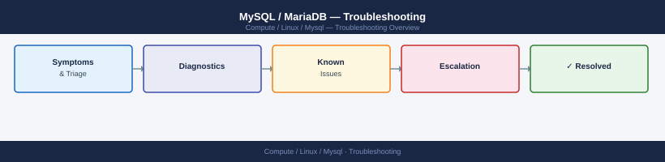

---
tags:
  - linux
  - troubleshooting
search:
  boost: 1.5
---
# MySQL / MariaDB — Troubleshooting

MySQL/MariaDB troubleshooting hub: replication failures, performance degradation, crash recovery, and escalation path to MySQL Enterprise Support.

*Applies to: RHEL / Ubuntu LTS*

  <a class="kb-card" href="common-issues/">Common Issues</a>
  <a class="kb-card" href="diagnostics/">Diagnostics</a>
  <a class="kb-card" href="escalation/">Escalation</a>

