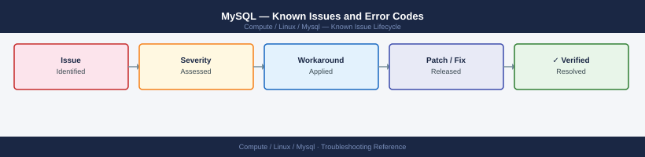

---
tags:
  - troubleshooting
  - mysql
  - linux
  - known-issues
---
# MySQL — Known Issues and Error Codes

<div class="kb-summary">
Catalog of known MySQL bugs, error codes, and workarounds covering replication, InnoDB, and Group Replication.

*Applies to: MySQL 8.0 / 8.4*
</div>



```d2
direction: down

symptom: Identify Symptom {shape: diamond}
connectivity: "Connectivity" {shape: rectangle}
replication: "Replication" {shape: rectangle}
innodb: "InnoDB" {shape: rectangle}
group_replication: "Group Replication" {shape: rectangle}
resolution: Resolve or Escalate {shape: oval}

symptom -> connectivity: investigate
symptom -> replication: investigate
symptom -> innodb: investigate
symptom -> group_replication: investigate
connectivity -> resolution
replication -> resolution
innodb -> resolution
group_replication -> resolution
```

## Before you begin

- MySQL errors: `SHOW GLOBAL STATUS LIKE 'Last_Error'`; error log: `/var/log/mysql/error.log`.
- For InnoDB corruption: always stop MySQL cleanly; never force kill during InnoDB write.

## Connectivity

| Error Code | Description | Cause | Fix |
|---|---|---|---|
| Error 1045 | `Access denied for user` | Wrong password or no remote login grant | `GRANT ALL ON db.* TO 'user'@'%'; FLUSH PRIVILEGES;` |
| Error 2003 | `Can't connect to MySQL server` | MySQL not listening or port 3306 blocked | Check: `systemctl status mysql`; verify TCP 3306 |
| Error 1129 | `Host blocked due to many connection errors` | Too many failed logins from host | `FLUSH HOSTS;` or set `max_connect_errors` higher |

## Replication

| Error / Symptom | Affected Versions | Cause | Workaround / Fix | Fixed In |
|---|---|---|---|---|
| Replication stopped: `Error 1062 Duplicate entry` | MySQL 8.x | Row already exists on replica; replayed out of order | Skip: `SET GLOBAL SQL_SLAVE_SKIP_COUNTER=1; START SLAVE;`; or use GTID-based skip | N/A |
| `Slave SQL thread stopped — Error 1032: Row not found` | MySQL 8.x | Row exists on source but not replica (inconsistency) | Re-sync replica from source dump; or use `pt-table-sync` | N/A |

## InnoDB

| Error / Symptom | Affected Versions | Cause | Workaround / Fix | Fixed In |
|---|---|---|---|---|
| `InnoDB: Tablespace corrupt` on startup | MySQL 8.x | Unclean shutdown; disk error | Start with `innodb_force_recovery=1` (increment up to 6 if needed); export data; rebuild | N/A |
| `Table locked` preventing writes | MySQL 8.x | Long-running transaction holding lock | `SHOW PROCESSLIST;` identify long query; `KILL <id>` | N/A |

## Group Replication

| Error / Symptom | Affected Versions | Cause | Workaround / Fix | Fixed In |
|---|---|---|---|---|
| Group Replication member shows `ERROR` state | MySQL 8.x | Network partition or member lagging behind | Check: `SELECT * FROM performance_schema.replication_group_members`; rejoin member | N/A |

## See also

- [MySQL — Common Issues](common-issues/)
- [Linux — Known Issues](../../troubleshooting/known-issues.md)
