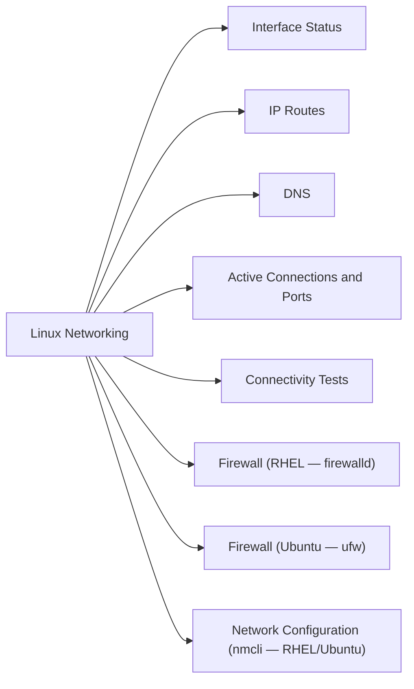

# Linux Networking

Network configuration, diagnostics, and troubleshooting on RHEL and Ubuntu.



## Interface Status

```bash
# Brief summary of all interfaces and IPs
ip -br addr

# Detailed interface info
ip addr show <interface>

# Interface statistics (errors, drops, bytes)
ip -s link show <interface>

# Link state (up/down)
ip link show | grep -E "state UP|state DOWN"

# Physical link detection
ethtool <interface> | grep -E "Link detected|Speed|Duplex"
```

## IP Routes

```bash
# Routing table
ip route show

# Route for a specific destination
ip route get 10.0.0.1

# Default gateway
ip route show default

# Policy routing tables
ip rule list
```

## DNS

```bash
# Test resolution
dig +short hostname.corp.local
nslookup hostname.corp.local

# Check configured resolvers
cat /etc/resolv.conf
resolvectl status   # systemd-resolved

# Flush DNS cache
resolvectl flush-caches   # systemd-resolved
systemctl restart nscd    # if using nscd

# Reverse lookup
dig -x 10.0.0.5
```

## Active Connections and Ports

```bash
# All listening ports with PID
ss -tulnp

# Established connections
ss -tnp state established

# Connections to a specific port
ss -tnp '( dport = :443 or sport = :443 )'

# UDP listening sockets
ss -ulnp

# Legacy (older systems)
netstat -tulnp
```

## Connectivity Tests

```bash
# Basic reachability
ping -c 4 10.0.0.1

# MTU test — set DF bit and test with 1500-byte payload
ping -M do -s 1472 10.0.0.1   # 1472 + 28 ICMP/IP headers = 1500 MTU

# Path MTU discovery
tracepath 10.0.0.1

# TCP port test
nc -zv 10.0.0.5 443
timeout 3 bash -c ">/dev/tcp/10.0.0.5/443" && echo "open" || echo "closed"

# Trace route
traceroute -n 10.0.0.1
mtr -n 10.0.0.1   # Continuous trace with packet loss stats
```

## Firewall (RHEL — firewalld)

```bash
# Check active rules
firewall-cmd --list-all
firewall-cmd --list-all-zones

# Open a port permanently
firewall-cmd --permanent --add-port=8080/tcp
firewall-cmd --reload

# Add a service
firewall-cmd --permanent --add-service=https
firewall-cmd --reload

# Check if port is open
firewall-cmd --query-port=443/tcp

# Temporarily disable (testing — not for production)
systemctl stop firewalld
```

## Firewall (Ubuntu — ufw)

```bash
# Status and rules
ufw status verbose

# Allow port
ufw allow 443/tcp

# Allow from specific source
ufw allow from 10.0.0.0/24 to any port 22

# Deny
ufw deny 23/tcp

# Enable/disable
ufw enable
ufw disable
```

## Network Configuration (nmcli — RHEL/Ubuntu)

```bash
# List connections
nmcli connection show

# Show active connection details
nmcli connection show <connection-name>

# Bring up/down a connection
nmcli connection up <name>
nmcli connection down <name>

# Add a static IP
nmcli connection modify <name> \
    ipv4.addresses "10.0.1.50/24" \
    ipv4.gateway "10.0.1.1" \
    ipv4.dns "10.0.1.10" \
    ipv4.method manual
nmcli connection up <name>

# Create a bond
nmcli connection add type bond \
    ifname bond0 bond.options "mode=802.3ad,miimon=100"
nmcli connection add type ethernet \
    ifname eth0 master bond0
nmcli connection add type ethernet \
    ifname eth1 master bond0
```

## VLAN Configuration

```bash
# Add VLAN interface (temporary)
ip link add link eth0 name eth0.100 type vlan id 100
ip addr add 10.1.100.5/24 dev eth0.100
ip link set eth0.100 up

# Permanent via nmcli
nmcli connection add type vlan \
    con-name vlan100 dev eth0 id 100 \
    ipv4.addresses "10.1.100.5/24" \
    ipv4.method manual
nmcli connection up vlan100
```

## Packet Capture

```bash
# Capture on interface (write to file)
tcpdump -i eth0 -w /tmp/capture.pcap

# Capture with filter
tcpdump -i eth0 host 10.0.0.5 and port 443

# Read capture file
tcpdump -r /tmp/capture.pcap | head -50

# Capture ICMP only
tcpdump -i eth0 icmp
```

## Troubleshooting Common Issues

| Symptom | First Commands |
|---|---|
| No connectivity | `ip link`, `ip addr`, `ping gateway`, `ip route` |
| DNS not resolving | `cat /etc/resolv.conf`, `dig +short hostname`, `resolvectl status` |
| Port unreachable | `ss -tulnp`, `firewall-cmd --list-all`, `nc -zv host port` |
| High packet loss | `mtr -n dest`, `ethtool eth0` (check errors), `ip -s link show` |
| Wrong IP/route | `ip addr show`, `ip route show`, `nmcli connection show` |
| Bond/team down | `cat /proc/net/bonding/bond0`, `nmcli device show` |
