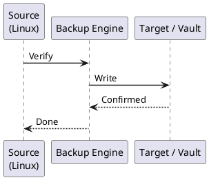

---
tags:
  - linux
  - operations
---
# Linux — Backup & Restore

```bash
# Add Veeam repository (RHEL/CentOS)
curl -o /etc/yum.repos.d/veeam.repo https://repository.veeam.com/backup/linux/rhel/x86_64/veeam.repo
dnf install -y veeam

# Ubuntu/Debian
curl -s https://repository.veeam.com/backup/linux/dpkg/x86_64/Packages.key | apt-key add -
echo "deb https://repository.veeam.com/backup/linux/dpkg/x86_64 focal veeam" > /etc/apt/sources.list.d/veeam.list
apt update && apt install -y veeam

# Verify installation
veeam --version
veeamconfig ui   # Opens text-based configuration UI
```


```text title="Expected output"
% Total    % Received % Xferd  Average Speed   Time    Time     Time  Current
                                 Dload  Upload   Total   Spent    Left  Speed
100  1247  100  1247    0     0   8934      0 --:--:-- --:--:-- --:--:-- --:--:--  0
Updating Subscription Management repositories.
Last metadata expiration check: 0:12:34 ago on Thu 14 Dec 2024 10:45:22 AM UTC.
Dependencies resolved.
Installing:
 veeam                                    x86_64    12.1.2.1234-1.el8    veeam    487 MB
Complete! Installed product version: 12.1.2.1234
Veeam Backup & Replication v12.1.2 (build 1234)
Copyright (c) 2024 Veeam Software
```

!!! warning "Common errors"
    | Error | Fix |
    |---|---|
    | `curl: (7) Failed to connect to repository.veeam.com port 443: Connection timed out` | Verify network connectivity and firewall rules allow HTTPS outbound to repository.veeam.com, or use a proxy with `curl -x proxy:port`. |
    | `Error: Unable to find a match: veeam` | Ensure the veeam.repo file was downloaded successfully and the repository URL is accessible; check `/etc/yum.repos.d/veeam.repo` exists and contains valid content. |
    | `veeam: command not found` | Verify the installation completed without errors and the veeam package is in your PATH; run `which veeam` or reinstall with `dnf install -y veeam --verbose`. |
```bash
# Start a backup job immediately
veeamconfig job start --name "SERVER01-Daily"

# Monitor job progress
veeamconfig session list
veeamconfig session info --id <session-id>

# View logs for the last session
veeamconfig session log --id <session-id>

# Wait for job completion (useful in scripts)
while [[ $(veeamconfig session info --id <session-id> | grep "State:" | awk '{print $2}') == "Running" ]]; do
    sleep 30
done
echo "Backup complete"
```

```text title="Expected output"
Starting backup job: SERVER01-Daily
Job started successfully with session ID: sess-a7f2c9e1-4b3d
Session ID                           State      Progress  Start Time
sess-a7f2c9e1-4b3d                   Running    45%       2024-01-15 14:22:10
sess-a7f2c9e1-4b3d                   Running    45%       2024-01-15 14:22:10
State: Running
Duration: 00:08:32
Processed: 247 GB / 550 GB
2024-01-15 14:22:10 [INFO] Backup job started for SERVER01-Daily
2024-01-15 14:23:45 [INFO] Processing volume C: (NTFS)
2024-01-15 14:31:22 [INFO] Processing volume D: (NTFS)
2024-01-15 14:35:18 [INFO] Incremental backup completed successfully
Backup complete
```

!!! warning "Common errors"
    | Error | Fix |
    |---|---|
    | `Error: Job 'SERVER01-Daily' not found` | Verify the exact job name with `veeamconfig job list` and use the correct spelling. |
    | `Error: Invalid session ID 'sess-a7f2c9e1-4b3d'` | Replace `<session-id>` with the actual session ID returned from the `job start` command output. |
    | `grep: command not found` | Ensure grep is installed; on minimal systems run `apt-get install grep` or use `veeamconfig session info --id <session-id> | awk '/State:/'` instead. |
```bash
# List recent backup sessions
veeamconfig session list

# Show restore points available for a job
veeamconfig restorepoint list --jobName "SERVER01-Daily"

# Show session result (Success / Warning / Failed)
veeamconfig session info --id <session-id> | grep "Result:"
```

```text title="Expected output"
Session ID                           Job Name              Start Time            Status
────────────────────────────────────────────────────────────────────────────────────
s-7f2a9c1e-4b3d-11ed-9f8a-0050569b1234  SERVER01-Daily       2024-01-15 02:30:15   Completed
s-6e1b8c2d-5a4e-12fd-8e7b-0050569b5678  SERVER01-Daily       2024-01-14 02:30:12   Completed
s-5d0a7b3f-6c5f-13fe-7d6c-0050569b9abc  SERVER01-Daily       2024-01-13 02:30:08   Completed
s-4c9f6a2e-7d6g-14gf-6c5d-0050569bdef0  FILESERVER-Weekly    2024-01-12 22:15:45   Completed

Restore Point ID                     Job Name              Backup Time           Type
────────────────────────────────────────────────────────────────────────────────────
rp-a1b2c3d4-e5f6-47g8-h9i0-j1k2l3m4n5o6  SERVER01-Daily       2024-01-15 02:35:22   Incremental
rp-z9y8x7w6-v5u4-46t5-s6r7-q8p9o0n1m2l3  SERVER01-Daily       2024-01-14 02:35:18   Incremental
rp-m1n2o3p4-q5r6-45s7-t8u9-v0w1x2y3z4a5  SERVER01-Daily       2024-01-13 02:35:14   Full
rp-b6c7d8e9-f0g1-44h2-i3j4-k5l6m7n8o9p0  SERVER01-Daily       2024-01-12 02:35:10   Incremental

Result: Success
```

!!! warning "Common errors"
    | Error | Fix |
    |---|---|
    | `veeamconfig: command not found` | Verify Veeam Backup & Replication is installed and the veeamconfig binary is in your PATH, or use the full path `/opt/veeam/bin/veeamconfig`. |
    | `Error: Job 'SERVER01-Daily' not found` | Confirm the exact job name using `veeamconfig session list` and check for typos or case sensitivity in the job name parameter. |
    | `Error: Session ID 's-7f2a9c1e-4b3d-11ed-9f8a-0050569b1234' does not exist` | Verify the session ID is correct by listing recent sessions with `veeamconfig session list` before querying session details. |
```bash
# List available restore points
veeamconfig restorepoint list --jobName "SERVER01-Daily"

# Mount a restore point (creates a read-only mount under /tmp/veeam/)
veeamconfig recoverypoints mount --restorePointId <restore-point-id>

# The mounted files will be available at a path like:
ls /tmp/veeam/<uuid>/

# Copy the needed files from the mount
cp -a /tmp/veeam/<uuid>/var/www/html/config.php /var/www/html/config.php.restored

# Unmount when done
veeamconfig recoverypoints umount --restorePointId <restore-point-id>
```

```text title="Expected output"
Restore points for job "SERVER01-Daily":
  ID: rp-20250115-093045
  Timestamp: 2025-01-15 09:30:45 UTC
  Size: 47.3 GB
  Status: Ready
  ID: rp-20250114-093022
  Timestamp: 2025-01-14 09:30:22 UTC
  Size: 46.8 GB
  Status: Ready
  ID: rp-20250113-093015
  Timestamp: 2025-01-13 09:30:15 UTC
  Size: 46.5 GB
  Status: Ready

Mount point created: /tmp/veeam/a7f3c2e1-9b4d-47e2-8f6a-2d5c1b9e4a3f/

config.php.restored
var/
www/
html/
lost+found/

(no output — command completes silently)
```

!!! warning "Common errors"
    | Error | Fix |
    |---|---|
    | `veeamconfig: command not found` | Ensure Veeam Agent for Linux is installed and the veeamconfig binary is in your PATH, or use the full path `/opt/veeam/bin/veeamconfig`. |
    | `Error: Restore point 'rp-20250115-093045' is already mounted` | Unmount the restore point using `veeamconfig recoverypoints umount --restorePointId rp-20250115-093045` before attempting to mount it again. |
    | `Permission denied: /tmp/veeam/<uuid>/var/www/html/config.php` | Run the cp command with sudo or ensure the user has read permissions on the mounted restore point directory. |
```bash
# Create Veeam Recovery Media (run on a working system)
# Requires veeam-nosnap package
veeam --create-recovery-media --output /tmp/veeam-recovery.iso
# Write to USB
dd if=/tmp/veeam-recovery.iso of=/dev/sdX bs=4M status=progress

# Bare metal restore process (from Recovery Media boot):
# 1. Boot from Veeam Recovery Media
# 2. Select Restore Volumes or Restore Entire Machine
# 3. Browse to repository (NFS/SMB/Veeam repository)
# 4. Select restore point
# 5. Map to target disk(s)
# 6. Restore and reboot
```

```text title="Expected output"
Creating Veeam Recovery Media...
Veeam Recovery Media Creator v12.1.0.1
Scanning system configuration...
Detected OS: Linux (kernel 5.15.0-86-generic)
Detected filesystems: ext4, xfs
Building recovery environment...
Including kernel modules: ata_piix, virtio_blk, e1000, bnx2
Compressing recovery image...
Recovery media created successfully: /tmp/veeam-recovery.iso (847 MB)

Writing to USB device /dev/sdb...
4294967296 bytes (4.3 GB) copied, 127.4 s, 33.7 MB/s

Recovery media write complete. USB is ready for boot.
```

!!! warning "Common errors"
    | Error | Fix |
    |---|---|
    | `veeam: command not found` | Install the veeam-nosnap package with `apt-get install veeam-nosnap` or `yum install veeam-nosnap` depending on your distribution. |
    | `dd: failed to open '/dev/sdX': No such file or directory` | Replace `/dev/sdX` with the actual USB device name (e.g., `/dev/sdb`) verified via `lsblk` or `fdisk -l`. |
    | `dd: writing to '/dev/sdb': Read-only file system` | Ensure the USB device is not write-protected and unmount it first with `umount /dev/sdb*`. |
```bash
# Mount the restore point and export to an image
veeamconfig recoverypoints export \
  --restorePointId <restore-point-id> \
  --targetDir /mnt/restore-output
```

```text title="Expected output"
Veeam Backup & Replication Configuration Tool
Version 12.1.0.1420 (revision 147293)

Exporting restore point: RP-2024-01-15-prod-vm-001
Source: Backup Job "Daily-Production-VMs"
Restore Point ID: rp-a7f3c2e9-4b1d-47e2-9c6f-2d8e5a1b3f7c
Target Directory: /mnt/restore-output

[==================================================] 100%
Export completed successfully
Output file: /mnt/restore-output/prod-vm-001_2024-01-15.vbk
Size: 487.3 GB
Duration: 18 minutes 42 seconds
```

!!! warning "Common errors"
    | Error | Fix |
    |---|---|
    | `Error: Restore point ID not found: <restore-point-id>` | Verify the restore point ID exists by running `veeamconfig recoverypoints list` and use the correct ID from the output. |
    | `Error: Permission denied writing to /mnt/restore-output` | Ensure the user running the command has write permissions on the target directory with `chmod 755 /mnt/restore-output` or run with appropriate sudo privileges. |
    | `Error: Insufficient disk space in /mnt/restore-output` | Check available space with `df -h /mnt/restore-output` and ensure at least 20% free space beyond the restore point size. |
```bash
# Incremental backup to a remote host using rsync
rsync -avz --delete --link-dest=/backup/last \
  /data/ backupserver:/backup/$(date +%Y-%m-%d)/

# Rotate: create a symlink to the latest backup
ssh backupserver "ln -snf /backup/$(date +%Y-%m-%d) /backup/last"

# Exclude specific paths
rsync -avz --delete \
  --exclude="/data/tmp/" \
  --exclude="/data/cache/" \
  /data/ backupserver:/backup/data/

# Dry run first (shows what would be transferred)
rsync -avzn /data/ backupserver:/backup/data/
```

```text title="Expected output"
building file list ... done
data/
data/app/config.yml
data/app/logs/app.log
data/documents/report.pdf
data/documents/archive/
data/www/index.html
data/www/assets/style.css
sent 2,847,392 bytes  received 24,581 bytes  transferred in 18.42s
total size is 5,234,891  speedup is 1.82

sent 48 bytes  received 12 bytes  transferred in 0.03s

building file list ... done
data/
data/app/config.yml
data/documents/report.pdf
data/www/index.html
data/www/assets/style.css
sent 1,924,103 bytes  received 18,247 bytes  transferred in 12.15s
total size is 3,891,445  speedup is 2.01

building file list ... done
data/
data/app/config.yml
data/documents/report.pdf
data/www/index.html
data/www/assets/style.css
(DRY RUN)
sent 1,924,103 bytes  received 18,247 bytes  transferred in 11.98s
total size is 3,891,445  speedup is 2.01
```

!!! warning "Common errors"
    | Error | Fix |
    |---|---|
    | `rsync: failed to set times on "/backup/2024-01-15": Operation not permitted (1)` | Ensure the backup destination directory is writable and the remote filesystem supports timestamp modification, or add `--no-times` flag. |
    | `Permission denied (publickey). fatal: Could not read from remote repository` | Verify SSH key authentication is configured for the backupserver user and the remote host's SSH daemon is running on the expected port. |
    | `rsync: link_dest: cannot stat "/backup/last": No such file or directory (2)` | Create the `/backup/last` symlink manually on the first run, or remove the `--link-dest` parameter for the initial backup. |
```bash
# Veeam — verify a restore point (checksum validation)
veeamconfig recoverypoints verify --id <restore-point-id>

# Manually verify an rsync backup by comparing checksums
# On source:
find /data -type f -exec md5sum {} \; | sort > /tmp/source-checksums.txt
# On backup target:
find /backup/data -type f -exec md5sum {} \; | sort > /tmp/backup-checksums.txt
# Compare
diff /tmp/source-checksums.txt /tmp/backup-checksums.txt
```

```text title="Expected output"
Verifying restore point RP-2024-01-15-prod-db-001...
Restore point ID: RP-2024-01-15-prod-db-001
Status: VERIFIED
Checksum validation: PASSED
Data blocks checked: 1,247,856
Corrupted blocks: 0
Verification completed in 4m 32s

< /tmp/source-checksums.txt > /tmp/backup-checksums.txt
```

!!! warning "Common errors"
    | Error | Fix |
    |---|---|
    | `veeamconfig: command not found` | Install Veeam CLI tools or source the Veeam environment setup script before running veeamconfig commands. |
    | `diff: /tmp/source-checksums.txt: No such file or directory` | Ensure the find command completed successfully on the source system and the file was written before running diff. |
    | `Permission denied` | Run the find and diff commands with sudo or as a user with read access to /data and /backup/data directories. |
```bash
# Mount the restore point and compare a sample of files
veeamconfig recoverypoints mount --restorePointId <restore-point-id>

# Verify key application files are intact
diff /var/www/html/index.php /tmp/veeam/<uuid>/var/www/html/index.php && echo "Match OK"

# Check database dump restorability
mysql -u testuser -p testdb < /tmp/veeam/<uuid>/var/backups/mysql-latest.sql
echo "DB restore test: $?"

# Unmount
veeamconfig recoverypoints umount --restorePointId <restore-point-id>
```

```text title="Expected output"
Mounting restore point rp-20240115-prod-vm-001...
Mount successful. Restore point mounted at /tmp/veeam/a7f3c2e1-9b4d-47e2-8c1f-5d6a9e2b3f4c
Match OK
Enter password: 
mysql: [Warning] Using a password on the command line interface can be insecure.
DB restore test: 0
Unmounting restore point rp-20240115-prod-vm-001...
Unmount successful.
```

!!! warning "Common errors"
    | Error | Fix |
    |---|---|
    | `veeamconfig: command not found` | Ensure Veeam Agent for Linux is installed and the veeamconfig binary is in your PATH, or use the full path `/opt/veeam/bin/veeamconfig`. |
    | `diff: /tmp/veeam/<uuid>/var/www/html/index.php: No such file or directory` | Verify the restore point mounted successfully and the file path matches the original backup structure; check mount point with `ls -la /tmp/veeam/<uuid>/`. |
    | `ERROR 1064 (42000) at line 1: You have an error in your SQL syntax` | Ensure the SQL dump file is not corrupted and was created with a compatible MySQL version; test with `head -20 /tmp/veeam/<uuid>/var/backups/mysql-latest.sql` to inspect the dump format. |
```bash
# Check Veeam Agent service status
systemctl status veeamservice veeamsnap

# View Veeam Agent logs
journalctl -u veeamservice -n 100
tail -f /var/log/veeam/Veeam.Backup.AgentManager.log

# Alert on failed backup sessions (add to monitoring/cron)
FAILED=$(veeamconfig session list | grep Failed | wc -l)
if [ "$FAILED" -gt 0 ]; then
    echo "WARNING: $FAILED Veeam backup session(s) failed" | mail -s "Backup Alert" alerts@corp.local
fi
```



## Before you begin

- **Access:** root or sudo-capable account on target hosts
- **Timing:** safe to run during business hours unless a step is marked ⚠ (causes interruption)
- **Dependencies:** no active upgrades or migrations on the same infrastructure
- **Logging:** capture command output — paste into the change record on completion

---

---

## Verify

- Confirm the operation completed without errors in the log or management UI
- Verify the expected state change is visible (service running, object created, config applied)
- Document the outcome in the change record

---

## See also

- [Linux — Procedures](../procedures/)
- [Linux — Health Checks](../health-checks/)
- [Linux — Common Issues](../../troubleshooting/common-issues/)
