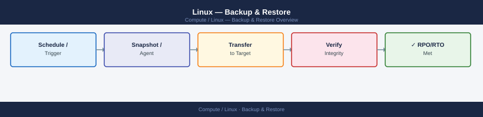
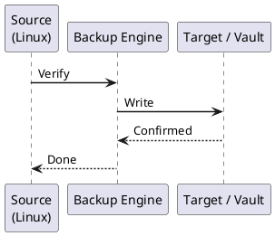

---
tags:
  - linux
  - operations
---
# Linux — Backup & Restore



```bash
# Add Veeam repository (RHEL/CentOS)
curl -o /etc/yum.repos.d/veeam.repo https://repository.veeam.com/backup/linux/rhel/x86_64/veeam.repo
dnf install -y veeam

# Ubuntu/Debian
curl -s https://repository.veeam.com/backup/linux/dpkg/x86_64/Packages.key | apt-key add -
echo "deb https://repository.veeam.com/backup/linux/dpkg/x86_64 focal veeam" > /etc/apt/sources.list.d/veeam.list
apt update && apt install -y veeam

# Verify installation
veeam --version
veeamconfig ui   # Opens text-based configuration UI
```

```bash
# Start a backup job immediately
veeamconfig job start --name "SERVER01-Daily"

# Monitor job progress
veeamconfig session list
veeamconfig session info --id <session-id>

# View logs for the last session
veeamconfig session log --id <session-id>

# Wait for job completion (useful in scripts)
while [[ $(veeamconfig session info --id <session-id> | grep "State:" | awk '{print $2}') == "Running" ]]; do
    sleep 30
done
echo "Backup complete"
```
```bash
# List recent backup sessions
veeamconfig session list

# Show restore points available for a job
veeamconfig restorepoint list --jobName "SERVER01-Daily"

# Show session result (Success / Warning / Failed)
veeamconfig session info --id <session-id> | grep "Result:"
```
```bash
# List available restore points
veeamconfig restorepoint list --jobName "SERVER01-Daily"

# Mount a restore point (creates a read-only mount under /tmp/veeam/)
veeamconfig recoverypoints mount --restorePointId <restore-point-id>

# The mounted files will be available at a path like:
ls /tmp/veeam/<uuid>/

# Copy the needed files from the mount
cp -a /tmp/veeam/<uuid>/var/www/html/config.php /var/www/html/config.php.restored

# Unmount when done
veeamconfig recoverypoints umount --restorePointId <restore-point-id>
```
```bash
# Create Veeam Recovery Media (run on a working system)
# Requires veeam-nosnap package
veeam --create-recovery-media --output /tmp/veeam-recovery.iso
# Write to USB
dd if=/tmp/veeam-recovery.iso of=/dev/sdX bs=4M status=progress

# Bare metal restore process (from Recovery Media boot):
# 1. Boot from Veeam Recovery Media
# 2. Select Restore Volumes or Restore Entire Machine
# 3. Browse to repository (NFS/SMB/Veeam repository)
# 4. Select restore point
# 5. Map to target disk(s)
# 6. Restore and reboot
```
```bash
# Mount the restore point and export to an image
veeamconfig recoverypoints export \
  --restorePointId <restore-point-id> \
  --targetDir /mnt/restore-output
```
```bash
# Incremental backup to a remote host using rsync
rsync -avz --delete --link-dest=/backup/last \
  /data/ backupserver:/backup/$(date +%Y-%m-%d)/

# Rotate: create a symlink to the latest backup
ssh backupserver "ln -snf /backup/$(date +%Y-%m-%d) /backup/last"

# Exclude specific paths
rsync -avz --delete \
  --exclude="/data/tmp/" \
  --exclude="/data/cache/" \
  /data/ backupserver:/backup/data/

# Dry run first (shows what would be transferred)
rsync -avzn /data/ backupserver:/backup/data/
```
```bash
# Veeam — verify a restore point (checksum validation)
veeamconfig recoverypoints verify --id <restore-point-id>

# Manually verify an rsync backup by comparing checksums
# On source:
find /data -type f -exec md5sum {} \; | sort > /tmp/source-checksums.txt
# On backup target:
find /backup/data -type f -exec md5sum {} \; | sort > /tmp/backup-checksums.txt
# Compare
diff /tmp/source-checksums.txt /tmp/backup-checksums.txt
```
```bash
# Mount the restore point and compare a sample of files
veeamconfig recoverypoints mount --restorePointId <restore-point-id>

# Verify key application files are intact
diff /var/www/html/index.php /tmp/veeam/<uuid>/var/www/html/index.php && echo "Match OK"

# Check database dump restorability
mysql -u testuser -p testdb < /tmp/veeam/<uuid>/var/backups/mysql-latest.sql
echo "DB restore test: $?"

# Unmount
veeamconfig recoverypoints umount --restorePointId <restore-point-id>
```
```bash
# Check Veeam Agent service status
systemctl status veeamservice veeamsnap

# View Veeam Agent logs
journalctl -u veeamservice -n 100
tail -f /var/log/veeam/Veeam.Backup.AgentManager.log

# Alert on failed backup sessions (add to monitoring/cron)
FAILED=$(veeamconfig session list | grep Failed | wc -l)
if [ "$FAILED" -gt 0 ]; then
    echo "WARNING: $FAILED Veeam backup session(s) failed" | mail -s "Backup Alert" alerts@corp.local
fi
```



## Before you begin

- **Access:** root or sudo-capable account on target hosts
- **Timing:** safe to run during business hours unless a step is marked ⚠ (causes interruption)
- **Dependencies:** no active upgrades or migrations on the same infrastructure
- **Logging:** capture command output — paste into the change record on completion

---

---

## Verify

- Confirm the operation completed without errors in the log or management UI
- Verify the expected state change is visible (service running, object created, config applied)
- Document the outcome in the change record

---

## See also

- [Linux — Procedures](../procedures/)
- [Linux — Health Checks](../health-checks/)
- [Linux — Common Issues](../../troubleshooting/common-issues/)
