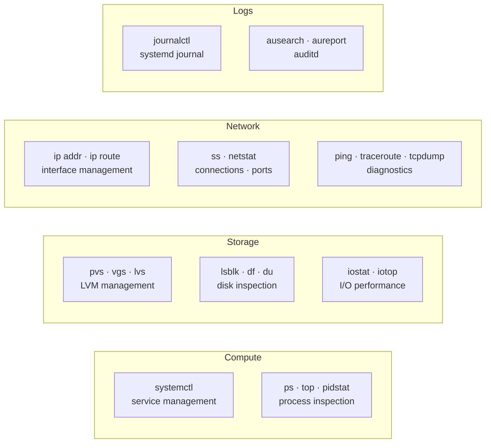

---
tags:
  - linux
  - operations
---
# Linux — CLI Reference

<div class="kb-summary">
Commands, syntax, and quick reference. Commonly used Linux administration commands, grouped by category. Applies to RHEL 8/9 and Ubuntu 22.04 unless noted.

*Applies to: RHEL / Ubuntu LTS*
</div>

Commands, syntax, and quick reference.

Commonly used Linux administration commands, grouped by category. Applies to RHEL 8/9 and Ubuntu 22.04 unless noted.

## Before you begin

- **Access:** root or sudo-capable account on target hosts
- **Timing:** safe to run during business hours unless a step is marked ⚠ (causes interruption)
- **Dependencies:** no active upgrades or migrations on the same infrastructure
- **Logging:** capture command output — paste into the change record on completion

---

## Command Categories



## Process Management

```bash
ps aux                              # All processes
ps aux --sort=-%cpu | head -15      # Top CPU consumers
ps aux --sort=-%mem | head -15      # Top memory consumers
ps -eLf | sort -k4 -rn | head -20  # Per-thread CPU
kill -9 <PID>                       # Force kill
pkill -f <process-name>             # Kill by name
nohup <command> &                   # Run detached
jobs                                # List background jobs
```


```text title="Expected output"
USER       PID %CPU %MEM    VSZ   RSS TTY      STAT START   TIME COMMAND
root         1  0.0  0.2  19232  9140 ?        Ss   08:14   0:02 /sbin/init
root       412  0.1  0.8  55280 32456 ?        Ss   08:14   0:15 /lib/systemd/systemd-journald
postgres   2847  2.3  5.6 892456 228904 ?       Ss   09:22   1:47 /usr/lib/postgresql/13/bin/postgres
nginx      3102  0.4  1.2 145680 48920 ?        S    09:45   0:08 nginx: worker process
root       4521  8.7  12.1 2456780 492560 ?     Sl   10:01   3:42 java -Xmx2g -jar app.jar
ubuntu     5634  0.0  0.1  21544  4128 pts/0    Ss   10:15   0:00 -bash
ubuntu     6789  1.2  0.3  98765  12340 pts/0   S+   10:22   0:05 python3 data_processor.py

nohup: ignoring input and appending output to 'nohup.out'
[1] 7234

[1]+  Running                 nohup long_running_task.sh &
```

!!! warning "Common errors"
    **`bash: kill: (12345): No such process`** — Verify the PID exists with `ps aux | grep <PID>` before attempting to kill it.
    **`pkill: invalid option -- 'f'`** — Use `pkill -f` on Linux systems; on some BSD variants use `pgrep -f` to find processes first.
    **`nohup: failed to run command '<command>': No such file or directory`** — Ensure the command path is correct and the executable exists in your PATH or provide the full absolute path.
## Disk and Filesystem

```bash
lsblk -o NAME,SIZE,TYPE,MOUNTPOINT,FSTYPE
df -h                               # Filesystem usage
df -i                               # Inode usage
du -sh <path>                       # Directory size
du -sh /* 2>/dev/null | sort -h     # Find large directories
fdisk -l /dev/sdb                   # Partition table
parted /dev/sdb print
mount /dev/vg/lv /mnt/point
umount /mnt/point
```

## LVM

```bash
pvs / pvdisplay                     # Physical volumes
vgs / vgdisplay                     # Volume groups
lvs / lvdisplay                     # Logical volumes
pvcreate /dev/sdb
vgcreate vg_name /dev/sdb
lvcreate -L 50G -n lv_name vg_name
lvextend -L +20G /dev/vg/lv
xfs_growfs /dev/vg/lv               # Grow XFS online
resize2fs /dev/vg/lv                # Grow ext4 online
```

## Networking

```bash
ip -br addr                         # Interface summary
ip addr show <iface>
ip route show
ip route get <destination>
ip link set <iface> up/down
ss -tulnp                           # Listening ports
ss -tnp state established           # Active connections
ss -s                               # Connection summary
ethtool <iface>                     # Physical link info
nmcli connection show
nmcli device status
```

## Logging (journalctl)

```bash
journalctl -p err --since "1 hour ago"
journalctl -u <service> -f          # Follow
journalctl -u <service> -n 100      # Last 100 lines
journalctl -b                       # This boot
journalctl -b -1                    # Previous boot
journalctl -k                       # Kernel messages only
journalctl --disk-usage
journalctl --vacuum-time=7d
```

## User and Session Management

```bash
last                                # Login history
lastb                               # Failed login attempts
who                                 # Currently logged in
w                                   # Who and what they're doing
id <user>                           # UID/GID/groups
getent passwd <user>                # User entry
useradd -m -s /bin/bash <user>
usermod -aG sudo <user>             # Add to sudo (Ubuntu)
usermod -aG wheel <user>            # Add to wheel (RHEL)
passwd -l <user>                    # Lock account
passwd -u <user>                    # Unlock account
```

## Firewall

```bash
# RHEL — firewalld
firewall-cmd --list-all
firewall-cmd --permanent --add-port=8080/tcp
firewall-cmd --permanent --add-service=https
firewall-cmd --reload
firewall-cmd --query-port=443/tcp

# Ubuntu — ufw
ufw status verbose
ufw allow 443/tcp
ufw allow from 10.0.0.0/24 to any port 22
ufw deny 23/tcp
ufw enable
```

## Performance / Diagnostics

```bash
uptime                              # Load average
top -b -n1 | head -25               # CPU/memory snapshot
htop                                # Interactive process viewer
vmstat 1 5                          # VM stats (CPU, swap, I/O)
iostat -xz 1 5                      # Disk I/O per device
mpstat -P ALL 1 3                   # Per-CPU usage
free -h                             # Memory summary
iotop -o -P                         # Processes doing I/O
strace -p <PID>                     # Syscall trace
lsof -p <PID>                       # Open files for a process
lsof <file>                         # Which process has a file open
```

## File Operations

```bash
find /path -name "*.log" -mtime +30         # Files older than 30 days
find /path -size +100M -type f 2>/dev/null  # Files larger than 100 MB
find /etc -newer /etc/passwd -type f        # Recently modified in /etc
tar -czf archive.tar.gz /path/to/dir        # Create archive
tar -xzf archive.tar.gz -C /dest/           # Extract archive
rsync -avz /src/ user@host:/dest/           # Sync files remotely
chmod 750 /path
chown user:group /path
```

## NTP / Time

```bash
timedatectl status
timedatectl set-timezone Europe/Athens
chronyc tracking
chronyc sources -v
chronyc makestep                    # Force immediate sync
```

---

## Verify

- Confirm the operation completed without errors in the log or management UI
- Verify the expected state change is visible (service running, object created, config applied)
- Document the outcome in the change record

---

## See also

- [Linux — Procedures](../procedures/)
- [Linux — Scripts](../scripts/)
- [Linux — Health Checks](../health-checks/)
