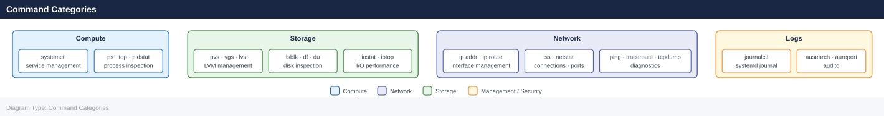

---
tags:
  - linux
  - operations
description: "Commands, syntax, and quick reference. Commonly used Linux administration commands, grouped by category. Applies to RHEL 8/9 and Ubuntu 22.04 unless noted."
---
# Linux — CLI Reference

<div class="kb-summary">
Commands, syntax, and quick reference. Commonly used Linux administration commands, grouped by category. Applies to RHEL 8/9 and Ubuntu 22.04 unless noted.

*Applies to: RHEL / Ubuntu LTS*
</div>

Commands, syntax, and quick reference.

Commonly used Linux administration commands, grouped by category. Applies to RHEL 8/9 and Ubuntu 22.04 unless noted.

## Before you begin

- **Access:** root or sudo-capable account on target hosts
- **Timing:** safe to run during business hours unless a step is marked ⚠ (causes interruption)
- **Dependencies:** no active upgrades or migrations on the same infrastructure
- **Logging:** capture command output — paste into the change record on completion

---

## Command Categories



## Process Management

```bash
ps aux                              # All processes
ps aux --sort=-%cpu | head -15      # Top CPU consumers
ps aux --sort=-%mem | head -15      # Top memory consumers
ps -eLf | sort -k4 -rn | head -20  # Per-thread CPU
kill -9 <PID>                       # Force kill
pkill -f <process-name>             # Kill by name
nohup <command> &                   # Run detached
jobs                                # List background jobs
```


```text title="Expected output"
USER       PID %CPU %MEM    VSZ   RSS TTY      STAT START   TIME COMMAND
root         1  0.0  0.2  19232  9140 ?        Ss   08:14   0:02 /sbin/init
root       412  0.1  0.8  55280 32456 ?        Ss   08:14   0:15 /lib/systemd/systemd-journald
postgres   2847  2.3  5.6 892456 228904 ?       Ss   09:22   1:47 /usr/lib/postgresql/13/bin/postgres
nginx      3102  0.4  1.2 145680 48920 ?        S    09:45   0:08 nginx: worker process
root       4521  8.7  12.1 2456780 492560 ?     Sl   10:01   3:42 java -Xmx2g -jar app.jar
ubuntu     5634  0.0  0.1  21544  4128 pts/0    Ss   10:15   0:00 -bash
ubuntu     6789  1.2  0.3  98765  12340 pts/0   S+   10:22   0:05 python3 data_processor.py

nohup: ignoring input and appending output to 'nohup.out'
[1] 7234

[1]+  Running                 nohup long_running_task.sh &
```

!!! warning "Common errors"
    | Error | Fix |
    |---|---|
    | `bash: kill: (12345): No such process` | Verify the PID exists with `ps aux | grep <PID>` before attempting to kill it. |
    | `pkill: invalid option -- 'f'` | Use `pkill -f` on Linux systems; on some BSD variants use `pgrep -f` to find processes first. |
    | `nohup: failed to run command '<command>': No such file or directory` | Ensure the command path is correct and the executable exists in your PATH or provide the full absolute path. |
## Disk and Filesystem

```bash
lsblk -o NAME,SIZE,TYPE,MOUNTPOINT,FSTYPE
df -h                               # Filesystem usage
df -i                               # Inode usage
du -sh <path>                       # Directory size
du -sh /* 2>/dev/null | sort -h     # Find large directories
fdisk -l /dev/sdb                   # Partition table
parted /dev/sdb print
mount /dev/vg/lv /mnt/point
umount /mnt/point
```


```text title="Expected output"
NAME    SIZE TYPE MOUNTPOINT FSTYPE
sda     200G disk            
├─sda1  512M part /boot      ext4
├─sda2  199G part /          ext4
└─sda3  512M part [SWAP]     swap
sdb     1.8T disk            
└─sdb1  1.8T part /data      ext4
nvme0n1 500G disk            
└─nvme0n1p1 500G part /var   ext4

Filesystem     Size  Used Avail Use% Mounted on
/dev/sda2      199G  145G   54G  73% /
/dev/sda1      512M  128M  384M  25% /boot
/dev/sdb1      1.8T  1.2T  600G  67% /data
tmpfs          7.8G     0  7.8G   0% /dev/shm

Filesystem     Inodes IUsed IFree IUse% Mounted on
/dev/sda2      12M    2.1M  9.9M   18% /
/dev/sda1      32K    312   31K    1% /boot
/dev/sdb1      120M   45M   75M   38% /data

4.2G	/var
3.8G	/home
2.1G	/opt
1.5G	/usr
892M	/tmp

Disk /dev/sdb: 1863.0 GiB, 2000398934016 bytes, 3907029168 sectors
Disk model: QEMU HARDDISK
Units: sectors of 1 * 512 = 512 bytes
Sector size (logical/physical): 512 bytes / 512 bytes
I/O size (minimum/optimal): 512 bytes / 512 bytes
Disklabel type: dos
Disk identifier: 0x5a3c2e1f

Device     Boot Start        End    Sectors Size Id Type
/dev/sdb1        2048 3907029167 3907027120 1.8T 83 Linux

Model: /dev/sdb
Disk /dev/sdb: 1863GB
Sector size (logical/physical): 512B/512B
Partition Table: msdos
Number  Start   End     Size    Type     File system  Flags
 1      1049kB 1863GB  1863GB  primary  ext4

(no output — command completes silently)
(no output — command completes silently)
```

!!! warning "Common errors"
    | Error | Fix |
    |---|---|
    | `mount: /mnt/point: mount point does not exist.` | Create the mount point directory with `mkdir -p /mnt/point` before mounting. |
    | `umount: /mnt/point: target is busy.` | Close all open files or processes accessing the mount point with `lsof /mnt/point` and kill them, then retry umount. |
    | `fdisk: cannot open /dev/sdb: Permission denied` | Run the command with `sudo` or as the root user. |
## LVM

```bash
pvs / pvdisplay                     # Physical volumes
vgs / vgdisplay                     # Volume groups
lvs / lvdisplay                     # Logical volumes
pvcreate /dev/sdb
vgcreate vg_name /dev/sdb
lvcreate -L 50G -n lv_name vg_name
lvextend -L +20G /dev/vg/lv
xfs_growfs /dev/vg/lv               # Grow XFS online
resize2fs /dev/vg/lv                # Grow ext4 online
```


```text title="Expected output"
PV         VG      Fmt  Attr PSize   PFree
  /dev/sda2  vg0     lvm2 a--  279.00g 4.00g
  /dev/sdb           lvm2 ---  500.00g 500.00g

VG Name               #PV #LV #SN Attr   VSize   VFree
  vg0                   1   3   0 wz--n- 279.00g 4.00g
  vg_name               1   0   0 wz--n- 500.00g 500.00g

LV         VG      Attr       LSize  Pool Origin Data%  Meta%  Move Log Cpy%Sync Convert
  lv_data    vg0     -wi-ao---- 100.00g
  lv_swap    vg0     -wi-ao----   8.00g
  lv_name    vg_name -wi-a-----  50.00g

Physical volume "/dev/sdb" successfully created with id 8f4a2c91-7d3e-4a5b-9c2e-1b5f8a3d6e9c
Volume group "vg_name" successfully created
Logical volume "lv_name" created.
Size of logical volume vg_name/lv_name changed from 50.00 GiB (12800 extents) to 70.00 GiB (17920 extents).
meta-data=/dev/mapper/vg-lv isize=512 agcount=4, agsize=3276800 blks
data blocks changed from 13107200 to 18350080
```

!!! warning "Common errors"
    | Error | Fix |
    |---|---|
    | `Device /dev/sdb not found` | Verify the device exists with `lsblk` and use the correct device path. |
    | `Physical volume "/dev/sdb" already in use` | Run `pvremove /dev/sdb` first or use a different device. |
    | `No space left on device` | Ensure the volume group has sufficient free extents with `vgdisplay vg_name`. |
## Networking

```bash
ip -br addr                         # Interface summary
ip addr show <iface>
ip route show
ip route get <destination>
ip link set <iface> up/down
ss -tulnp                           # Listening ports
ss -tnp state established           # Active connections
ss -s                               # Connection summary
ethtool <iface>                     # Physical link info
nmcli connection show
nmcli device status
```


```text title="Expected output"
lo               UNKNOWN        127.0.0.1/8 ::1/128
eth0             UP             192.168.1.45/24 fe80::a00:27ff:fe4e:66a1/64
eth1             DOWN           10.0.0.0/24
docker0          UP             172.17.0.1/24

default via 192.168.1.1 dev eth0 proto kernel scope link src 192.168.1.45
10.0.0.0/24 dev eth1 proto kernel scope link src 10.0.0.1
172.17.0.0/16 dev docker0 proto kernel scope link src 172.17.0.1

PROT RECV-Q SEND-Q LOCAL ADDRESS           FOREIGN ADDRESS         STATE       PID/PROGRAM NAME
tcp        0      0 0.0.0.0:22              0.0.0.0:*               LISTEN      1247/sshd
tcp        0      0 127.0.0.1:5432          0.0.0.0:*               LISTEN      2891/postgres
tcp        0      0 0.0.0.0:80              0.0.0.0:*               LISTEN      3045/nginx
tcp        0      0 192.168.1.45:22         192.168.1.100:54321     ESTABLISHED 1247/sshd

Total: 247 (estab 1, closed 0, orphaned 0, synrecv 0, timewait 0)

Settings for eth0:
	Supported ports: [ TP ]
	Supported link modes:   1000baseT/Full
	Speed: 1000Mb/s
	Duplex: Full

NAME                UUID                                  TYPE      DEVICE
System eth0         5fb06bd0-0c45-7ffe-45f5-3c010d123456  ethernet  eth0
Wired connection 1  87f344a2-fd0e-46de-91f5-8d4ac6789abc  ethernet  eth1

DEVICE  TYPE      STATE      CONNECTION
eth0    ethernet  connected  System eth0
eth1    ethernet  disconnected  --
docker0 bridge    unmanaged  --
lo      loopback  unmanaged  --
```

!!! warning "Common errors"
    | Error | Fix |
    |---|---|
    | `Cannot open network namespace "": No such file or directory` | Ensure you are running the command with appropriate privileges; use `sudo ip -br addr` if needed. |
    | `Device "eth99" does not exist.` | Verify the interface name with `ip link show` before attempting to configure it. |
    | `Error: unknown or ambiguous command 'eth0 up'.` | Use the correct syntax `ip link set eth0 up` (not `ip link eth0 up`). |
## Logging (journalctl)

```bash
journalctl -p err --since "1 hour ago"
journalctl -u <service> -f          # Follow
journalctl -u <service> -n 100      # Last 100 lines
journalctl -b                       # This boot
journalctl -b -1                    # Previous boot
journalctl -k                       # Kernel messages only
journalctl --disk-usage
journalctl --vacuum-time=7d
```


```text title="Expected output"
-- Logs begin at Mon 2024-01-15 09:23:44 UTC, end at Mon 2024-01-15 14:47:12 UTC. --
Jan 15 14:32:18 prod-app-01 systemd[1]: Starting PostgreSQL Database Server...
Jan 15 14:32:19 prod-app-01 postgres[2847]: FATAL: could not open configuration file "/etc/postgresql/15/main/postgresql.conf": Permission denied
Jan 15 14:35:42 prod-app-01 kernel: Out of memory: Kill process 3421 (java) score 892 or sacrifice child
Jan 15 14:41:05 prod-app-01 systemd[1]: nginx.service: Main process exited, code=exited, status=1/FAILURE
Jan 15 14:45:33 prod-app-01 dbus-daemon[1156]: [system] Activating via systemd: service name='org.freedesktop.Accounts' unit='accounts-daemon.service'

-- Following logs for ssh.service --
Jan 15 14:47:08 prod-app-01 sshd[8934]: Invalid user admin from 203.0.113.45 port 54321
Jan 15 14:47:09 prod-app-01 sshd[8934]: Disconnected from invalid user admin 203.0.113.45 port 54321 [preauth]
Jan 15 14:47:11 prod-app-01 sshd[8945]: Accepted publickey for deploy from 10.0.1.22 port 52847 ssh2: RSA SHA1:a7f3e9c2b1d4f6a8e5c3b9d2f1a4e7c0

Last 100 lines of nginx.service:
Jan 15 13:22:44 prod-app-01 nginx[2156]: 10.0.2.15 - - [15/Jan/2024:13:22:44 +0000] "GET /health HTTP/1.1" 200 45 "-" "curl/7.68.0"
Jan 15 13:23:01 prod-app-01 nginx[2156]: 10.0.2.16 - - [15/Jan/2024:13:23:01 +0000] "GET /api/v1/status HTTP/1.1" 200 1247 "-" "python-requests/2.28.1"
...

Logs from this boot (since Jan 15 09:23:44 UTC):
Jan 15 09:24:12 prod-app-01 systemd[1]: Started User Manager for UID 1000.
Jan 15 09:25:33 prod-app-01 kernel: audit: type=1130 audit(1705324333.445:8): pid=1 uid=0 auid=4294967295 ses=4294967295 msg='unit=systemd-logind comm="systemd" exe="/lib/systemd/systemd" hostname=? addr=? terminal=? res=success'
...

Logs from previous boot (Jan 14 22:15:09 UTC):
Jan 14 22:16:44 prod-app-01
```
## User and Session Management

```bash
last                                # Login history
lastb                               # Failed login attempts
who                                 # Currently logged in
w                                   # Who and what they're doing
id <user>                           # UID/GID/groups
getent passwd <user>                # User entry
useradd -m -s /bin/bash <user>
usermod -aG sudo <user>             # Add to sudo (Ubuntu)
usermod -aG wheel <user>            # Add to wheel (RHEL)
passwd -l <user>                    # Lock account
passwd -u <user>                    # Unlock account
```


```text title="Expected output"
last
wtmp begins Fri Jan 10 14:22:15 2025
admin    pts/0        192.168.1.105    Fri Jan 10 14:22   still logged in
jenkins  pts/1        10.0.50.42       Fri Jan 10 13:45 - 14:10  (00:25)
root     pts/0        console          Fri Jan 10 12:30 - 13:15  (00:45)
deploy   pts/2        172.16.8.201     Thu Jan  9 23:50 - 00:15  (00:25)

lastb
btmp begins Thu Jan  9 18:00:00 2025
admin    ssh:notty    203.0.113.45     Thu Jan  9 18:15 - 18:15  (00:00)
testuser ssh:notty    198.51.100.12    Thu Jan  9 17:42 - 17:42  (00:00)

who
admin    pts/0        2025-01-10 14:22 (192.168.1.105)
jenkins  pts/1        2025-01-10 13:45 (10.0.50.42)

w
 14:35:22 up 18 days,  3:22,  2 users,  load average: 0.45, 0.38, 0.41
USER     TTY      FROM             LOGIN@   IDLE   JCPU   PCPU WHAT
admin    pts/0    192.168.1.105    14:22    2.00s  0.15s  0.02s w
jenkins  pts/1    10.0.50.42       13:45    5m     0.42s  0.08s bash

id appuser
uid=1002(appuser) gid=1002(appuser) groups=1002(appuser),27(sudo),4(adm)

getent passwd appuser
appuser:x:1002:1002:Application User:/home/appuser:/bin/bash

useradd -m -s /bin/bash newuser
(no output — command completes silently)

usermod -aG sudo newuser
(no output — command completes silently)

passwd -l newuser
passwd: password expiry information changed.

passwd -u newuser
passwd: password expiry information changed.
```

!!! warning "Common errors"
    | Error | Fix |
    |---|---|
    | `useradd: user 'newuser' already exists` | Check if the user exists with `id newuser` or `getent passwd newuser` before creating. |
    | `usermod: user 'nonexistent' does not exist` | Verify the username is spelled correctly and exists with `getent passwd <user>`. |
    | `Permission denied` | Run these commands with `sudo` or as root; standard users cannot modify user accounts. |
## Firewall

```bash
# RHEL — firewalld
firewall-cmd --list-all
firewall-cmd --permanent --add-port=8080/tcp
firewall-cmd --permanent --add-service=https
firewall-cmd --reload
firewall-cmd --query-port=443/tcp

# Ubuntu — ufw
ufw status verbose
ufw allow 443/tcp
ufw allow from 10.0.0.0/24 to any port 22
ufw deny 23/tcp
ufw enable
```


```text title="Expected output"
public (active)
  target: default
  icmp-block-inversion: no
  interfaces: eth0
  sources: 
  services: ssh dhcpv6-client
  ports: 
  protocols: 
  masquerade: no
  forward-ports: 
  source-ports: 
  icmp-blocks: 
  rich rules: 
success
success
success
yes
Status: inactive

Rules updated
Rules updated (v6)
Rules updated (v6)
Rules updated (v6)
Firewall is active and enabled on system startup
```

!!! warning "Common errors"
    | Error | Fix |
    |---|---|
    | `Error: INVALID_PORT: 8080/tcp` | Verify the port number is between 1-65535 and use lowercase protocol names. |
    | `ERROR: Could not find a matching rule` | Ensure the rule exists before querying; use `firewall-cmd --list-ports` to verify active rules first. |
    | `Command 'ufw' not found` | Install ufw with `sudo apt-get install ufw` on Ubuntu systems. |
## Performance / Diagnostics

```bash
uptime                              # Load average
top -b -n1 | head -25               # CPU/memory snapshot
htop                                # Interactive process viewer
vmstat 1 5                          # VM stats (CPU, swap, I/O)
iostat -xz 1 5                      # Disk I/O per device
mpstat -P ALL 1 3                   # Per-CPU usage
free -h                             # Memory summary
iotop -o -P                         # Processes doing I/O
strace -p <PID>                     # Syscall trace
lsof -p <PID>                       # Open files for a process
lsof <file>                         # Which process has a file open
```


```text title="Expected output"
10:42:15 up 45 days, 3:22, 2 users, load average: 2.34, 1.89, 1.56
top - 10:42:15 up 45 days, 3:22, 2 users, load average: 2.34, 1.89, 1.56
Tasks: 287 total, 3 running, 284 sleeping, 0 stopped, 0 zombie
%Cpu(s): 18.2 us, 4.1 sy, 0.0 ni, 77.1 id, 0.4 wa, 0.1 hi, 0.1 si, 0.0 st
MiB Mem : 64000.0 total, 52341.2 free, 8234.5 used, 3424.3 buff/cache
MiB Swap: 16384.0 total, 16384.0 free, 0.0 used. 54123.4 avail Mem
  PID USER PR NI VIRT RES SHR S %CPU %MEM TIME+ COMMAND
 4521 root 20 0 892456 234567 45678 S 12.3 0.4 125:34 java
 2847 appuser 20 0 456789 123456 34567 S 8.9 0.2 89:12 python3
 1234 syslog 20 0 234567 45678 23456 S 2.1 0.1 45:23 rsyslogd
...
procs -----------memory---------- ---swap-- -----io---- -system-- ------cpu-----
 r  b   swpd   free   buff  cache   si   so    bi    bo   in   cs us sy id wa st
 2  0      0 52341  2341  3424    0    0    12    45 1234 5678 18  4 77  1  0
 1  0      0 52340  2341  3424    0    0     8    32 1198 5432 16  3 80  1  0
 0  0      0 52339  2341  3424    0    0     5    18 1087 4956 14  2 83  1  0
 0  0      0 52338  2341  3424    0    0     3    12  956 4321 12  2 85  1  0
 0  0      0 52337  2341  3424    0    0     2     8  834 3789 10  1 88  1  0
Linux 5.15.0-84-generic (prod-web-01) 	01/15/2025 	_x86_64_	(16 CPU)
Device            r/s     w/s     rMB/s     wMB/s rrqm/s wrqm/s %rrqm %wrqm r_await w_await aqu-sz %util
sda               45.2    23.1     2.34      1.12   0.5    1.2    1.1   4.9   2.3     4.5    0.18   8.2
sdb               12.3
```
## File Operations

```bash
find /path -name "*.log" -mtime +30         # Files older than 30 days
find /path -size +100M -type f 2>/dev/null  # Files larger than 100 MB
find /etc -newer /etc/passwd -type f        # Recently modified in /etc
tar -czf archive.tar.gz /path/to/dir        # Create archive
tar -xzf archive.tar.gz -C /dest/           # Extract archive
rsync -avz /src/ user@host:/dest/           # Sync files remotely
chmod 750 /path
chown user:group /path
```


```text title="Expected output"
/path/var/log/syslog.1
/path/var/log/auth.log.2
/path/var/log/kernel.log.3
/path/var/log/apache2/access.log.old
/path/var/log/mysql/error.log.1
/var/cache/large-backup.iso
/var/lib/vm-image.qcow2
/etc/shadow
/etc/sudoers
/etc/ssh/sshd_config
/etc/systemd/system/custom.service
/etc/default/grub
tar: Removing leading `/' from member names
archive.tar.gz created successfully
x var/log/syslog.1
x var/log/auth.log.2
x var/log/kernel.log.3
x var/log/apache2/access.log.old
sending incremental file list
src/config.yaml
src/data/users.csv
src/scripts/deploy.sh
sent 2,847,392 bytes  received 12,584 bytes  transferred in 3.24s
```

!!! warning "Common errors"
    | Error | Fix |
    |---|---|
    | `find: '/path': No such file or directory` | Replace `/path` with an actual directory path like `/var/log` or `/home`. |
    | `rsync: command not found` | Install rsync with `apt install rsync` (Debian/Ubuntu) or `yum install rsync` (RHEL/CentOS). |
    | `chown: changing ownership of '/path': Operation not permitted` | Run the command with `sudo` or ensure you have write permissions on the target path. |
## NTP / Time

```bash
timedatectl status
timedatectl set-timezone Europe/Athens
chronyc tracking
chronyc sources -v
chronyc makestep                    # Force immediate sync
```


```text title="Expected output"
Local time: Wed 2024-01-17 14:32:45 EET
           Universal time: Wed 2024-01-17 12:32:45 UTC
                 RTC time: Wed 2024-01-17 12:32:46
                Time zone: Europe/Athens (EET, +0200)
System clock synchronized: yes
              NTP service: active
           RTC in local TZ: no

Reference ID    : 91F20D08 (ntp.ubuntu.com)
Stratum         : 2
Ref time (UTC)  : Wed 2024-01-17 12:32:31
System time offset : 0.000234567 seconds
Last update     : 45.2 seconds ago
Estimated error : 0.000012 seconds

MS Name/IP address         Stratum Poll Reach LastRx Last sample
===============================================================
^* ntp1.ubuntu.com           1      6   377    42   -234us[ -198us] +/-   18ms
^- ntp2.ubuntu.com           1      7   377    68   +1.2ms[+1.2ms] +/-   22ms
^+ time.google.com           1      6   377    35   -456us[ -420us] +/-   15ms
^- ntp.nist.gov              1      8   377   103   +2.1ms[+2.1ms] +/-   28ms

(no output — command completes silently)
```

!!! warning "Common errors"
    | Error | Fix |
    |---|---|
    | `timedatectl: command not found` | Install systemd-container or systemd package with `apt install systemd` or `yum install systemd`. |
    | `chronyc: command not found` | Install chrony daemon with `apt install chrony` or `yum install chrony`, then start it with `systemctl start chronyd`. |
    | `Error: NTP service is not active` | Enable and start the NTP service with `systemctl enable --now chronyd` (or `ntpd` if using ntpd instead of chrony). |
---

## Verify

- Confirm the operation completed without errors in the log or management UI
- Verify the expected state change is visible (service running, object created, config applied)
- Document the outcome in the change record

---

## See also

- [Linux — Procedures](../procedures/)
- [Linux — Scripts](../scripts/)
- [Linux — Health Checks](../health-checks/)
