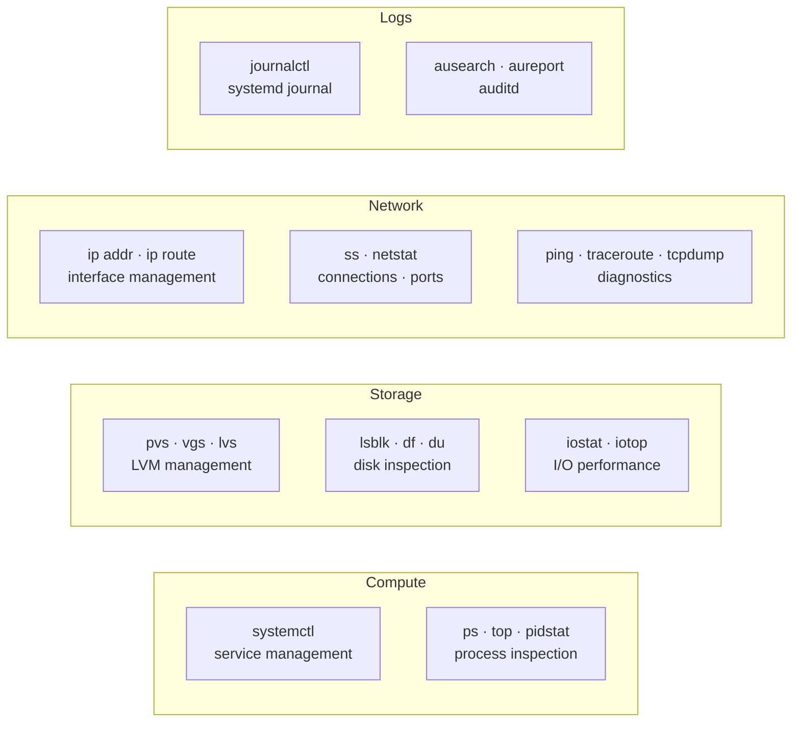

---
tags:
  - linux
  - operations
---
# Linux — CLI Reference


<div class="kb-summary">
Commands, syntax, and quick reference. Commonly used Linux administration commands, grouped by category. Applies to RHEL 8/9 and Ubuntu 22.04 unless noted.
</div>

Commands, syntax, and quick reference.

Commonly used Linux administration commands, grouped by category. Applies to RHEL 8/9 and Ubuntu 22.04 unless noted.

## Command Categories


```text
┌──────────────────────────────────────── Linux — CLI Reference ────────────────────────────────────────┐
│                                                                                                       │
│  Command-line reference for day-to-day Linux administration tasks.                                    │
│                                                                                                       │
│   ┌──────────────────────────────────────────────┐  ┌─────────────────────────────────────────────┐   │
│   │               System & Process               │  │                 File & Disk                 │   │
│   │            ps aux: all processes             │  │            ls -lah: list w/ sizes           │   │
│   │            top / htop: live view             │  │              df -h: disk usage              │   │
│   │           kill / killall: signals            │  │             du -sh *: dir sizes             │   │
│   │             systemctl status svc             │  │              find / grep / awk              │   │
│   │             journalctl -u svc -f             │  │            rsync / scp: transfer            │   │
│   └──────────────────────────────────────────────┘  └─────────────────────────────────────────────┘   │
│                                                                                                       │
│   ┌──────────────────────────────────────────────┐  ┌─────────────────────────────────────────────┐   │
│   │                   Network                    │  │              User & Permissions             │   │
│   │              ip addr / ip route              │  │              useradd / usermod              │   │
│   │             ss -tlnp: open ports             │  │                passwd / chage               │   │
│   │              ping / traceroute               │  │                chmod / chown                │   │
│   │                nmap / netstat                │  │                sudo / visudo                │   │
│   │                tcpdump / curl                │  │              id / groups / who              │   │
│   └──────────────────────────────────────────────┘  └─────────────────────────────────────────────┘   │
│                                                                                                       │
│  Physical Infrastructure (the hardware everything above runs on):                                     │
│  x86-64 servers · terminal emulator · SSH client · NIC · storage mounts                               │
│                                                                                                       │
│  Key terms:                                                                                           │
│                                                                                                       │
│  stdin/stdout= Standard input (fd 0) and output (fd 1); pipes connect them                            │
│  stderr      = Standard error (fd 2); separate from stdout for clean pipelines                        │
│  pipe |      = Passes stdout of left command as stdin of right command                                │
│  redirect >  = Sends stdout to a file; >> appends; 2>&1 merges stderr                                 │
│  signal      = IPC mechanism: SIGTERM (15) graceful, SIGKILL (9) immediate                            │
│  PID         = Process ID; unique integer assigned by kernel to each process                          │
│  UID / GID   = User/Group ID; integers that control file permission checks                            │
│  sudo        = Run command as another user (default root) via policy in sudoers                       │
│  sticky bit  = Restricts file deletion in shared dir to owner only (e.g. /tmp)                        │
│  inode       = Metadata structure on disk: permissions, owner, size, timestamps                       │
│  hard link   = Directory entry pointing to same inode; same data, diff name                           │
│  symlink     = Symbolic link; pointer to another path, can cross filesystems                          │
│                                                                                                       │
└───────────────────────────────────────────────────────────────────────────────────────────────────────┘
```

## Process Management

```bash
ps aux                              # All processes
ps aux --sort=-%cpu | head -15      # Top CPU consumers
ps aux --sort=-%mem | head -15      # Top memory consumers
ps -eLf | sort -k4 -rn | head -20  # Per-thread CPU
kill -9 <PID>                       # Force kill
pkill -f <process-name>             # Kill by name
nohup <command> &                   # Run detached
jobs                                # List background jobs
```

## Disk and Filesystem

```bash
lsblk -o NAME,SIZE,TYPE,MOUNTPOINT,FSTYPE
df -h                               # Filesystem usage
df -i                               # Inode usage
du -sh <path>                       # Directory size
du -sh /* 2>/dev/null | sort -h     # Find large directories
fdisk -l /dev/sdb                   # Partition table
parted /dev/sdb print
mount /dev/vg/lv /mnt/point
umount /mnt/point
```

## LVM

```bash
pvs / pvdisplay                     # Physical volumes
vgs / vgdisplay                     # Volume groups
lvs / lvdisplay                     # Logical volumes
pvcreate /dev/sdb
vgcreate vg_name /dev/sdb
lvcreate -L 50G -n lv_name vg_name
lvextend -L +20G /dev/vg/lv
xfs_growfs /dev/vg/lv               # Grow XFS online
resize2fs /dev/vg/lv                # Grow ext4 online
```

## Networking

```bash
ip -br addr                         # Interface summary
ip addr show <iface>
ip route show
ip route get <destination>
ip link set <iface> up/down
ss -tulnp                           # Listening ports
ss -tnp state established           # Active connections
ss -s                               # Connection summary
ethtool <iface>                     # Physical link info
nmcli connection show
nmcli device status
```

## Logging (journalctl)

```bash
journalctl -p err --since "1 hour ago"
journalctl -u <service> -f          # Follow
journalctl -u <service> -n 100      # Last 100 lines
journalctl -b                       # This boot
journalctl -b -1                    # Previous boot
journalctl -k                       # Kernel messages only
journalctl --disk-usage
journalctl --vacuum-time=7d
```

## User and Session Management

```bash
last                                # Login history
lastb                               # Failed login attempts
who                                 # Currently logged in
w                                   # Who and what they're doing
id <user>                           # UID/GID/groups
getent passwd <user>                # User entry
useradd -m -s /bin/bash <user>
usermod -aG sudo <user>             # Add to sudo (Ubuntu)
usermod -aG wheel <user>            # Add to wheel (RHEL)
passwd -l <user>                    # Lock account
passwd -u <user>                    # Unlock account
```

## Firewall

```bash
# RHEL — firewalld
firewall-cmd --list-all
firewall-cmd --permanent --add-port=8080/tcp
firewall-cmd --permanent --add-service=https
firewall-cmd --reload
firewall-cmd --query-port=443/tcp

# Ubuntu — ufw
ufw status verbose
ufw allow 443/tcp
ufw allow from 10.0.0.0/24 to any port 22
ufw deny 23/tcp
ufw enable
```

## Performance / Diagnostics

```bash
uptime                              # Load average
top -b -n1 | head -25               # CPU/memory snapshot
htop                                # Interactive process viewer
vmstat 1 5                          # VM stats (CPU, swap, I/O)
iostat -xz 1 5                      # Disk I/O per device
mpstat -P ALL 1 3                   # Per-CPU usage
free -h                             # Memory summary
iotop -o -P                         # Processes doing I/O
strace -p <PID>                     # Syscall trace
lsof -p <PID>                       # Open files for a process
lsof <file>                         # Which process has a file open
```

## File Operations

```bash
find /path -name "*.log" -mtime +30         # Files older than 30 days
find /path -size +100M -type f 2>/dev/null  # Files larger than 100 MB
find /etc -newer /etc/passwd -type f        # Recently modified in /etc
tar -czf archive.tar.gz /path/to/dir        # Create archive
tar -xzf archive.tar.gz -C /dest/           # Extract archive
rsync -avz /src/ user@host:/dest/           # Sync files remotely
chmod 750 /path
chown user:group /path
```

## NTP / Time

```bash
timedatectl status
timedatectl set-timezone Europe/Athens
chronyc tracking
chronyc sources -v
chronyc makestep                    # Force immediate sync
```
