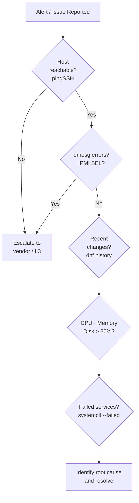

---
tags:
  - linux
  - operations
---
# Linux — Known Issues


<div class="kb-summary">
Quick reference for common problems and resolutions. Structured approach to diagnosing common Linux server issues.
</div>

Quick reference for common problems and resolutions.

Structured approach to diagnosing common Linux server issues.

## Triage Order

1. **Is the host reachable?** — ping, SSH, IPMI/iDRAC console
2. **Is it a hardware or OS issue?** — dmesg errors, IPMI SEL
3. **What changed recently?** — yum/dnf history, git log, cron, deployments
4. **What is the resource state?** — CPU, memory, disk, network
5. **Which services/processes are involved?** — systemctl, ps, journalctl


```text
┌────────────────────────────────── Linux — Common Operational Issues ──────────────────────────────────┐
│                                                                                                       │
│  Recurring Linux issues and their triage steps for quick resolution.                                  │
│                                                                                                       │
│   ┌──────────────────────────────────────────────┐  ┌─────────────────────────────────────────────┐   │
│   │              Performance Issues              │  │                Storage Issues               │   │
│   │              High CPU: top/htop              │  │            Disk full: df -h / du            │   │
│   │             OOM: journalctl grep             │  │             Inode exhaust: df -i            │   │
│   │            High LA: check iowait             │  │              Mount fail: dmesg              │   │
│   │              Memory leak: pmap               │  │               FS errors: fsck               │   │
│   │             Swap thrash: vmstat              │  │             LVM resize: lvextend            │   │
│   └──────────────────────────────────────────────┘  └─────────────────────────────────────────────┘   │
│                                                                                                       │
│   ┌──────────────────────────────────────────────┐  ┌─────────────────────────────────────────────┐   │
│   │                Network Issues                │  │                Service Issues               │   │
│   │              No route: ip route              │  │             Service fail: status            │   │
│   │           DNS fail: dig / nslookup           │  │           Port conflict: ss -tlnp           │   │
│   │            MTU mismatch: ping -M             │  │             Dep missing: rpm -q             │   │
│   │            FW block: iptables -L             │  │             Config error: syslog            │   │
│   │            SSH timeout: tcp dumps            │  │           SELinux deny: audit2why           │   │
│   └──────────────────────────────────────────────┘  └─────────────────────────────────────────────┘   │
│                                                                                                       │
│  Physical Infrastructure (the hardware everything above runs on):                                     │
│  x86-64 servers · NIC · storage arrays · network switches · out-of-band IPMI                          │
│                                                                                                       │
│  Key terms:                                                                                           │
│                                                                                                       │
│  OOM killer  = Kernel mechanism that kills processes when RAM is exhausted                            │
│  load avg    = 1/5/15 min averages of runnable + uninterruptible processes                            │
│  iowait      = CPU time spent waiting for I/O; high value indicates disk bottleneck                   │
│  inode       = Fixed-count metadata structures; can exhaust independently of disk space               │
│  fsck        = Filesystem consistency check and repair tool; run on unmounted FS                      │
│  vmstat      = Reports virtual memory stats: swap, io, cpu, processes                                 │
│  pmap        = Displays memory map of a process; useful for leak investigation                        │
│  audit2why   = Explains SELinux denials in human-readable form from audit.log                         │
│  MTU         = Maximum Transmission Unit; packet size limit on a network interface                    │
│  dmesg       = Kernel ring buffer log; first place to check hardware/driver errors                    │
│  lvextend    = LVM command to grow a logical volume; paired with resize2fs/xfs_growfs                 │
│  ss          = Socket statistics; replaces netstat; shows ports, states, processes                    │
│                                                                                                       │
└───────────────────────────────────────────────────────────────────────────────────────────────────────┘
```

## High Disk I/O or Latency

```bash
# Which device is busy?
iostat -xz 1 5
# %util > 80% = saturated; await > 20ms = high latency

# Which process is doing the I/O?
iotop -o -P

# Filesystem fill causing ENOSPC errors
df -h | awk '$5+0 > 85'
dmesg | grep -i "ENOSPC\|no space left\|filesystem full"

# Large temp files
find /tmp /var/tmp -size +100M 2>/dev/null

# Growing log files
du -sh /var/log/* | sort -h | tail -10
```

## Network Connectivity Issues

```bash
# Step 1 — Is the interface up?
ip link show | grep -E "state UP|state DOWN"

# Step 2 — Does the IP and route exist?
ip addr show
ip route show

# Step 3 — Can we reach the gateway?
ping -c 4 $(ip route show default | awk '{print $3}')

# Step 4 — Can we reach DNS?
dig +short google.com @8.8.8.8

# Step 5 — Is the local port open?
ss -tulnp | grep <port>

# Step 6 — Is firewall blocking?
firewall-cmd --list-all          # RHEL
ufw status verbose               # Ubuntu
iptables -L -n -v | grep DROP    # Direct iptables

# Step 7 — Packet capture to confirm traffic flow
tcpdump -i eth0 host <remote-ip> and port <port> -c 50
```

## Service Not Starting

```bash
# Check the exact error
systemctl status <service> -l
journalctl -u <service> -n 50 --no-pager

# Check dependencies
systemctl list-dependencies <service> | grep failed

# Validate unit file
systemd-analyze verify /etc/systemd/system/<service>.service

# Check if port is already in use
ss -tulnp | grep <port>

# Test the command manually
sudo -u <service-user> <ExecStart-command> --dry-run
```

## SSH Access Denied

```bash
# Check sshd is running
systemctl status sshd

# Check sshd config for auth method restrictions
grep -E "PasswordAuth|PubkeyAuth|AllowUsers|DenyUsers|MaxAuthTries" /etc/ssh/sshd_config

# Check PAM for account restrictions
journalctl _SYSTEMD_UNIT=sshd.service | grep "Failed\|error\|pam" | tail -20

# Check if account is locked
passwd -S <username>   # L = locked
faillock --user <username>    # Check failed login counter
faillock --user <username> --reset    # Reset counter

# Check /etc/hosts.allow and hosts.deny (tcpwrappers)
cat /etc/hosts.deny
cat /etc/hosts.allow

# SELinux blocking SSH (non-standard port)
ausearch -m avc -c sshd --start recent | tail -10
```

## Disk Full — Emergency

```bash
# Find the full filesystem
df -h | awk '$5+0 > 90'

# Largest directories
du -sh /* 2>/dev/null | sort -h | tail -10
du -sh /var/* 2>/dev/null | sort -h | tail -10

# Large log files
find /var/log -size +100M -type f 2>/dev/null
# Truncate (don't delete — running process may hold FD open)
> /var/log/large-logfile.log

# Open but deleted files still consuming space
lsof | grep deleted | sort -k7 -rn | head -10
# Restart the holding process to release inodes

# Force journal vacuum
journalctl --vacuum-size=500M
```

## System Crash / Reboot Analysis

```bash
# Recent reboots
last reboot | head -10

# Was it a kernel panic?
journalctl -b -1 | tail -50   # Previous boot
dmesg | grep -i "panic\|bug:\|BUG:\|Oops:"

# kdump crash dump (if configured)
ls /var/crash/

# Hardware errors (memory, CPU, PCIe)
mcelog --client 2>/dev/null
dmesg | grep -iE "mce|machine check|uncorrect|hardware error"

# Check IPMI SEL (system event log)
ipmitool sel list | tail -20
```

## Useful One-Liners

```bash
# All errors in the last 10 minutes
journalctl -p err --since "10 minutes ago"

# Files recently modified in /etc
find /etc -newer /etc/fstab -type f 2>/dev/null | sort

# Which process has a file open
lsof /path/to/file

# Which process is listening on a port
ss -tlnp | grep :8080

# Strace a process for syscall-level debugging
strace -p <PID> -s 200 -f 2>&1 | head -100

# Check for time skew (NTP offset > 1s = problematic)
chronyc tracking | grep "System time"
```
