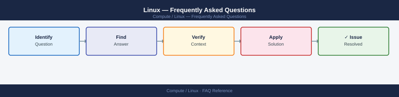

---
tags:
  - linux
  - faq
  - operations
---
# Linux — Frequently Asked Questions

Common questions about Linux operations, configuration, and troubleshooting. For step-by-step procedures, see the <a href="index.md">Operations</a> section.

## General

**Q: How do I check the Linux distribution and kernel version?**
A: Run `cat /etc/os-release` for distro info and `uname -r` for kernel version. For RHEL/CentOS: `cat /etc/redhat-release`. For Ubuntu: `lsb_release -a`.

**Q: How do I check the current Linux version?**
A: `uname -r && cat /etc/os-release`

## Configuration

**Q: What is the default SSH timeout and when should it be changed?**
A: `ClientAliveInterval 0` (no timeout) is the default in most distros. Set `ClientAliveInterval 300` and `ClientAliveCountMax 3` in `/etc/ssh/sshd_config` to disconnect idle sessions after 15 minutes.

**Q: How do I enable SELinux enforcing mode on RHEL/CentOS?**
A: Check current mode: `getenforce`. To enable: edit `/etc/selinux/config`, set `SELINUX=enforcing`, and reboot. First boot with `permissive` to collect AVC denials before switching to `enforcing`.

## Operations

**Q: How do I apply kernel updates across a fleet without downtime?**
A: Use live patching (RHEL: `kpatch`, Ubuntu: `livepatch`) for security patches without reboot. For full kernel upgrades, use rolling reboots — update and reboot one host at a time, verify before proceeding.

**Q: What is the correct procedure to add a new disk to a running Linux system?**
A: Attach the disk, then `lsblk` to identify it. Partition with `fdisk` or `parted`. Create filesystem: `mkfs.xfs /dev/sdb1`. Add to `/etc/fstab` with UUID (`blkid`). Mount: `mount -a`.

## Troubleshooting

**Q: System logs show 'kernel: EXT4-fs error'. What does it mean?**
A: Filesystem corruption detected. Run `fsck /dev/sdX` from single-user mode or a rescue environment (unmount first). Check `dmesg` and `smartctl -a /dev/sdX` for underlying disk errors.

**Q: System load is high — where do I start?**
A: Run `top` or `htop` to identify the culprit process. Check I/O wait with `iostat -x 1`. Review memory with `free -h` and `vmstat`. Check for zombie processes. Review `/proc/<pid>/status` for a specific process.

## Backup and Recovery

**Q: How often should I back up Linux system configuration?**
A: Critical config in `/etc` should be in version control (etckeeper or Ansible). Full system backups weekly via Veeam Agent, Commvault, or similar. Log rotation configured in `/etc/logrotate.d/`.

**Q: Can I restore a single configuration file without a full system restore?**
A: Yes — from Veeam Agent file-level recovery, or from your version-controlled `/etc` repo (`git checkout HEAD -- /etc/nginx/nginx.conf`). Always test changes in a non-production environment first.

## See Also

- [Linux Operations](index.md)
- [Linux Troubleshooting](../../troubleshooting/index.md)
