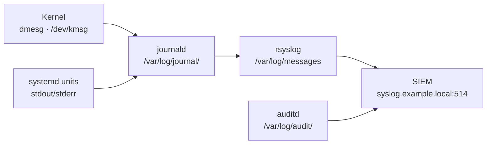

# Linux — Health Checks


<div class="kb-summary">
Routine checks, service validation, and status verification.
</div>

## Run This Routine

Run these commands in sequence at the start of any health check or before making changes to a Linux server.

```bash
# 1. OS version and uptime
cat /etc/os-release && uptime

# 2. CPU and load average
top -bn1 | head -5
# Or use vmstat for a 3-sample view:
vmstat 1 3

# 3. Memory usage
free -h

# 4. Disk usage (exclude tmpfs mounts)
df -h --output=source,size,used,avail,pcent | grep -v tmpfs

# 5. Filesystem errors in kernel ring buffer
dmesg | grep -i "error\|fail\|fault" | tail -20

# 6. Failed systemd services
systemctl --failed

# 7. Network interface status and routing
ip addr show && ip route show

# 8. Recent login failures
grep "Failed password" /var/log/secure | tail -10
# Ubuntu/Debian:
# grep "Failed password" /var/log/auth.log | tail -10

# 9. Open listening ports
ss -tlnp

# 10. Pending security updates
yum check-update --security 2>/dev/null | wc -l
# Ubuntu/Debian:
# apt list --upgradable 2>/dev/null | wc -l
```
```text
┌──────────────────────────────────────── Linux — Health Checks ────────────────────────────────────────┐
│                                                                                                       │
│   ┌───────────────────────────────────────────────────────────────────────────────────────────────┐   │
│   │                                     Health Check Framework                                    │   │
│   │           Daily: check failed services · disk usage · load average · OOM log entries          │   │
│   │        Weekly: review auditd logs · zombie processes · swap usage · NIC error counters        │   │
│   │        Monthly: kernel errata check · LVM free extents · certificate expiry · cron jobs       │   │
│   │             Alerting: Prometheus rules → Alertmanager → PagerDuty / Slack / email             │   │
│   └───────────────────────────────────────────────────────────────────────────────────────────────┘   │
│                                                                                                       │
│    Proactive health checks prevent incidents; alerts surface issues before users notice               │
│                                                                                                       │
│                          ▼                                                 ▼                          │
│                                                                                                       │
│   ┌──────────────────────────────────────────────┐  ┌─────────────────────────────────────────────┐   │
│   │               Resource Checks                │  │             Service & Log Checks            │   │
│   │           top/htop: CPU + mem live           │  │           systemctl --failed: list          │   │
│   │           df -h: filesystem usage            │  │          journalctl -p err: errors          │   │
│   │           free -h: RAM + swap view           │  │          dmesg -T: kernel messages          │   │
│   │          iostat -x: disk await/util          │  │            ss -s: socket summary            │   │
│   │           uptime: load avg 1/5/15            │  │          ip -s link: NIC error ctrs         │   │
│   └──────────────────────────────────────────────┘  └─────────────────────────────────────────────┘   │
│                                                                                                       │
│  Physical Infrastructure (the hardware everything above runs on):                                     │
│  x86-64 servers · RAM DIMMs · NVMe/SSD · NIC · iDRAC/iLO IPMI · Power & Cooling                       │
│                                                                                                       │
│  Key terms:                                                                                           │
│                                                                                                       │
│  load average= 1/5/15-min exponential moving avg of runnable + uninterruptible tasks                  │
│  OOM         = Out-of-Memory; kernel kills processes when physical + swap RAM exhausted               │
│  zombie      = Process in Z state; exited but parent has not called wait(); check ppid                │
│  df          = Disk Free; reports filesystem usage by mount point; -h for human-readable              │
│  iostat      = I/O Stat; reports device utilisation, IOPS, await (ms), and throughput                 │
│  dmesg       = Kernel ring buffer; shows hardware errors, driver messages, and panics                 │
│  Prometheus  = Time-series metrics database; scrapes exporters on configured intervals                │
│  Alertmanager= Prometheus companion; routes alerts to receivers (PagerDuty, email, Slack)             │
│  ss          = Socket Statistics; replacement for netstat; faster via kernel netlink                  │
│  journalctl  = Query systemd journal; use -p err for errors, -b for current boot                      │
│  LVM extents = Free PE (Physical Extents) in a VG; available for LV growth                            │
│  NIC error counters= rx_errors/tx_errors on interface; indicate cabling or driver issues              │
│                                                                                                       │
└───────────────────────────────────────────────────────────────────────────────────────────────────────┘
```

## CPU and Load

```bash
# Current CPU usage snapshot
top -b -n1 | head -20

# Load average vs. CPU count — load > nCPUs = saturated
nproc
uptime   # 1m 5m 15m averages

# Per-CPU breakdown
mpstat -P ALL 1 3

# Top CPU-consuming processes
ps aux --sort=-%cpu | head -15
```

## Memory

```bash
# Summary
free -h

# Detailed breakdown
cat /proc/meminfo | grep -E "MemTotal|MemFree|MemAvailable|SwapTotal|SwapFree|Cached|Buffers"

# Top memory-consuming processes
ps aux --sort=-%mem | head -15

# OOM kill events
journalctl -k --since "1 hour ago" | grep -i "oom\|killed process"
dmesg | grep -i "out of memory" | tail -10
```

## Disk

```bash
# Filesystem usage — flag anything above 80%
df -h | awk 'NR==1 || $5+0 > 80'

# Inode usage (can fill independently of space)
df -i | awk 'NR==1 || $5+0 > 80'

# I/O stats per device
iostat -xz 1 3

# Disk errors in kernel ring buffer
dmesg | grep -iE "error|failed|reset|timeout" | grep -iE "sd[a-z]|nvme|dm-" | tail -20

# Large files consuming unexpected space
du -sh /var/log/* 2>/dev/null | sort -h | tail -10
du -sh /tmp/* 2>/dev/null | sort -h | tail -10
```

## Network

```bash
# Interface status and IPs
ip -br addr

# Active listening ports
ss -tulnp

# Interface errors and drops
ip -s link show | grep -A 5 "errors\|dropped"

# Connection counts
ss -s

# Recent network-related kernel events
dmesg | grep -iE "link is down|link is up|reset adapter|carrier" | tail -10
```

## Services and Systemd

```bash
# Failed units — should return 0
systemctl --failed

# Check a specific service
systemctl status <service-name>

# Service restart history
journalctl -u <service-name> | grep -i "start\|stop\|fail" | tail -20

# Services that have restarted unexpectedly
journalctl --since "24 hours ago" | grep "Start request repeated" | tail -10
```

## System Logs — Quick Errors

```bash
# All errors from the last hour
journalctl -p err --since "1 hour ago"

# Kernel warnings and errors
dmesg --level=err,warn | tail -30

# Auth failures
journalctl _SYSTEMD_UNIT=sshd.service | grep "Failed\|Invalid" | tail -20
```

## NTP / Time Sync

```bash
# Check sync status
timedatectl status

# chrony detail (RHEL)
chronyc tracking
chronyc sources -v

# Flag offset > 1 second
chronyc tracking | grep "System time"
```

## Security Posture

```bash
# SELinux status (RHEL)
getenforce
sestatus | grep -E "mode|status"

# AppArmor status (Ubuntu)
aa-status 2>/dev/null | head -5

# Locked or expired accounts
passwd -S -a 2>/dev/null | grep -E " L | P " | head -20

# Sudo configuration
visudo -c   # Syntax check, no changes
```

## Health Check Summary Table

| Check | Command | Healthy |
|---|---|---|
| Load vs CPU count | `uptime` + `nproc` | load ≤ nCPU |
| Memory available | `free -h` | Available > 20% |
| No FS > 85% | `df -h` | All < 85% |
| No inode FS > 85% | `df -i` | All < 85% |
| No failed services | `systemctl --failed` | 0 failed |
| NTP synchronised | `timedatectl` | Synchronised: yes |
| No interface errors | `ip -s link` | TX/RX errors = 0 |
| No kernel errors | `dmesg --level=err` | None recent |
| SELinux enforcing | `getenforce` | Enforcing |

## Log Pipeline



## Log Locations

| Log | Path / Command | Content |
|---|---|---|
| System journal | `journalctl` | All systemd units, kernel, boot |
| Kernel messages | `dmesg` / `journalctl -k` | Hardware, driver events |
| Auth / SSH | `journalctl _SYSTEMD_UNIT=sshd.service` | Login, sudo, SSH |
| Audit | `/var/log/audit/audit.log` | SELinux denials, syscall auditing |
| Application | `/var/log/<app>/` or `journalctl -u <svc>` | Per-service |
| cron | `/var/log/cron` (RHEL) / `journalctl -u cron` | Scheduled job output |
| Boot log | `journalctl -b` | Full boot sequence |
| DNF/YUM history | `/var/log/dnf.log` + `dnf history` | Package installs/removals (RHEL) |
| APT history | `/var/log/apt/history.log` | Package changes (Ubuntu) |

## journalctl — Common Queries

```bash
# Errors and above — last hour
journalctl -p err --since "1 hour ago"

# Follow a service in real time
journalctl -u nginx.service -f

# Messages since last boot
journalctl -b

# Previous boot (for crashed systems)
journalctl -b -1

# Between timestamps
journalctl --since "2026-05-01 08:00:00" --until "2026-05-01 09:00:00"

# By PID
journalctl _PID=1234

# Kernel messages only
journalctl -k

# Output as JSON (for parsing)
journalctl -u myservice -o json | jq '.MESSAGE'

# Export for TAC/vendor
journalctl --since "yesterday" > /tmp/journal-export.txt
```

## dmesg — Kernel Ring Buffer

```bash
# Errors and warnings
dmesg --level=err,warn

# Watch in real time
dmesg -w

# Hardware errors (memory, disk, network)
dmesg | grep -iE "error|fail|reset|timeout|uncorrect" | tail -30

# Disk I/O errors
dmesg | grep -iE "sd[a-z]|nvme|blk_update_request|I/O error"

# OOM events
dmesg | grep -i "oom\|killed process\|out of memory"
```

## Audit Log (auditd)

```bash
# SELinux denials
ausearch -m avc --start recent

# Failed logins
ausearch -m USER_AUTH --success no --start today

# Changes to sensitive files
ausearch -f /etc/passwd
ausearch -f /etc/sudoers

# Commands run via sudo
ausearch -ua root --start today | grep EXECVE

# Summary report
aureport --summary
aureport --login --failed
```

## Remote Log Forwarding (rsyslog)

```bash
# /etc/rsyslog.d/90-remote.conf — forward all logs via TCP to centralised syslog
*.* action(type="omfwd"
    target="syslog.example.local"
    port="514"
    protocol="tcp")

# Restart rsyslog
systemctl restart rsyslog

# Verify TCP connection to syslog server
ss -tnp | grep :514
```

## Journal Size Management

```bash
# Check journal disk usage
journalctl --disk-usage

# Vacuum to keep last 7 days
journalctl --vacuum-time=7d

# Vacuum to size limit
journalctl --vacuum-size=500M

# Persistent journal size cap in /etc/systemd/journald.conf:
# SystemMaxUse=2G
systemctl restart systemd-journald
```

---

## CPU Health

Commands to assess CPU utilisation and identify processes causing high load.

```bash
# Load average vs. CPU count — load > nCPUs indicates saturation
nproc
uptime

# Snapshot of CPU usage by process
top -bn1 | head -20

# Per-CPU utilisation over 3 samples
mpstat -P ALL 1 3

# Top CPU-consuming processes
ps aux --sort=-%cpu | head -15

# Processor interrupt and context-switch rates
vmstat 1 5
```

What to look for:
- Load average 1-minute value consistently above `nproc` output indicates CPU saturation.
- `%iowait` above 20% in `mpstat` output suggests disk I/O is blocking CPU.
- Single-core pinned at 100% may indicate a runaway process or missing multi-threading.
- `%steal` above 5% on VMs indicates the hypervisor is overcommitting CPU resources.

---

## Memory Health

Commands to assess memory availability and detect Out-of-Memory (OOM) events.

```bash
# Summary: total / used / free / available
free -h

# Detailed breakdown from kernel
cat /proc/meminfo | grep -E "MemTotal|MemFree|MemAvailable|SwapTotal|SwapFree|Cached|Buffers"

# Top memory-consuming processes
ps aux --sort=-%mem | head -15

# OOM kill events
journalctl -k --since "24 hours ago" | grep -i "oom\|killed process\|out of memory"
dmesg | grep -i "out of memory" | tail -10

# Swap usage — high swap usage with low available RAM = memory pressure
swapon --show
```

What to look for:
- `MemAvailable` below 10% of `MemTotal` indicates memory pressure.
- Any OOM kill events in `dmesg` require immediate investigation — a process was terminated by the kernel.
- Swap usage above 20% of swap total on a system with low available RAM indicates the system is swapping heavily.
- Large `Cached` value is normal and healthy — Linux uses free memory as page cache.

---

## Disk and Filesystem Health

Commands to assess filesystem usage, I/O performance, and detect disk errors.

```bash
# Filesystem usage — flag anything above 85%
df -h | awk 'NR==1 || $5+0 > 80'

# Inode usage — can fill independently of block usage
df -i | awk 'NR==1 || $5+0 > 80'

# I/O statistics — await (ms) and utilisation per device
iostat -xz 1 3

# Disk errors in kernel ring buffer
dmesg | grep -iE "error|failed|reset|timeout|I/O error" | grep -iE "sd[a-z]|nvme|dm-" | tail -20

# Large files or directories consuming unexpected space
du -sh /var/log/* 2>/dev/null | sort -h | tail -10
du -sh /tmp/* 2>/dev/null | sort -h | tail -10
```

What to look for:
- Any filesystem above 85% used requires action — logs and application data will fail to write at 100%.
- `await` above 20ms in `iostat` output indicates disk latency; above 100ms is critical.
- `%util` above 80% in `iostat` means the device is saturated.
- Hardware errors in `dmesg` (`I/O error`, `blk_update_request`, `reset`) may indicate a failing disk — escalate immediately.
- Inode exhaustion (`df -i` shows 100%) prevents file creation even when block space is available.

---

## Network Health

Commands to verify interface state, connectivity, and detect errors or unexpected connections.

```bash
# Interface status and IP addresses
ip -br addr
ip link show

# Routing table
ip route show

# Active listening ports
ss -tlnp

# Interface error and drop counters
ip -s link show

# Connection counts by state
ss -s

# Recent network-related kernel events
dmesg | grep -iE "link is down|link is up|reset adapter|carrier" | tail -10

# DNS resolution test
dig corp.local
```

What to look for:
- Any interface showing `DOWN` state that should be `UP` requires immediate investigation.
- Non-zero `RX errors` or `TX errors` in `ip -s link` output indicate NIC or cabling issues.
- Unexpected listening ports in `ss -tlnp` may indicate an unauthorized service.
- High `CLOSE-WAIT` or `TIME-WAIT` connection counts in `ss -s` may indicate application connection handling issues.
- `link is down` messages in `dmesg` that are not expected (scheduled maintenance) indicate network instability.

---

## Service Health

Commands to check the state of systemd services and review recent service failures.

```bash
# Failed services — should return 0 in a healthy state
systemctl --failed

# Check a specific service
systemctl status <service-name>

# Services that auto-started unexpectedly (restart loops)
journalctl --since "24 hours ago" | grep "Start request repeated" | tail -10

# Recent service stop/start events
journalctl --since "1 hour ago" | grep -iE "started|stopped|failed|killed" | grep -v "^--" | tail -20

# Services enabled at boot
systemctl list-unit-files --type=service --state=enabled
```

What to look for:
- Any unit in `systemctl --failed` output requires immediate investigation and resolution.
- Services entering a restart loop (`Start request repeated too quickly`) indicate a configuration or dependency problem.
- `Killed` entries in the journal often indicate OOM kills — correlate with memory health checks.
- Services that were `Active: active (running)` and are now `inactive (dead)` without a scheduled stop.

---

## Security Health

Commands to verify security controls, access policy, and detect suspicious activity.

```bash
# SELinux enforcement status (RHEL/AlmaLinux)
getenforce
sestatus | grep -E "mode|status"

# AppArmor status (Ubuntu/Debian)
aa-status 2>/dev/null | head -5

# Recent SELinux denials
ausearch -m avc --start recent 2>/dev/null | tail -20

# Failed SSH login attempts
grep "Failed password" /var/log/secure | tail -20
# Ubuntu: grep "Failed password" /var/log/auth.log | tail -20

# Currently logged-in users
who
w

# Recent sudo usage
journalctl -u sudo --since "24 hours ago" | tail -20

# Open ports — verify all are expected
ss -tlnp

# Check for accounts with empty passwords
awk -F: '($2 == "") {print $1}' /etc/shadow 2>/dev/null
```

What to look for:
- SELinux should be `Enforcing` on production RHEL systems — `Permissive` means policy is not being enforced.
- Repeated failed SSH logins from the same IP indicate a brute-force attack — consider `fail2ban` or firewall block.
- Unexpected users in `who` output or logins at unusual hours warrant investigation.
- Any account with an empty password in `/etc/shadow` is a critical security misconfiguration.
- Unexpected listening ports may indicate a backdoor or misconfigured service.
