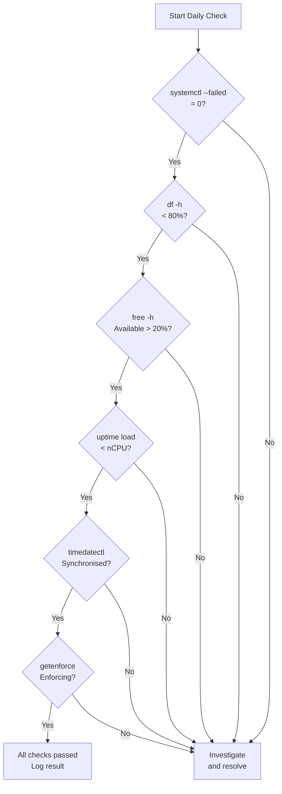
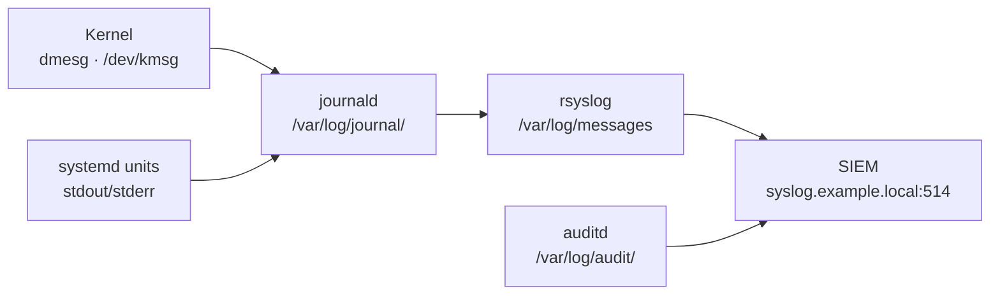

# Linux — Health Checks


<div class="kb-summary">
Routine checks, service validation, and status verification.
</div>

## Health Check Flow


┌──────────────────────────────────────── Linux — Health Checks ────────────────────────────────────────┐
│                                                                                                       │
│   ┌───────────────────────────────────────────────────────────────────────────────────────────────┐   │
│   │                                     Health Check Framework                                    │   │
│   │           Daily: check failed services · disk usage · load average · OOM log entries          │   │
│   │        Weekly: review auditd logs · zombie processes · swap usage · NIC error counters        │   │
│   │        Monthly: kernel errata check · LVM free extents · certificate expiry · cron jobs       │   │
│   │             Alerting: Prometheus rules → Alertmanager → PagerDuty / Slack / email             │   │
│   └───────────────────────────────────────────────────────────────────────────────────────────────┘   │
│                                                                                                       │
│    Proactive health checks prevent incidents; alerts surface issues before users notice               │
│                                                                                                       │
│                          ▼                                                 ▼                          │
│                                                                                                       │
│   ┌──────────────────────────────────────────────┐  ┌─────────────────────────────────────────────┐   │
│   │               Resource Checks                │  │             Service & Log Checks            │   │
│   │           top/htop: CPU + mem live           │  │           systemctl --failed: list          │   │
│   │           df -h: filesystem usage            │  │          journalctl -p err: errors          │   │
│   │           free -h: RAM + swap view           │  │          dmesg -T: kernel messages          │   │
│   │          iostat -x: disk await/util          │  │            ss -s: socket summary            │   │
│   │           uptime: load avg 1/5/15            │  │          ip -s link: NIC error ctrs         │   │
│   └──────────────────────────────────────────────┘  └─────────────────────────────────────────────┘   │
│                                                                                                       │
│  Physical Infrastructure (the hardware everything above runs on):                                     │
│  x86-64 servers · RAM DIMMs · NVMe/SSD · NIC · iDRAC/iLO IPMI · Power & Cooling                       │
│                                                                                                       │
│  Key terms:                                                                                           │
│                                                                                                       │
│  load average= 1/5/15-min exponential moving avg of runnable + uninterruptible tasks                  │
│  OOM         = Out-of-Memory; kernel kills processes when physical + swap RAM exhausted               │
│  zombie      = Process in Z state; exited but parent has not called wait(); check ppid                │
│  df          = Disk Free; reports filesystem usage by mount point; -h for human-readable              │
│  iostat      = I/O Stat; reports device utilisation, IOPS, await (ms), and throughput                 │
│  dmesg       = Kernel ring buffer; shows hardware errors, driver messages, and panics                 │
│  Prometheus  = Time-series metrics database; scrapes exporters on configured intervals                │
│  Alertmanager= Prometheus companion; routes alerts to receivers (PagerDuty, email, Slack)             │
│  ss          = Socket Statistics; replacement for netstat; faster via kernel netlink                  │
│  journalctl  = Query systemd journal; use -p err for errors, -b for current boot                      │
│  LVM extents = Free PE (Physical Extents) in a VG; available for LV growth                            │
│  NIC error counters= rx_errors/tx_errors on interface; indicate cabling or driver issues              │
│                                                                                                       │
└───────────────────────────────────────────────────────────────────────────────────────────────────────┘
```
```bash

## CPU and Load

```bash
# Current CPU usage snapshot
top -b -n1 | head -20

# Load average vs. CPU count — load > nCPUs = saturated
nproc
uptime   # 1m 5m 15m averages

# Per-CPU breakdown
mpstat -P ALL 1 3

# Top CPU-consuming processes
ps aux --sort=-%cpu | head -15
```

## Memory

```bash
# Summary
free -h

# Detailed breakdown
cat /proc/meminfo | grep -E "MemTotal|MemFree|MemAvailable|SwapTotal|SwapFree|Cached|Buffers"

# Top memory-consuming processes
ps aux --sort=-%mem | head -15

# OOM kill events
journalctl -k --since "1 hour ago" | grep -i "oom\|killed process"
dmesg | grep -i "out of memory" | tail -10
```

## Disk

```bash
# Filesystem usage — flag anything above 80%
df -h | awk 'NR==1 || $5+0 > 80'

# Inode usage (can fill independently of space)
df -i | awk 'NR==1 || $5+0 > 80'

# I/O stats per device
iostat -xz 1 3

# Disk errors in kernel ring buffer
dmesg | grep -iE "error|failed|reset|timeout" | grep -iE "sd[a-z]|nvme|dm-" | tail -20

# Large files consuming unexpected space
du -sh /var/log/* 2>/dev/null | sort -h | tail -10
du -sh /tmp/* 2>/dev/null | sort -h | tail -10
```

## Network

```bash
# Interface status and IPs
ip -br addr

# Active listening ports
ss -tulnp

# Interface errors and drops
ip -s link show | grep -A 5 "errors\|dropped"

# Connection counts
ss -s

# Recent network-related kernel events
dmesg | grep -iE "link is down|link is up|reset adapter|carrier" | tail -10
```

## Services and Systemd

```bash
# Failed units — should return 0
systemctl --failed

# Check a specific service
systemctl status <service-name>

# Service restart history
journalctl -u <service-name> | grep -i "start\|stop\|fail" | tail -20

# Services that have restarted unexpectedly
journalctl --since "24 hours ago" | grep "Start request repeated" | tail -10
```

## System Logs — Quick Errors

```bash
# All errors from the last hour
journalctl -p err --since "1 hour ago"

# Kernel warnings and errors
dmesg --level=err,warn | tail -30

# Auth failures
journalctl _SYSTEMD_UNIT=sshd.service | grep "Failed\|Invalid" | tail -20
```

## NTP / Time Sync

```bash
# Check sync status
timedatectl status

# chrony detail (RHEL)
chronyc tracking
chronyc sources -v

# Flag offset > 1 second
chronyc tracking | grep "System time"
```

## Security Posture

```bash
# SELinux status (RHEL)
getenforce
sestatus | grep -E "mode|status"

# AppArmor status (Ubuntu)
aa-status 2>/dev/null | head -5

# Locked or expired accounts
passwd -S -a 2>/dev/null | grep -E " L | P " | head -20

# Sudo configuration
visudo -c   # Syntax check, no changes
```

## Health Check Summary Table

| Check | Command | Healthy |
|---|---|---|
| Load vs CPU count | `uptime` + `nproc` | load ≤ nCPU |
| Memory available | `free -h` | Available > 20% |
| No FS > 85% | `df -h` | All < 85% |
| No inode FS > 85% | `df -i` | All < 85% |
| No failed services | `systemctl --failed` | 0 failed |
| NTP synchronised | `timedatectl` | Synchronised: yes |
| No interface errors | `ip -s link` | TX/RX errors = 0 |
| No kernel errors | `dmesg --level=err` | None recent |
| SELinux enforcing | `getenforce` | Enforcing |

## Log Pipeline



## Log Locations

| Log | Path / Command | Content |
|---|---|---|
| System journal | `journalctl` | All systemd units, kernel, boot |
| Kernel messages | `dmesg` / `journalctl -k` | Hardware, driver events |
| Auth / SSH | `journalctl _SYSTEMD_UNIT=sshd.service` | Login, sudo, SSH |
| Audit | `/var/log/audit/audit.log` | SELinux denials, syscall auditing |
| Application | `/var/log/<app>/` or `journalctl -u <svc>` | Per-service |
| cron | `/var/log/cron` (RHEL) / `journalctl -u cron` | Scheduled job output |
| Boot log | `journalctl -b` | Full boot sequence |
| DNF/YUM history | `/var/log/dnf.log` + `dnf history` | Package installs/removals (RHEL) |
| APT history | `/var/log/apt/history.log` | Package changes (Ubuntu) |

## journalctl — Common Queries

```bash
# Errors and above — last hour
journalctl -p err --since "1 hour ago"

# Follow a service in real time
journalctl -u nginx.service -f

# Messages since last boot
journalctl -b

# Previous boot (for crashed systems)
journalctl -b -1

# Between timestamps
journalctl --since "2026-05-01 08:00:00" --until "2026-05-01 09:00:00"

# By PID
journalctl _PID=1234

# Kernel messages only
journalctl -k

# Output as JSON (for parsing)
journalctl -u myservice -o json | jq '.MESSAGE'

# Export for TAC/vendor
journalctl --since "yesterday" > /tmp/journal-export.txt
```

## dmesg — Kernel Ring Buffer

```bash
# Errors and warnings
dmesg --level=err,warn

# Watch in real time
dmesg -w

# Hardware errors (memory, disk, network)
dmesg | grep -iE "error|fail|reset|timeout|uncorrect" | tail -30

# Disk I/O errors
dmesg | grep -iE "sd[a-z]|nvme|blk_update_request|I/O error"

# OOM events
dmesg | grep -i "oom\|killed process\|out of memory"
```

## Audit Log (auditd)

```bash
# SELinux denials
ausearch -m avc --start recent

# Failed logins
ausearch -m USER_AUTH --success no --start today

# Changes to sensitive files
ausearch -f /etc/passwd
ausearch -f /etc/sudoers

# Commands run via sudo
ausearch -ua root --start today | grep EXECVE

# Summary report
aureport --summary
aureport --login --failed
```

## Remote Log Forwarding (rsyslog)

```bash
# /etc/rsyslog.d/90-remote.conf — forward all logs via TCP to centralised syslog
*.* action(type="omfwd"
    target="syslog.example.local"
    port="514"
    protocol="tcp")

# Restart rsyslog
systemctl restart rsyslog

# Verify TCP connection to syslog server
ss -tnp | grep :514
```

## Journal Size Management

```bash
# Check journal disk usage
journalctl --disk-usage

# Vacuum to keep last 7 days
journalctl --vacuum-time=7d

# Vacuum to size limit
journalctl --vacuum-size=500M

# Persistent journal size cap in /etc/systemd/journald.conf:
# SystemMaxUse=2G
systemctl restart systemd-journald
```
