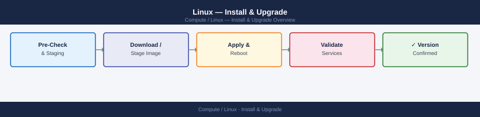
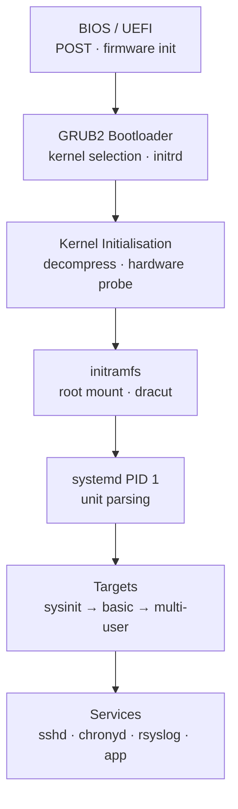

---
tags:
  - linux
  - operations
---
# Linux — Install & Upgrade


<div class="kb-summary">
Linux install and upgrade: kickstart/preseed PXE setup, OS patching with `yum update` or `apt upgrade`, kernel module management, and decommission steps.

*Applies to: RHEL / Ubuntu LTS*
</div>



```d2
direction: right

plan: "Plan" {shape: oval}
linux_boot_sequence: "Linux Boot Sequence" {shape: rectangle}
inplace_upgrade_rhel_8_9: "In-Place Upgrade (RHEL 8 → 9)" {shape: rectangle}
server_lifecycle: "Server Lifecycle" {shape: rectangle}
decommission_checklist: "Decommission Checklist" {shape: rectangle}
patching: "Patching" {shape: rectangle}
verify: "Verify" {shape: rectangle}
validate: "Validate" {shape: oval}

plan -> linux_boot_sequence
linux_boot_sequence -> inplace_upgrade_rhel_8_9
inplace_upgrade_rhel_8_9 -> server_lifecycle
server_lifecycle -> decommission_checklist
decommission_checklist -> patching
patching -> verify
verify -> validate
```

## Before you begin

- **Access:** root or sudo-capable account on target hosts
- **Timing:** safe to run during business hours unless a step is marked ⚠ (causes interruption)
- **Dependencies:** no active upgrades or migrations on the same infrastructure
- **Logging:** capture command output — paste into the change record on completion

---

## Linux Boot Sequence




## In-Place Upgrade (RHEL 8 → 9)

In-place RHEL upgrades use the `leapp` tool and require a maintenance window. Not all workloads support in-place upgrade — validate application vendor support first.

```bash
# Install leapp
dnf install leapp-upgrade

# Pre-upgrade assessment (does not make changes)
leapp preupgrade

# Review inhibitors in /var/log/leapp/leapp-report.txt
cat /var/log/leapp/leapp-report.txt | grep -A5 "inhibitor"

# Perform the upgrade (server will reboot multiple times)
leapp upgrade
```

Take a VM snapshot or backup before starting the upgrade. A rollback after the upgrade completes requires restoring from the snapshot.

## Server Lifecycle


## Decommission Checklist

Before removing a server:

- [ ] Confirm with the service owner that the server is no longer in use
- [ ] Remove from load balancer pool / DNS entries
- [ ] Remove from monitoring (Prometheus, Aria)
- [ ] Remove backup jobs from Veeam or NetBackup and delete restore points after retention
- [ ] Unjoin from Active Directory: `realm leave`
- [ ] Remove from Ansible inventory
- [ ] Update CMDB state to Retired
- [ ] If VM: remove from vCenter and delete VMDK files
- [ ] If physical: initiate hardware decommission process

---

## Patching

Patch management procedures for RHEL 8/9 and Ubuntu 22.04 LTS servers.

### Pre-Patch Checklist

```bash
# 1. Confirm system is healthy before patching
uptime
systemctl --failed
df -h | awk '$5+0 > 85'

# 2. Capture current package versions (rollback reference)
rpm -qa --qf "%{NAME}-%{VERSION}-%{RELEASE}.%{ARCH}\n" | sort > /tmp/pre-patch-packages.txt   # RHEL
dpkg -l | awk 'NR>5' > /tmp/pre-patch-packages.txt   # Ubuntu

# 3. Capture running kernel
uname -r

# 4. Check available updates without applying
dnf check-update   # RHEL
apt list --upgradable 2>/dev/null   # Ubuntu
```

### RHEL — dnf Patching

```bash
# List available updates
dnf check-update

# Apply all updates (security + bug fix + enhancement)
dnf update -y

# Apply security updates only
dnf update --security -y

# Apply a specific advisory
dnf update --advisory=RHSA-2026:1234 -y

# Apply updates excluding the kernel (maintenance without reboot risk)
dnf update --exclude=kernel* -y

# List installed security advisories
dnf updateinfo list security installed | head -20
```

### RHEL — yum history (Rollback)

```bash
# List recent transactions
yum history list | head -20

# View what a transaction did
yum history info <transaction-id>

# Undo a specific transaction (rollback)
yum history undo <transaction-id>
```

### Ubuntu — apt Patching

```bash
# Refresh package index
apt update

# List upgradable packages
apt list --upgradable 2>/dev/null

# Apply all upgrades
apt upgrade -y

# Apply security updates only (using unattended-upgrades filter)
apt-get install --only-upgrade $(apt-get --just-print upgrade 2>/dev/null | \
  grep "^Inst" | grep -i security | awk '{print $2}') -y

# Full upgrade (handles dependency changes)
apt full-upgrade -y

# Remove unused packages after upgrade
apt autoremove -y
```

### Kernel Updates and Reboot

```bash
# Check if a reboot is required (RHEL)
needs-restarting -r
# Exit code 1 = reboot required

# Check if a reboot is required (Ubuntu)
ls /var/run/reboot-required 2>/dev/null && echo "Reboot required" || echo "No reboot needed"

# Verify new kernel is default after update
grub2-editenv list | grep saved_entry   # RHEL
grep GRUB_DEFAULT /etc/default/grub     # Ubuntu
```

### Ansible Patching at Scale

```yaml
# patch-rhel.yml — apply security patches to a group of RHEL servers
- hosts: rhel_servers
  become: true
  tasks:
    - name: Apply all security updates
      ansible.builtin.dnf:
        name: "*"
        state: latest
        security: true
      register: dnf_result

    - name: Check if reboot is required
      ansible.builtin.command: needs-restarting -r
      register: reboot_check
      failed_when: false
      changed_when: false

    - name: Reboot if required
      ansible.builtin.reboot:
        reboot_timeout: 300
      when: reboot_check.rc == 1
```

### Post-Patch Validation

```bash
# Confirm updated kernel is running (after reboot)
uname -r

# Confirm critical services are up
systemctl is-active sshd chronyd auditd

# Check for new failed services
systemctl --failed

# Compare package list to pre-patch snapshot
rpm -qa --qf "%{NAME}-%{VERSION}-%{RELEASE}.%{ARCH}\n" | sort > /tmp/post-patch-packages.txt
diff /tmp/pre-patch-packages.txt /tmp/post-patch-packages.txt

# Verify no unexpected changes in /etc
find /etc -newer /tmp/pre-patch-packages.txt -type f 2>/dev/null | head -20
```

### Patch Schedule Standards

| Server Tier | Patch Frequency | Reboot Window |
|---|---|---|
| Non-production | Weekly (automated) | Immediate on completion |
| Production — non-critical | Monthly (change-controlled) | Weekend 02:00–06:00 |
| Production — critical | Quarterly OR emergency (CVE ≥ 9.0) | Agreed maintenance window |
| Emergency (CVSS ≥ 9.0) | Within 72 hours | Emergency change process |

---

## Verify

- Confirm the operation completed without errors in the log or management UI
- Verify the expected state change is visible (service running, object created, config applied)
- Document the outcome in the change record

---

## See also

- [Linux — Deploy](../../deploy/)
