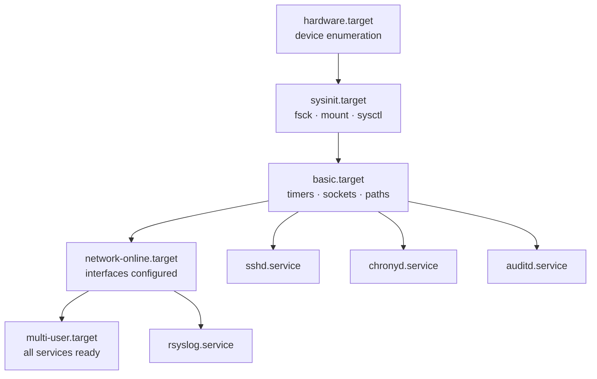
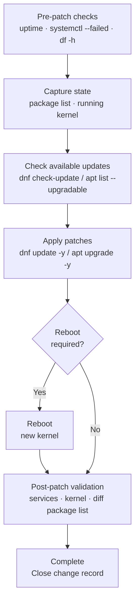

---
tags:
  - linux
  - operations
---
# Linux Operations — Procedures

```bash
# Confirm system is healthy before making changes
uptime
systemctl --failed
df -h | awk '$5+0 > 85'

# Capture current state for comparison
rpm -qa --qf "%{NAME}-%{VERSION}-%{RELEASE}.%{ARCH}\n" | sort > /tmp/pre-change-packages.txt   # RHEL
dpkg -l | awk 'NR>5' > /tmp/pre-change-packages.txt   # Ubuntu

# Capture running kernel
uname -r
```
```text
┌──────────────────────────────────── Linux Operations — Procedures ────────────────────────────────────┐
│                                                                                                       │
│   ┌───────────────────────────────────────────────────────────────────────────────────────────────┐   │
│   │                                 Standard Operating Procedures                                 │   │
│   │           User provisioning: adduser → set password → add to groups → configure sudo          │   │
│   │            Disk expansion: pvcreate → vgextend → lvextend → xfs_growfs / resize2fs            │   │
│   │           Service deployment: create unit file → systemctl enable → start → validate          │   │
│   │        Kernel update: dnf update kernel → grub2-set-default → reboot → verify uname -r        │   │
│   └───────────────────────────────────────────────────────────────────────────────────────────────┘   │
│                                                                                                       │
│    Documented procedures reduce errors and ensure consistent repeatable outcomes                      │
│                                                                                                       │
│                          ▼                                                 ▼                          │
│                                                                                                       │
│   ┌──────────────────────────────────────────────┐  ┌─────────────────────────────────────────────┐   │
│   │              Network & Firewall              │  │              Certificate & SSH              │   │
│   │         ip addr add: add IP address          │  │            ssh-keygen -t ed25519            │   │
│   │         nmcli: NetworkManager config         │  │          ssh-copy-id to target host         │   │
│   │         firewall-cmd --permanent add         │  │          openssl req: generate CSR          │   │
│   │         ss -tlnp: verify open ports          │  │          certbot: ACME cert renewal         │   │
│   │           ip route: add/del routes           │  │           known_hosts maintenance           │   │
│   └──────────────────────────────────────────────┘  └─────────────────────────────────────────────┘   │
│                                                                                                       │
│  Physical Infrastructure (the hardware everything above runs on):                                     │
│  x86-64 servers · LVM volumes · NIC · iDRAC/iLO BMC · NTP · Power & Cooling                           │
│                                                                                                       │
│  Key terms:                                                                                           │
│                                                                                                       │
│  pvcreate    = Initialise a block device as an LVM Physical Volume                                    │
│  vgextend    = Add a new Physical Volume to an existing Volume Group                                  │
│  lvextend    = Grow a Logical Volume; must be followed by filesystem resize                           │
│  xfs_growfs  = Online-resize an XFS filesystem to fill available LV space                             │
│  resize2fs   = Online or offline-resize an ext4 filesystem after lvextend                             │
│  grub2-set-default= Select which kernel entry GRUB2 boots by default                                  │
│  nmcli       = NetworkManager CLI; manages connections, devices, and profiles                         │
│  firewall-cmd= CLI for firewalld; adds/removes services, ports, and rich rules                        │
│  ss          = Socket statistics; replaces netstat for viewing open ports/connections                 │
│  ssh-keygen  = Generates RSA/Ed25519 key pairs for SSH public-key authentication                      │
│  openssl req = Generates a Certificate Signing Request from a private key                             │
│  certbot     = ACME client for Let's Encrypt; automates TLS cert issuance and renewal                 │
│                                                                                                       │
└───────────────────────────────────────────────────────────────────────────────────────────────────────┘
```
```bash
# Detailed memory breakdown
cat /proc/meminfo

# Check OOM (Out of Memory) killer events
journalctl -k | grep -i "oom\|killed process"
dmesg | grep -i "oom\|killed process"

# Check which process the OOM killer targeted
dmesg | grep -i "out of memory" | tail -10

# Drop caches if available memory is low (safe on production — does not affect file data)
echo 3 > /proc/sys/vm/drop_caches
```
```bash
# Check interface state and IP addresses
ip addr show
ip link show

# Check routing table
ip route show
ip route get <destination-ip>  # shows which interface and gateway would be used

# Check listening ports and connections
ss -tlnp   # TCP listeners
ss -unlp   # UDP listeners
ss -tnp    # established TCP connections with PID

# Test connectivity
ping -c 4 <host>
traceroute <host>
curl -v --max-time 5 http://<host>  # test HTTP reachability

# Check DNS resolution
dig <hostname>
dig @<dns-server-ip> <hostname>
nslookup <hostname> <dns-server-ip>

# Check firewalld rules (RHEL)
firewall-cmd --list-all
firewall-cmd --list-services

# Check iptables directly
iptables -L -n -v
```
```bash
# Search journal for a specific service over a time range
journalctl -u sshd --since "2024-01-15 08:00" --until "2024-01-15 09:00" --no-pager

# Follow logs in real time
journalctl -f
journalctl -f -u <service>

# Check authentication log (failed/successful logins)
journalctl -u sshd | grep -E "Failed|Accepted"
cat /var/log/secure   # RHEL
cat /var/log/auth.log # Ubuntu/Debian

# Kernel messages (hardware errors, OOM, filesystem errors)
dmesg -T | tail -50
dmesg -T | grep -i "error\|warning\|fail"
```
```bash
# List logged-in users
who
w

# Recent login history
last | head -20
lastb | head -20   # failed logins

# Check sudo access for a user
sudo -l -U <username>

# Lock / unlock a user account
passwd -l <username>   # lock
passwd -u <username>   # unlock

# Check account expiry
chage -l <username>

# Check /etc/sudoers and sudoers.d
visudo -c   # validate sudoers file
ls -la /etc/sudoers.d/
```

```bash
# List all running services
systemctl list-units --type=service --state=running

# Start / stop / restart a service
systemctl start <service>
systemctl stop <service>
systemctl restart <service>

# Enable service to start at boot
systemctl enable <service>

# Check service status with recent log tail
systemctl status <service>

# View full service logs
journalctl -u <service> -n 100 --no-pager
journalctl -u <service> --since "1 hour ago"
```
```bash
# All active services
systemctl list-units --type=service --state=active

# Failed services
systemctl --failed

# All services (active + inactive)
systemctl list-units --type=service --all

# Services that are enabled but not running
systemctl list-units --type=service --state=inactive | grep enabled
```
```bash
# What does a service depend on?
systemctl list-dependencies <service>

# What depends on this service?
systemctl list-dependencies --reverse <service>

# Show service unit file
systemctl cat <service>

# Show all properties
systemctl show <service>
```
```ini
# /etc/systemd/system/myapp.service
[Unit]
Description=My Application
After=network.target

[Service]
Type=simple
User=myapp
WorkingDirectory=/opt/myapp
ExecStart=/opt/myapp/bin/myapp --config /etc/myapp/config.yaml
Restart=on-failure
RestartSec=5
StandardOutput=journal
StandardError=journal
SyslogIdentifier=myapp

[Install]
WantedBy=multi-user.target
```
```bash
# Load and start the new unit
systemctl daemon-reload
systemctl enable --now myapp
```
```bash
# Check current limits on a running service
systemctl show <service> | grep -E "LimitNOFILE|LimitNPROC|MemoryMax|CPUQuota"

# Set memory limit via drop-in
mkdir -p /etc/systemd/system/<service>.service.d/
cat > /etc/systemd/system/<service>.service.d/limits.conf <<EOF
[Service]
MemoryMax=2G
LimitNOFILE=65536
EOF
systemctl daemon-reload
systemctl restart <service>
```
```bash
# Mask a service (prevents any start, even manual)
systemctl mask <service>

# Unmask
systemctl unmask <service>

# Services to disable on production servers (no UI needed)
systemctl disable --now bluetooth cups avahi-daemon
```
```bash
# 1. Check status for the error message
systemctl status <service> -l

# 2. Check journal for the unit
journalctl -u <service> -n 50 --no-pager

# 3. Check dependencies
systemctl list-dependencies <service> | grep failed

# 4. Validate unit file syntax
systemd-analyze verify /etc/systemd/system/<service>.service

# 5. Test ExecStart command manually as the service user
sudo -u <service-user> /path/to/binary --args
```

```bash
# 1. Confirm system is healthy before patching
uptime
systemctl --failed
df -h | awk '$5+0 > 85'

# 2. Capture current package versions (rollback reference)
rpm -qa --qf "%{NAME}-%{VERSION}-%{RELEASE}.%{ARCH}\n" | sort > /tmp/pre-patch-packages.txt   # RHEL
dpkg -l | awk 'NR>5' > /tmp/pre-patch-packages.txt   # Ubuntu

# 3. Capture running kernel
uname -r

# 4. Check available updates without applying
dnf check-update   # RHEL
apt list --upgradable 2>/dev/null   # Ubuntu
```
```bash
# List available updates
dnf check-update

# Apply all updates (security + bug fix + enhancement)
dnf update -y

# Apply security updates only
dnf update --security -y

# Apply a specific advisory
dnf update --advisory=RHSA-2026:1234 -y

# Apply updates excluding the kernel (maintenance without reboot risk)
dnf update --exclude=kernel* -y

# List installed security advisories
dnf updateinfo list security installed | head -20
```
```bash
# List recent transactions
yum history list | head -20

# View what a transaction did
yum history info <transaction-id>

# Undo a specific transaction (rollback)
yum history undo <transaction-id>
```
```bash
# Refresh package index
apt update

# List upgradable packages
apt list --upgradable 2>/dev/null

# Apply all upgrades
apt upgrade -y

# Full upgrade (handles dependency changes)
apt full-upgrade -y

# Remove unused packages after upgrade
apt autoremove -y
```
```bash
# Check if a reboot is required (RHEL)
needs-restarting -r
# Exit code 1 = reboot required

# Check if a reboot is required (Ubuntu)
ls /var/run/reboot-required 2>/dev/null && echo "Reboot required" || echo "No reboot needed"
```
```bash
# Confirm updated kernel is running (after reboot)
uname -r

# Confirm critical services are up
systemctl is-active sshd chronyd auditd

# Check for new failed services
systemctl --failed

# Compare package list to pre-patch snapshot
rpm -qa --qf "%{NAME}-%{VERSION}-%{RELEASE}.%{ARCH}\n" | sort > /tmp/post-patch-packages.txt
diff /tmp/pre-patch-packages.txt /tmp/post-patch-packages.txt
```

---

## Add a User Account

Create a new local user account, set a password, assign group membership, and ensure a home directory is created.

```bash
# Create user with home directory
useradd -m -s /bin/bash <username>

# Set password
passwd <username>

# Add user to supplementary groups (e.g., wheel for sudo, docker, adm)
usermod -aG wheel,adm <username>

# Verify account and home directory
id <username>
ls -la /home/<username>

# Confirm group membership
groups <username>
```

Home directory is created automatically with `-m`; skeleton files from `/etc/skel` are copied in. On RHEL, `wheel` group members get sudo access by default.

---

## Configure Sudo Access

Grant a user or group elevated privileges using the `/etc/sudoers.d/` drop-in approach (preferred over editing `/etc/sudoers` directly).

```bash
# Create a drop-in file for the user (preferred — avoids editing /etc/sudoers directly)
visudo -f /etc/sudoers.d/<username>
```

Drop-in file contents:
```bash
# Validate sudoers syntax before saving
visudo -c

# Validate a specific drop-in file
visudo -c -f /etc/sudoers.d/<username>

# List what a user can sudo
sudo -l -U <username>
```

Drop-in files in `/etc/sudoers.d/` are included automatically. File names must not contain `.` or `~`. Set permissions to `0440`.

---

## Configure Network Interface (nmcli)

Configure a static IP address, DNS, and gateway on a NetworkManager-managed interface.

```bash
# List all connections
nmcli con show

# Show current connection details
nmcli con show "<connection-name>"

# Set static IP address (replace DHCP)
nmcli con mod "<connection-name>" ipv4.method manual \
    ipv4.addresses "192.168.1.100/24" \
    ipv4.gateway "192.168.1.1" \
    ipv4.dns "192.168.1.10,8.8.8.8"

# Disable IPv6 if not required
nmcli con mod "<connection-name>" ipv6.method ignore

# Apply changes by restarting the connection
nmcli con down "<connection-name>" && nmcli con up "<connection-name>"

# Verify the new configuration
ip addr show
ip route show
cat /etc/resolv.conf
```

```bash
# Add a secondary DNS search domain
nmcli con mod "<connection-name>" ipv4.dns-search "example.local,corp.local"

# Verify NetworkManager applied the settings
nmcli -p con show "<connection-name>" | grep -E "ipv4|ipv6"
```

---

## Mount a Filesystem Permanently

Add a persistent mount entry to `/etc/fstab` so a filesystem mounts automatically at boot.

```bash
# Identify the device UUID (preferred over /dev/sdX — stable across reboots)
blkid /dev/sdb1

# Create the mount point directory
mkdir -p /mnt/data

# Test the fstab entry without rebooting
mount -a

# Verify the mount
df -h /mnt/data
mount | grep /mnt/data
```

Add entry to `/etc/fstab`:
Common NFS mount options in `/etc/fstab`:
The `_netdev` option tells systemd to wait for the network before mounting. Use `pass` value `0` for network filesystems and non-root local disks; use `2` for additional local disks; `1` is reserved for `/`.

---

## Configure NTP (chrony)

Configure chrony as the NTP client on RHEL/CentOS/AlmaLinux or configure systemd-timesyncd on Debian/Ubuntu.

```bash
# RHEL / AlmaLinux — edit chrony configuration
vi /etc/chrony.conf
```

Key directives in `/etc/chrony.conf`:
```bash
# Restart and enable chrony
systemctl enable --now chronyd

# Verify time sources and synchronisation
chronyc sources -v
chronyc tracking

# Check offset — should be < 1 second in normal operation
chronyc tracking | grep "System time"

# Force immediate sync
chronyc makestep

# Confirm system clock is synchronised
timedatectl status
```

Ubuntu/Debian — systemd-timesyncd alternative:

```ini
# /etc/systemd/timesyncd.conf
[Time]
NTP=ntp1.example.local ntp2.example.local
FallbackNTP=pool.ntp.org
```

```bash
systemctl restart systemd-timesyncd
timedatectl show-timesync --no-pager
```

---

## Extend an LVM Volume

Grow a logical volume online and resize the filesystem to use the additional space.

```bash
# 1. Confirm new disk or partition is visible
lsblk
fdisk -l /dev/sdb

# 2. Initialise the disk as a Physical Volume
pvcreate /dev/sdb

# 3. Extend the Volume Group with the new PV
vgextend <vg-name> /dev/sdb

# 4. Confirm free extents are available
vgdisplay <vg-name> | grep "Free  PE"

# 5. Extend the Logical Volume (use all available space with -l +100%FREE)
lvextend -l +100%FREE /dev/<vg-name>/<lv-name>
# Or extend by a specific size:
lvextend -L +20G /dev/<vg-name>/<lv-name>

# 6. Resize the filesystem (online — no unmount required)
# For XFS:
xfs_growfs /mount/point

# For ext4:
resize2fs /dev/<vg-name>/<lv-name>

# 7. Verify
df -h /mount/point
lvdisplay /dev/<vg-name>/<lv-name>
```

XFS filesystems can only grow, not shrink. `resize2fs` works online for ext4 on kernels 3.8+.

---

## Configure syslog / rsyslog Forwarding

Forward all local syslog events to a central syslog server using rsyslog.

```bash
# Create a drop-in forwarding config
vi /etc/rsyslog.d/90-remote.conf
```

Contents of `/etc/rsyslog.d/90-remote.conf`:
```bash
# Validate rsyslog configuration syntax
rsyslogd -N1

# Apply the new configuration
systemctl restart rsyslog

# Verify the TCP connection to the syslog server
ss -tnp | grep :514

# Send a test message and confirm it appears on the remote server
logger -t TEST "rsyslog forwarding test from $(hostname)"
```

Use TLS encryption (`omfwd` with `StreamDriver="gtls"`) for forwarding across untrusted networks.

---

## Manage systemd Services

Enable, disable, start, stop, and monitor systemd services and their logs.

```bash
# Enable a service to start at boot (and start it immediately)
systemctl enable --now <service>

# Disable a service (and stop it immediately)
systemctl disable --now <service>

# Start / stop / restart
systemctl start <service>
systemctl stop <service>
systemctl restart <service>

# Reload configuration without full restart (if the service supports it)
systemctl reload <service>

# Check status — shows recent log lines
systemctl status <service>
```

```bash
# Follow service logs in real time
journalctl -u <service> -f

# View last 100 log lines
journalctl -u <service> -n 100 --no-pager

# Logs since a specific time
journalctl -u <service> --since "1 hour ago"

# Reload all unit files after editing a unit
systemctl daemon-reload
```

```bash
# Check all failed services
systemctl --failed

# List all services with their start type
systemctl list-units --type=service --all

# Mask a service to prevent it from being started by any means
systemctl mask <service>
```

---

## Apply Security Updates

Patch a Linux server with security-only updates and determine whether a reboot is required.

```bash
# RHEL / AlmaLinux / Rocky — check available security updates
dnf check-update --security

# Apply security updates only
dnf update --security -y

# Apply a specific advisory
dnf update --advisory=RHSA-2026:1234 -y

# Check if a reboot is required after patching
needs-restarting -r
# Exit code 0 = no reboot needed; 1 = reboot required

# Check which services need restarting without a full reboot
needs-restarting -s
```

```bash
# Ubuntu / Debian — update package index and apply security upgrades
apt update
apt-get upgrade -y

# Check if reboot is required (Ubuntu)
ls /var/run/reboot-required 2>/dev/null && echo "Reboot required" || echo "No reboot needed"
cat /var/run/reboot-required.pkgs 2>/dev/null
```

```bash
# Post-patch: verify critical services are still running
systemctl is-active sshd chronyd auditd rsyslog

# Confirm running kernel after reboot
uname -r
```

---

## Configure SSH Key Authentication

Generate an SSH key pair, deploy the public key to a remote host, and harden the SSH daemon configuration.

```bash
# 1. Generate an Ed25519 key pair (recommended — smaller and more secure than RSA)
ssh-keygen -t ed25519 -C "$(whoami)@$(hostname)-$(date +%Y%m%d)"
# Default output: ~/.ssh/id_ed25519 (private) and ~/.ssh/id_ed25519.pub (public)

# For RSA (use when Ed25519 is not supported)
ssh-keygen -t rsa -b 4096 -C "$(whoami)@$(hostname)"

# 2. Copy the public key to the remote host
ssh-copy-id -i ~/.ssh/id_ed25519.pub <user>@<remote-host>
# This appends the key to ~/.ssh/authorized_keys on the remote host

# 3. Verify key-based login works before disabling password auth
ssh -i ~/.ssh/id_ed25519 <user>@<remote-host>
```

```bash
# Manually add a public key (when ssh-copy-id is not available)
mkdir -p ~/.ssh && chmod 700 ~/.ssh
echo "ssh-ed25519 AAAA... comment" >> ~/.ssh/authorized_keys
chmod 600 ~/.ssh/authorized_keys
```

Harden `/etc/ssh/sshd_config`:
```bash
# Validate sshd_config syntax before restarting
sshd -t

# Apply the new configuration
systemctl reload sshd
```
