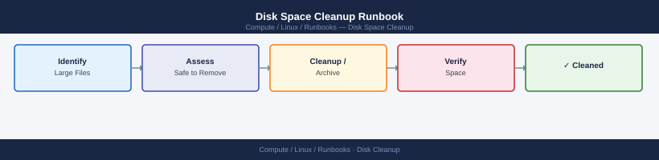
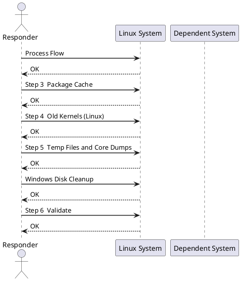

---
tags:
  - linux
  - operations
---
# Disk Space Cleanup Runbook


<div class="kb-summary">
| Field | Value | |---|---| | Risk | Low–Medium | | Approval | Standard change; confirm with app owner before deleting unfamiliar files | | Estimated time | 20–45 minutes | | Impact | No downtime expected; log deletion may affect audit trails |

*Applies to: RHEL / Ubuntu LTS*
</div>



| Field | Value |
|---|---|
| Risk | Low–Medium |
| Approval | Standard change; confirm with app owner before deleting unfamiliar files |
| Estimated time | 20–45 minutes |
| Impact | No downtime expected; log deletion may affect audit trails |



## Before you begin

- **Access:** root or sudo-capable account on target hosts
- **Timing:** safe to run during business hours unless a step is marked ⚠ (causes interruption)
- **Dependencies:** no active upgrades or migrations on the same infrastructure
- **Logging:** capture command output — paste into the change record on completion

---

## Process Flow


## Step 3 — Package Cache

```bash
# RHEL / CentOS / Rocky
dnf clean all

# Ubuntu / Debian
apt-get clean
apt-get autoremove --purge
```

## Step 4 — Old Kernels (Linux)

```bash
# List installed kernels — always keep current + one previous
rpm -q kernel                          # RHEL
dpkg --list 'linux-image*'             # Ubuntu

# Remove old kernels (keep 2)
dnf remove --oldinstallonly --setopt installonly_limit=2 kernel    # RHEL
```

## Step 5 — Temp Files and Core Dumps

```bash
# Preview before deleting
find /tmp -type f -mtime +7 -ls
find /var/tmp -type f -mtime +30 -ls
find /var/crash -type f -ls
find / -name "core" -type f -mtime +7 -ls 2>/dev/null

# Delete
find /tmp -type f -mtime +7 -delete
find /var/crash -type f -mtime +7 -delete
```

## Windows Disk Cleanup

```powershell
# Show disk usage by volume
Get-Volume | Select DriveLetter, FileSystemLabel,
    @{N="SizeGB";E={[math]::Round($_.Size/1GB,1)}},
    @{N="FreeGB";E={[math]::Round($_.SizeRemaining/1GB,1)}},
    @{N="FreePct";E={[math]::Round($_.SizeRemaining/$_.Size*100,1)}}

# Windows Update cache
Stop-Service wuauserv
Remove-Item C:\Windows\SoftwareDistribution\Download\* -Recurse -Force
Start-Service wuauserv

# User temp files
Remove-Item $env:TEMP\* -Recurse -Force -ErrorAction SilentlyContinue
Remove-Item C:\Windows\Temp\* -Recurse -Force -ErrorAction SilentlyContinue

# IIS logs older than 30 days
Get-ChildItem C:\inetpub\logs -Recurse -Include *.log |
    Where-Object { $_.LastWriteTime -lt (Get-Date).AddDays(-30) } |
    Remove-Item -Force
```

## Step 6 — Validate

```bash
df -h                              # confirm free space improved
ls -lt /var/log/ | head -20        # confirm logs still present and current
systemctl --failed                 # confirm no services broken by cleanup
```

## Safety Rules

| Rule | Reason |
|---|---|
| Never delete files in `/proc`, `/sys`, `/dev` | Virtual filesystems — not real disk consumers |
| Never delete active DB data files | Corruption risk |
| Never `rm` a file held open by a running process | Use `truncate -s 0` instead |
| Document everything removed | Audit trail and rollback reference |

## Checklist

- [ ] Filesystem usage confirmed high (> 85%)
- [ ] Top consumers identified
- [ ] App owner consulted if app data directories involved
- [ ] Files to remove listed and reviewed
- [ ] Cleanup performed by category
- [ ] `df -h` confirms space recovered
- [ ] Application still running and logging correctly
- [ ] Ticket updated with what was removed and recovered space

---

## Verify

- Confirm the operation completed without errors in the log or management UI
- Verify the expected state change is visible (service running, object created, config applied)
- Document the outcome in the change record

## See also

- [Server Reboot Runbook](server-reboot.md)
- [Service Restart Runbook](service-restart.md)
- [Linux — Operational Runbooks](index.md)
- [Linux — Architecture](../../../architecture/)
- [Linux Server — Initial Deployment](../../../deploy/)
- [Linux — Security](../../../security/)
- [Linux — Troubleshooting](../../../troubleshooting/)
